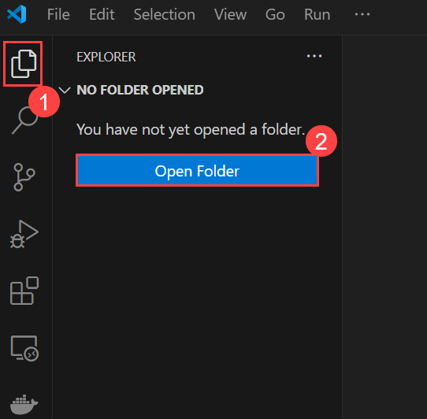
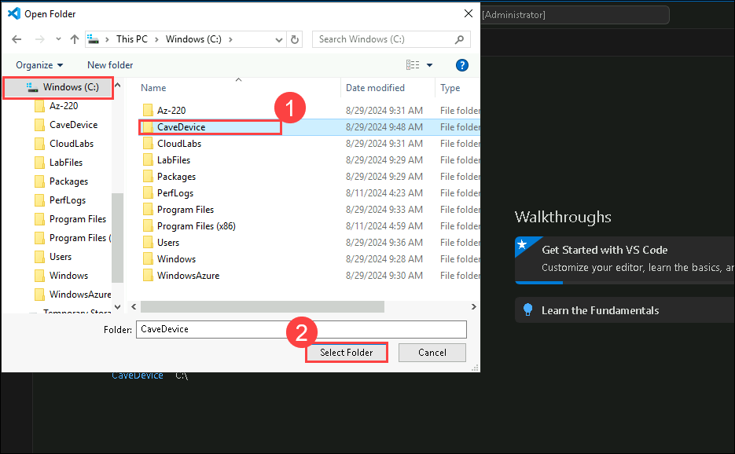
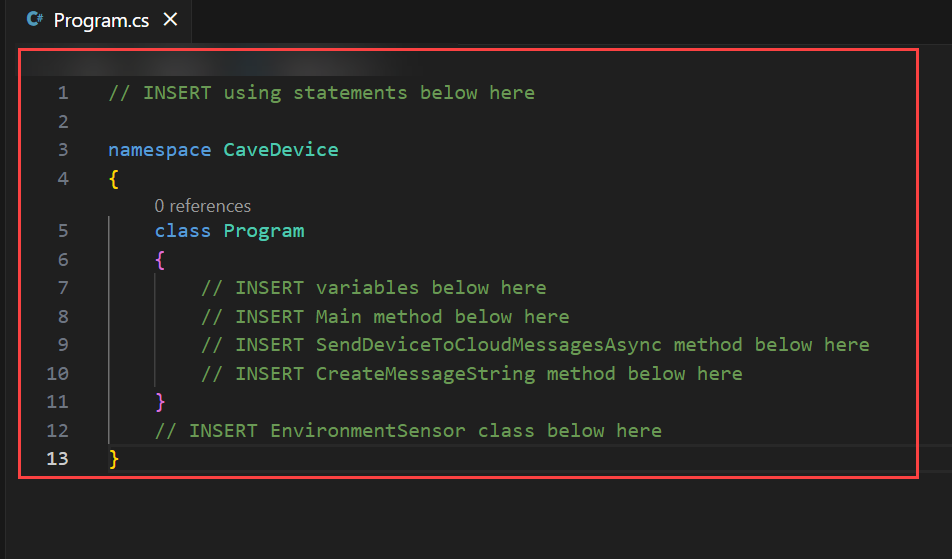
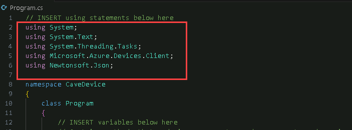
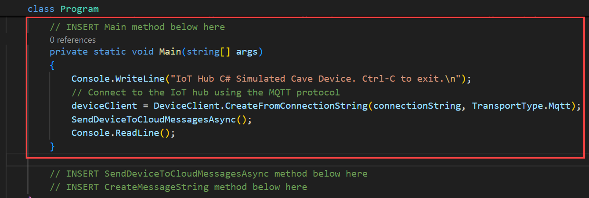
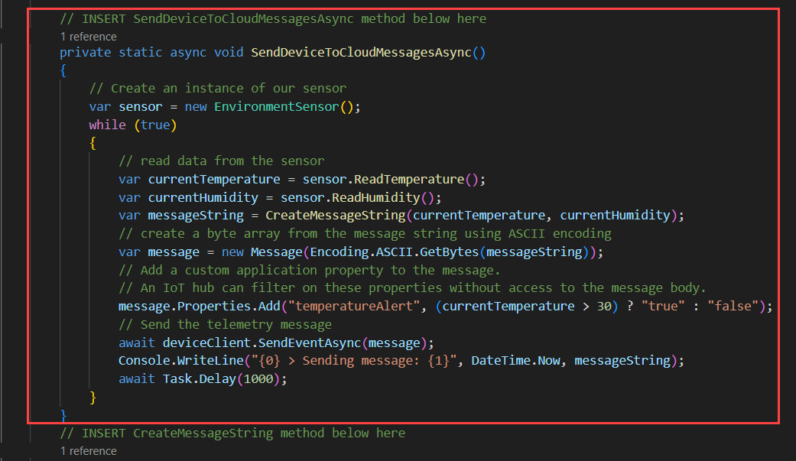
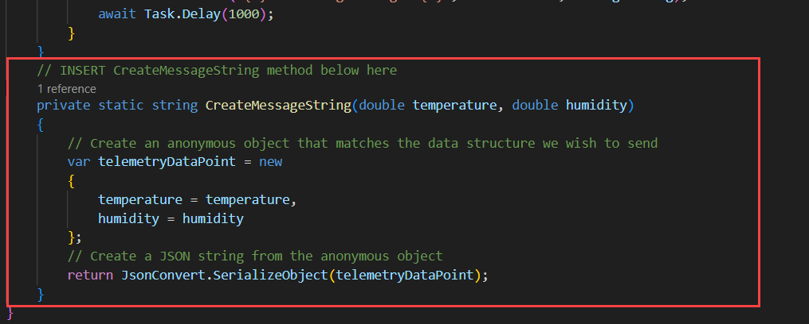
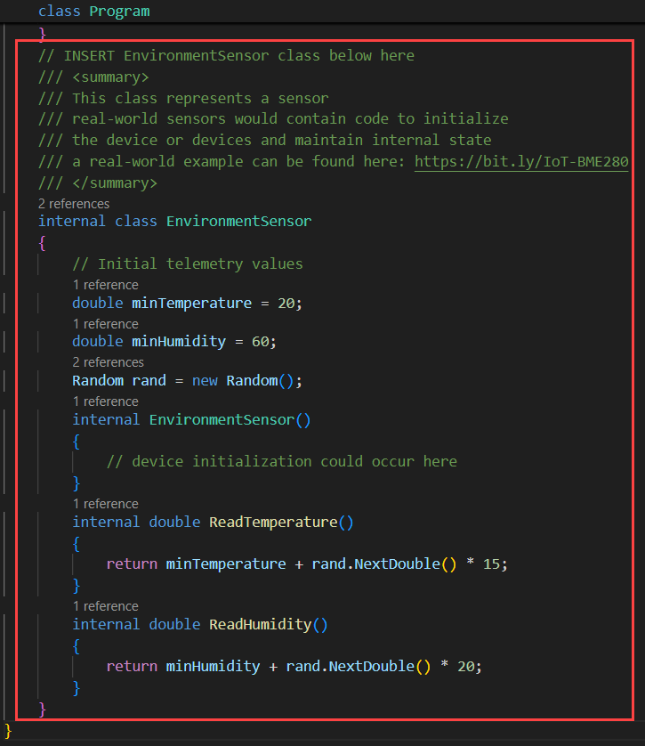
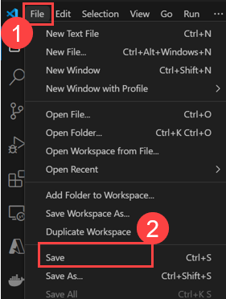

# Lab 02: Connect an IoT Device to Azure

### Estimated Duration: 120 minutes

## Lab Overview 

In this lab, you will be creating a .NET Core console application that simulates the physical IoT device and sensors. Your simulated device will implement the IoT Device SDK and it will connect to IoT Hub just like a physical device would. Your simulated device will also communicate telemetry values using the same SDK resources used by a physical device, but the sensor readings will be generated values rather than real values read from temperature and humidity sensors.

## Lab Scenario

Contoso is known for producing high quality cheeses. Due to the company's rapid growth in both popularity and sales, they want to take steps to ensure that their cheeses stay at the same high level of quality that their customers expect.

In the past, temperature and humidity data was collected by factory floor workers during each work shift. The company is concerned that the factory expansions will require increased monitoring as the new facilities come online and that a manual process for collecting data won't scale.

Contoso has decided to launch an automated system that uses IoT devices to monitor temperature and humidity. The rate at which telemetry data is communicated will be adjustable to help ensure that their manufacturing process is under control as batches of cheese proceed through environmentally sensitive processes.

To evaluate this asset monitoring solution prior to full scale implementation, you will be connecting an IoT device (that includes temperature and humidity sensors) to IoT Hub.

## Lab Objectives

In this lab, you will complete the following:

 - Exercise 1: Create an Azure IoT Hub Device ID using the Azure portal
 - Exercise 2: Create and Test a Simulated Device (C#)

## Architecure Diagram


## Exercise 1: Create an Azure IoT Hub Device ID using the Azure portal

In this exercise, you will open your IoT Hub in the Azure portal, add a new IoT device to the device registry, and then get a copy of the Connection String that IoT Hub created for your device (which you will use in your device code later in the lab).

> **Note**: This lab focuses on using IoT Hub to establish reliable and secure bidirectional communications between IoT Hub and your IoT device. The Microsoft Learn platform includes other Modules (and Learning Paths) that enable you to explore other IoT Hub capabilities. Collectively, this training will help you to build scalable, full-featured IoT solutions.

### Task 1: Create the Device

In this task, you will create a device in the IoT Hub.

1. On the Azure portal, navigate to resource group and then select the resource group named **az220rg-<inject key="DeploymentID" enableCopy="false" />**.

   

1. On the resources tile, click on **iot-az220-training-<inject key="DeploymentID" enableCopy="false" />**

   

1. On the left-side menu of your IoT Hub blade, click on **Devices** under **Device management.**
   
   

1. On the **Devices** pane, click on **+ Add Device**.

   

1. In the **Create a Device** page, enter the following details and click on **Save** **(6)** to add this device record to the IoT Hub.

    | Setting | Value |
    | --- | --- |
    | Device ID | `sensor-th-0001` **(1)** |
    | Authentication type | **Symmetric key** **(2)** |
    | Auto-generate keys | Ensure the checkbox is selected **(3)** |
    | Connect this device to an IoT hub | **Enable** **(4)** |
    | Parent device | **No parent device** **(5)** |

     

1. After a few moments, the **IoT devices** pane will refresh and the new device will be listed.

    > **Note**: You may need to refresh manually - click the **Refresh** button on the page, rather than refreshing the browser

      

      > **Congratulations** on completing the task! Now, it's time to validate it. Here are the steps:
      > - Hit the Validate button for the corresponding task. If you receive a success message, you can proceed to the next task. Alternatively, you can navigate to the Lab Validation Page, from the upper right corner in the lab guide section.
      > - If not, carefully read the error message and retry the step, following the instructions in the lab guide. 
      > - If you need any assistance, please contact us at labs-support@spektrasystems.com. We are available 24/7 to help you out.

      <validation step="3201069f-745a-4e51-aa22-bd5d492a066e" />

### Task 2: Get the Device Connection String

For a device to connect to an IoT Hub, it needs to establish a connection. In this lab, you will use a connection string to connect your device directly to the IoT Hub (this form of authentication is often referred to as symmetric key authentication). When using Symmetric key authentication, there are two connection strings available - one that utilizes the Primary key, the other that uses the Secondary key. As noted above, the Primary and Secondary keys are only generated once the device record is saved. Therefore, to obtain one of the connection strings, you must first save the record (as you did in the task above) and then re-open the device record (which is what you are about to do).

1. On the **IoT devices** pane of your IoT Hub, under **Device ID**, click on **sensor-th-0001**.

    

1. Take a minute to review the contents of the **sensor-th-0001** device detail blade.

1. Notice that the key and connection string values are now populated.

1. To the right of the **Primary Connection String** field, click on **Copy** and paste it in a notepad for later use.

     

## Exercise 2: Create and Test a Simulated Device (C#)

In this exercise, you will create a simulated device application using Visual Studio Code and the Azure IoT Device SDKs. You will connect your device to Azure IoT Hub using the Device ID and Shared Access Key (Primary Connection String) that you created in the previous exercise. You will then test your secured device connection and communication to ensure that IoT Hub is receiving the simulated temperature and humidity values from your device as expected.

   > **Note**: You will be writing your simulated device code using the C# programming language, but don't worry if you are more accustomed to another programming language or if your programming skills are a bit rusty, the instructions will be easy to follow. The important thing is for you to recognize how the IoT Device SDK is implemented in code (which is also explained in detail).

### Task 1: Create the initial project

In this task, you will be creating a initial dotnet project in your LabVM. For simulating telemetry data
 
1. Open **Visual Studio Code** editor from the desktop.

    

1. Select **Three dots(...) >> Terminal(1)** and click on **New Terminal(2)**.
   
    

1. In the terminal, run the following commands to create a directory named **CaveDevice** and switch to that directory.

    ```
    New-Item -Path "C:\CaveDevice" -ItemType "Directory"
    cd C:\CaveDevice
    ```

1. To create a new .NET console application, run the following command:

    ```bash
    dotnet new console
    ```

    This command creates a **Program.cs** file in your folder, along with a project file.

1. To install the Azure IoT Device SDK and code libraries required for your simulated device app, run the following command:

    ```bash
    dotnet add package Microsoft.Azure.Devices.Client
    ```

    > **Note**: The **Microsoft.Azure.Devices.Client** package contains the Azure IoT Device SDK for .NET and has the **Newtonsoft.Json** package as a dependency. The **Newtonsoft.Json** package contains APIs that aid in the creation and manipulation of JSON.

1. To ensure all the application dependencies are downloaded, run the following command:

    ```bash
    dotnet restore
    ```
    

1. In Visual Studio Code, on the **Explorer(1)** , click on **Open Folder(2)**.

    

1. In the **Open Folder** dialog box , navigate to the location `C:\CaveDevice` where you created the **CaveDevice** directory.

1. In the list of folders, click on **CaveDevice(1)** and then click on **Select Folder(2)**.

    

1. If the pop up appears click on **Yes, I trust the authors**.

    

1. The EXPLORER pane of Visual Studio Code should now list two C# project files:

    * CaveDevice.csproj
    * Program.cs

      

      > **Note**: If you see a message **Required assets to build and debug are missing from CaveDevice. Add them?**, you may click **Yes** to proceed.

### Task 2: Explore the application

In this task, you will be reviewing the starter files after creating a new consol and use Visual Studio Code to review the contents and purpose of the two application files.

As noted above, the application currently consists of two files:

* CaveDevice.csproj
* Program.cs

1. In the **EXPLORER** pane, to open the application project file, click on **CaveDevice.csproj**.

1. Take a minute to review the contents of the **CaveDevice.csproj** file. Your file contents should be similar to the following:

    ```xml
    <Project Sdk="Microsoft.NET.Sdk">
        <PropertyGroup>
            <OutputType>Exe</OutputType>
            <TargetFramework>netcoreapp8.0</TargetFramework>
        </PropertyGroup>
        <ItemGroup>
            <PackageReference Include="Microsoft.Azure.Devices.Client" Version="1.*" />
        </ItemGroup>
    </Project>
    ```
    
1. In the **EXPLORER** pane, click on **Program.cs**.

1. Take a minute to review the contents of the **Program.cs** file. Your file contents should be similar to the following:

    ```csharp
     Console.WriteLine("Hello, World!");
    ```

1. On the Visual Studio Code, click on **Terminal** and select **New Terminal**.

    

1. In the Terminal pane, ensure that the current directory path is set to the **CaveDevice** folder.

    

1. To build and run the **CaveDevice** project, run the following command:

    ```cmd/sh
    dotnet run
    ```

1. Notice that **Hello World!** is displayed.

    

### Task 3: Implement the simulated device code

In this task, you will use Visual Studio Code to enter the code that leverages the Azure IoT Device SDK to connect to your IoT Hub resource.

1. In the **EXPLORER** pane, click on **Program.cs**.

1. Select all the existing code, and then delete it.

1. In the code editor pane, to create the basic structure of your simulated device application, enter the following code:

    ```csharp
    // INSERT using statements below here

    namespace CaveDevice
    {
        class Program
        {
            // INSERT variables below here
            // INSERT Main method below here
            // INSERT SendDeviceToCloudMessagesAsync method below here
            // INSERT CreateMessageString method below here
        }
        // INSERT EnvironmentSensor class below here
    }
    ```
        

    > **Note:** As you can see, the namespace and the class have been retained, however, the other items are placeholder comments. In the following steps you will be inserting code into the file below specific comments.

    > **Tip**: To reformat the pasted text in Visual Studio Code, press **SHIFT + ALT + F**, or press **F1** to open the command palette and search for **Format Document**.

1. Locate the **// INSERT using statements below here** comment, and then position the cursor on a blank line below the comment.

1. To specify the namespaces that the application code will be using, enter the following code:

    ```csharp
    using System;
    using System.Text;
    using System.Threading.Tasks;
    using Microsoft.Azure.Devices.Client;
    using Newtonsoft.Json;
    ```

    Notice that as well as specifying **System**, you are also declaring other namespaces that the code will be using, such as **System.Text** for encoding strings, **System.Threading.Tasks** for asynchronous tasks, and the namespaces for the two packages you added earlier.

    

    > **Tip**: When inserting code, the code layout may not be ideal. You can have Visual Studio Code format the document for you by right-clicking in the code editor pane and then clicking **Format Document**. You can achieve the same result by opening the **Task** pane (press **F1**) and typing **Format Document** and then pressing **Enter**. And on Windows, the shortcut for this task is **SHIFT+ALT+F**.

1. Locate the **// INSERT variables below here** comment, and then position the cursor on a blank line below the comment.

1. To specify the variables that the program is using, enter the following code:

    ```csharp
    // Contains methods that a device can use to send messages to and receive from an IoT Hub.
    private static DeviceClient deviceClient;
    // The device connection string to authenticate the device with your IoT hub.
    // Note: in real-world applications you would not "hard-code" the connection string
    // It could be stored within an environment variable, passed in via the command-line or
    // stored securely within a TPM module.
    private readonly static string connectionString = "{Your device connection string here}";
    ```

1. In the code that you just entered, update the value for **connectionString** using the Primary Connection String that you copied from IoT Hub.

    Once updated, the **connectionString** variable line should be similar to the following:

    ```csharp
    private readonly static string connectionString = "HostName=iot-az220-training-dm200420.azure-devices.net;DeviceId=sensor-th-0001;SharedAccessKey=hfavUmFgoCPA9feWjyfTx23SUHr+dqG9X193ctdEd90=";
    ```

    

1. Locate the **// INSERT Main method below here** comment, and then position the cursor on a blank line below the comment.

1. To construct the **Main** method of your simulated device application, enter the following code:

    ```csharp
    private static void Main(string[] args)
    {
        Console.WriteLine("IoT Hub C# Simulated Cave Device. Ctrl-C to exit.\n");
        // Connect to the IoT hub using the MQTT protocol
        deviceClient = DeviceClient.CreateFromConnectionString(connectionString, TransportType.Mqtt);
        SendDeviceToCloudMessagesAsync();
        Console.ReadLine();
    }
    ```
            

    The **Main** method is the first part of your application that runs once your app is started.

1. Locate the **// INSERT - SendDeviceToCloudMessagesAsync below here** comment, and then position the cursor on a blank line below the comment. 

1. To construct the **SendDeviceToCloudMessagesAsync** method, enter the following code:

    ```csharp
    private static async void SendDeviceToCloudMessagesAsync()
    {
        // Create an instance of our sensor
        var sensor = new EnvironmentSensor();
        while (true)
        {
            // read data from the sensor
            var currentTemperature = sensor.ReadTemperature();
            var currentHumidity = sensor.ReadHumidity();
            var messageString = CreateMessageString(currentTemperature, currentHumidity);
            // create a byte array from the message string using ASCII encoding
            var message = new Message(Encoding.ASCII.GetBytes(messageString));
            // Add a custom application property to the message.
            // An IoT hub can filter on these properties without access to the message body.
            message.Properties.Add("temperatureAlert", (currentTemperature > 30) ? "true" : "false");
            // Send the telemetry message
            await deviceClient.SendEventAsync(message);
            Console.WriteLine("{0} > Sending message: {1}", DateTime.Now, messageString);
            await Task.Delay(1000);
        }
    }
    ```
    
   
    > **Note**: Notice that the declaration for the **SendDeviceToCloudMessagesAsync** method includes the keyword **async**. This specifies that the method contains asynchronous code that uses the **await** keyword and instructs the compiler to handle the callback plumbing for you.

1. Locate the **// INSERT CreateMessageString method below here** comment, and then position the cursor on a blank line below the comment.

1. To construct the **CreateMessageString** method that creates a JSON string from the sensor readings, enter the following code:

    ```csharp
    private static string CreateMessageString(double temperature, double humidity)
    {
        // Create an anonymous object that matches the data structure we wish to send
        var telemetryDataPoint = new
        {
            temperature = temperature,
            humidity = humidity
        };
        // Create a JSON string from the anonymous object
        return JsonConvert.SerializeObject(telemetryDataPoint);
    }
    ```
    
   
    > **Note**:  This method creates an anonymous object with the temperature and humidity properties and assigns it to **telemetryDataPoint**. The value of **telemetryDataPoint** is then converted to a JSON string via the **JsonConvert** class that is part of the **Newtonsoft.Json** package you added earlier. The JSON string value is then returned to be used as the payload in the message.

1. Locate the **// INSERT EnvironmentSensor class below here** comment, and then position the cursor on a blank line below the comment.

1. To construct the **EnvironmentSensor** class, enter the following code:

    ```csharp
    /// <summary>
    /// This class represents a sensor
    /// real-world sensors would contain code to initialize
    /// the device or devices and maintain internal state
    /// a real-world example can be found here: https://bit.ly/IoT-BME280
    /// </summary>
    internal class EnvironmentSensor
    {
        // Initial telemetry values
        double minTemperature = 20;
        double minHumidity = 60;
        Random rand = new Random();
        internal EnvironmentSensor()
        {
            // device initialization could occur here
        }
        internal double ReadTemperature()
        {
            return minTemperature + rand.NextDouble() * 15;
        }
        internal double ReadHumidity()
        {
            return minHumidity + rand.NextDouble() * 20;
        }
    }
    ```
    
   
    > **Information**:     This is a very simple class that uses random numbers to return values that represent temperature and humidity. In reality, it is often much more complex to interact with sensors, especially if you have to communicate with them at a low-level and derive the measurement value (rather than getting a direct reading in the appropriate units).

1. Final code should look like this. Make sure you replace the `<Connection_String>` with the connection string you copied earlier.

    ```csharp
     using System;
     using System.Text;
     using System.Threading.Tasks;
     using Microsoft.Azure.Devices.Client;
     using Newtonsoft.Json;

     namespace CaveDevice
     {
         class Program
         {
             // Contains methods that a device can use to send messages to and receive from an IoT Hub.
             private static DeviceClient deviceClient;

             // The device connection string to authenticate the device with your IoT hub.
             // Note: in real-world applications you would not "hard-code" the connection string
             // It could be stored within an environment variable, passed in via the command-line or
             // stored securely within a TPM module.
             private readonly static string connectionString = "<Con_STR>";

             private static void Main(string[] args)
             {
                 Console.WriteLine("IoT Hub C# Simulated Cave Device. Ctrl-C to exit.\n");

                 // Connect to the IoT hub using the MQTT protocol
                 deviceClient = DeviceClient.CreateFromConnectionString(connectionString, TransportType.Mqtt);
                 SendDeviceToCloudMessagesAsync();
                 Console.ReadLine();
             }

             private static async void SendDeviceToCloudMessagesAsync()
             {
                 // Create an instance of our sensor
                 var sensor = new EnvironmentSensor();

                 while (true)
                 {
                     // read data from the sensor
                     var currentTemperature = sensor.ReadTemperature();
                     var currentHumidity = sensor.ReadHumidity();

                     var messageString = CreateMessageString(currentTemperature, currentHumidity);

                     // create a byte array from the message string using ASCII encoding
                     var message = new Message(Encoding.ASCII.GetBytes(messageString));

                     // Add a custom application property to the message.
                     // An IoT hub can filter on these properties without access to the message body.
                     message.Properties.Add("temperatureAlert", (currentTemperature > 30) ? "true" : "false");

                     // Send the telemetry message
                     await deviceClient.SendEventAsync(message);
                     Console.WriteLine("{0} > Sending message: {1}", DateTime.Now, messageString);

                     await Task.Delay(1000);
                 }
             }

             private static string CreateMessageString(double temperature, double humidity)
             {
                 // Create an anonymous object that matches the data structure we wish to send
                 var telemetryDataPoint = new
                 {
                     temperature = temperature,
                     humidity = humidity
                 };

                 // Create a JSON string from the anonymous object
                 return JsonConvert.SerializeObject(telemetryDataPoint);
             }

         }

         /// <summary>
     /// This class represents a sensor
     /// real-world sensors would contain code to initialize
     /// the device or devices and maintain internal state
     /// a real-world example can be found here: https://bit.ly/IoT-BME280
     /// </summary>
     internal class EnvironmentSensor
         {
             // Initial telemetry values
             double minTemperature = 20;
             double minHumidity = 60;
             Random rand = new Random();

             internal EnvironmentSensor()
             {
                 // device initialization could occur here
             }

             internal double ReadTemperature()
             {
                 return minTemperature + rand.NextDouble() * 15;
             }

             internal double ReadHumidity()
             {
                 return minHumidity + rand.NextDouble() * 20;
             }
         }

     }

    ```

1. On the **File(1)** menu and then click on **Save(2)**.

    
   
1. Take a minute to scan through your completed application. Your completed application represents a simple simulated device. It demonstrates how to connect a device to an IoT Hub and send Device to Cloud messages. You are now ready to test the application.

### Task 4: Test the application

In this task, you will be testing the application that you have built in the previous tasks.

1. In the Visual Studio Code Explorer pane, on the **Terminal** menu, click on **New Terminal**.

    

1. In the Terminal view, at the command prompt, run the following command:

    ```cmd/sh
    dotnet run
    ```

    > **Note**:  If the command outputs a **Malformed Token** or other error message, then make sure the **Primary Connection String** value is configured correctly as the value of the **connectionString** variable.

1. Observe the message string output displayed in the Terminal. Once the Simulated Device application is running, it will be sending event messages to the Azure IoT Hub that include **temperature** and **humidity** values and displaying message string output in the console. The terminal output will look similar to the following:

    ```text
    IoT Hub C# Simulated Cave Device. Ctrl-C to exit.

    10/25/2019 6:10:12 PM > Sending message: {"temperature":27.714212817472504,"humidity":63.88147743599558}
    10/25/2019 6:10:13 PM > Sending message: {"temperature":20.017463779085066,"humidity":64.53511070671263}
    10/25/2019 6:10:14 PM > Sending message: {"temperature":20.723927165718717,"humidity":74.07808918230147}
    10/25/2019 6:10:15 PM > Sending message: {"temperature":20.48506045736608,"humidity":71.47250854944461}
    10/25/2019 6:10:16 PM > Sending message: {"temperature":25.027703996760632,"humidity":69.21247714628115}
    10/25/2019 6:10:17 PM > Sending message: {"temperature":29.867399432634656,"humidity":78.19206098010395}
    10/25/2019 6:10:18 PM > Sending message: {"temperature":33.29597232085465,"humidity":62.8990878830194}
    10/25/2019 6:10:19 PM > Sending message: {"temperature":25.77350195766124,"humidity":67.27347029711747}
    ```

    > **Note**: Leave the simulated device app running for now. Your next task will be to verify that your IoT Hub is receiving the telemetry messages.

    

### Task 5: Verify Telemetry Stream sent to Azure IoT Hub

In this task, you will use the Azure CLI to verify telemetry sent by the simulated device is being received by Azure IoT Hub.

1. In the Azure portal, Click on the **Cloudshell** icon to open Cloudshell.

    

1. From the **Welcome to Azure Cloud Shell** tab, select **Bash**.

    

1. Select **No Storage Account Required** and under **Subscription**, ensure the correct subscription is selected. Click on **Apply**.

    

1. Run the following Azure CLI command. Make sure to replace `{IoTHubName}` with the actual name which looks similar to **iot-az220-training-<inject key="DeploymentID" enableCopy="false" />**.

   
    ```cmd/sh
    az iot hub monitor-events --hub-name {IoTHubName} --device-id sensor-th-0001
    ```
    
    > **Note**: If prompted **Do you want to install it now? The command will continue to run after the extension is installed. (Y/n): Y**.
    
    > **Note**: **Dependency update (uamqp 1.2) required for IoT extension version: 0.24.0 
Continue? (y/n) -> y**
    
    You should see messages displayed that are similar to the following:

    ```cmd/sh
     Starting event monitor, filtering on device: sensor-th-0001, use ctrl-c to stop...
     {
         "event": {
             "origin": "sensor-th-0001",
             "payload": "{\"temperature\":25.058683971901743,\"humidity\":67.54816981383979}"
         }
     }
     {
         "event": {
             "origin": "sensor-th-0001",
             "payload": "{\"temperature\":29.202181296051563,\"humidity\":69.13840303623043}"
         }
     }
     ```

1. Once you have verified that IoT hub is receiving the telemetry, press **Ctrl+C** in the Azure Cloud Shell and Visual Studio Code windows.

    > **Note**: **Ctrl+C** is used to stop the running apps. Always remember to shut down unneeded apps and jobs.

## Summary 

In this lab, you first created an Azure IoT Hub Device ID.  Then, you developed a simulator using C# to generate and send telemetry data to the IoT Hub, and finally verified the data was successfully received.

## You have successfully completed the lab!!
