# Lab 02: Connect an IoT Device to Azure

## Overview 

In this lab, you will be creating a .NET Core console application that simulates the physical IoT device and sensors. Your simulated device will implement the IoT Device SDK and it will connect to IoT Hub just like a physical device would. Your simulated device will also communicate telemetry values using the same SDK resources used by a physical device, but the sensor readings will be generated values rather than real values read from temperature and humidity sensors.

## Lab Scenario

Contoso is known for producing high quality cheeses. Due to the company's rapid growth in both popularity and sales, they want to take steps to ensure that their cheeses stay at the same high level of quality that their customers expect.

In the past, temperature and humidity data was collected by factory floor workers during each work shift. The company is concerned that the factory expansions will require increased monitoring as the new facilities come online and that a manual process for collecting data won't scale.

Contoso has decided to launch an automated system that uses IoT devices to monitor temperature and humidity. The rate at which telemetry data is communicated will be adjustable to help ensure that their manufacturing process is under control as batches of cheese proceed through environmentally sensitive processes.

To evaluate this asset monitoring solution prior to full scale implementation, you will be connecting an IoT device (that includes temperature and humidity sensors) to IoT Hub.

## Lab Objectives

In this lab, you will perform these exercises:

 - Exercise 1: Create an Azure IoT Hub Device ID using the Azure portal
 - Exercise 2: Create and Test a Simulated Device (C#)

## Architecure Diagram

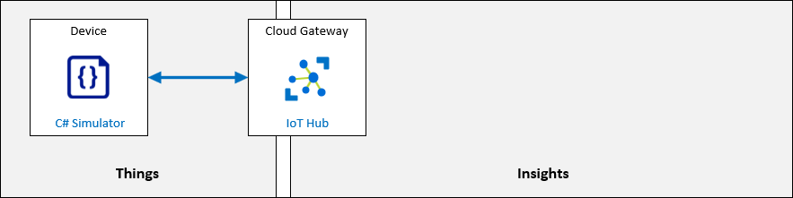


## Exercise 1: Create an Azure IoT Hub Device ID using the Azure portal

In this exercise, you will open your IoT Hub in the Azure portal, add a new IoT device to the device registry, and then get a copy of the Connection String that IoT Hub created for your device (which you will use in your device code later in the lab).

> **Note**: This lab focuses on using IoT Hub to establish reliable and secure bidirectional communications between IoT Hub and your IoT device. The Microsoft Learn platform includes other Modules (and Learning Paths) that enable you to explore other IoT Hub capabilities. Collectively, this training will help you to build scalable, full-featured IoT solutions.

### Task 1: Create the Device

In this task, you will create a device in the IoT Hub.

1. On the Azure portal, naviagate to Resource group and then select the resource group named **az220rg-<inject key="DeploymentID" enableCopy="false" />**.

   

1. On the resources tile, click on **iot-az220-training-<inject key="DeploymentID" enableCopy="false" />**

   

1. On the left-side menu of your IoT Hub blade, click on **Devices** under **Device management.**
   
   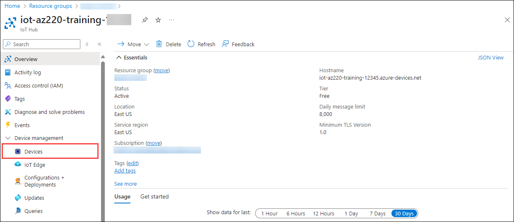

1. On the **Devices** pane, click on **+ Add Device**.

   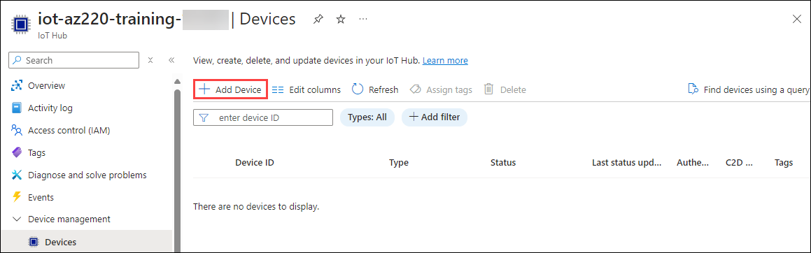

1. In the **Create a Device** page, enter the following details:

   - In the **Device ID** field, enter `sensor-th-0001` **(1)**.
   
   - Under **Authentication type**, ensure that **Symmetric key** **(2)** is selected.

   - Under **Auto-generate keys** **(3)**, ensure the checkbox is selected.

   - Under **Connect this device to an IoT hub**, ensure that **Enable** **(4)** is selected.

   - Under **Parent device**, leave **No parent device** **(5)** as the value.

   - To add this device record to the IoT Hub, click on **Save** **(6)**

     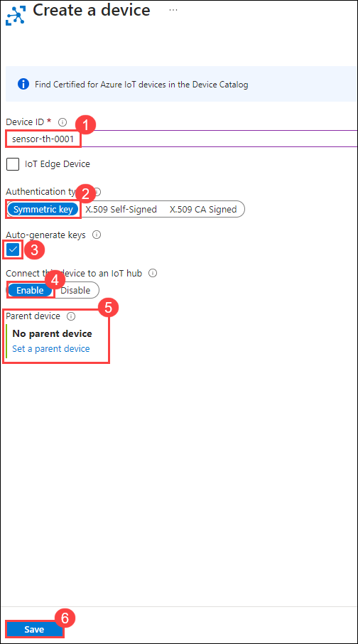

1. After a few moments, the **IoT devices** pane will refresh and the new device will be listed.

    > **TIP**: You may need to refresh manually - click the **Refresh** button on the page, rather than refreshing the browser

   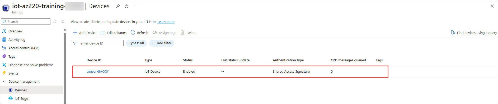

<validation step="3201069f-745a-4e51-aa22-bd5d492a066e" />

>**Congratulations** on completing the Task! Now, it's time to validate it. Here are the steps:

  > - Navigate to the Lab Validation tab, from the upper right corner in the lab guide section.
  > - Hit the Validate button for the corresponding task. If you receive a success message, you have successfully validated the lab. 
  > - If not, carefully read the error message and retry the step, following the instructions in the lab guide.
  > - If you need any assistance, please contact us at labs-support@spektrasystems.com.


### Task 2: Get the Device Connection String

In order for a device to connect to an IoT Hub, it needs to establish a connection. In this lab, you will use a connection string to connect your device directly to the IoT Hub (this for of authentication is often referred to as symmetric key authentication). When using Symmetric key authentication, there are two connection strings available - one that utilizes the Primary key, the other that uses the Secondary key. As noted above, the Primary and Secondary keys are only generated once the device record is saved. Therefore, to obtain one of the connection strings, you must first save the record (as you did in the task above) and then re-open the device record (which is what you are about to do).

In this task, you will get the device connection string from the Azure Portal.

1. On the **IoT devices** pane of your IoT Hub, under **Device ID**, click on **sensor-th-0001**.

    

1. Take a minute to review the contents of the **sensor-th-0001** device detail blade.

    In addition to the device properties, notice that the device detail blade provides access to a number of device related functions (such as Direct Method and Device Twin) along the top of the blade.

1. Notice that the key and connection string values are now populated.

    The values are obfuscated by default, but you can click the "eye" icon on the right of each field to toggle between showing and hiding the values.

1. To the right of the **Primary Connection String** field, click on **Copy** and paste it in a text editor such as notepad for later use.

    

    > **Note**: You will need to use the Primary Connection String value later in the lab, so you may want to save it to an accessible location (perhaps by pasting the value into a text editor such as Notepad).

    The connection string will be in the following format:

    ```text
    HostName={IoTHubName}.azure-devices.net;DeviceId=sensor-th-0001;SharedAccessKey={SharedAccessKey}
    ```

## Exercise 2: Create and Test a Simulated Device (C#)

The Azure IoT Device SDKs enable you to build apps that run on your IoT devices using the device client. Tools in the SDK will help you to establish secure connections as well as packaging messages and implementing communication with your IoT hub. The device SDK will also help you to receive messages, job, method, or device twin updates from your IoT hub.

In this exercise, you will create a simulated device application using Visual Studio Code and the Azure IoT Device SDKs. You will connect your device to Azure IoT Hub using the Device ID and Shared Access Key (Primary Connection String) that you created in the previous exercise. You will then test your secured device connection and communication to ensure that IoT Hub is receiving the simulated temperature and humidity values from your device as expected.

> **Note**: You will be writing your simulated device code using the C# programming language, but don't worry if you are more accustomed to another programming language or if your programming skills are a bit rusty, the instructions will be easy to follow. The important thing is for you to recognize how the IoT Device SDK is implemented in code (which is also explained in detail).

### Task 1: Create the initial project

In this task, you will be creating a initial dotnet project in your LabVM. For simulating telemetry data
 
1. Open **Visual Studio Code** editor from the desktop.

    

1. Select **Terminal(1)** and click on **New Terminal(2)** from the menu.

    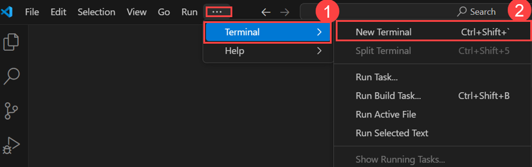

1. At the terminal, to create a directory named "CaveDevice" and change the current directory to that directory, enter the following commands after the last command hit enter.

    ```
    New-Item -Path "C:\CaveDevice" -ItemType "Directory"
    cd C:\CaveDevice
    ```

1. To create a new .NET console application, enter the following command:

    ```bash
    dotnet new console
    ```

    This command creates a **Program.cs** file in your folder, along with a project file.

1. To install the Azure IoT Device SDK and code libraries required for your simulated device app, enter the following commands:

    ```bash
    dotnet add package Microsoft.Azure.Devices.Client
    ```

    > **Note**: The **Microsoft.Azure.Devices.Client** package contains the Azure IoT Device SDK for .NET and has the **Newtonsoft.Json** package as a dependency. The **Newtonsoft.Json** package contains APIs that aid in the creation and manipulation of JSON.

    You will build and test your simulated device app in the next task.

1. To ensure all of the application dependencies are downloaded, enter the following command

    ```bash
    dotnet restore
    ```
    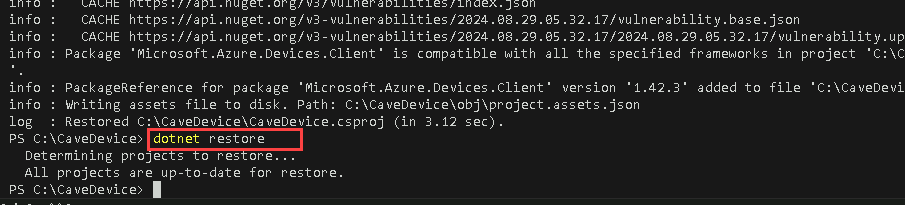

1. In Visual Studio Code, on the **Explorer** menu, click on **Open Folder**.

    

1. In the **Open Folder** dialog, navigate to the location (**C:\CaveDevice**) where you created the **CaveDevice** directory.

1. In the list of folders, click **CaveDevice**, and then click on **Select Folder**.

    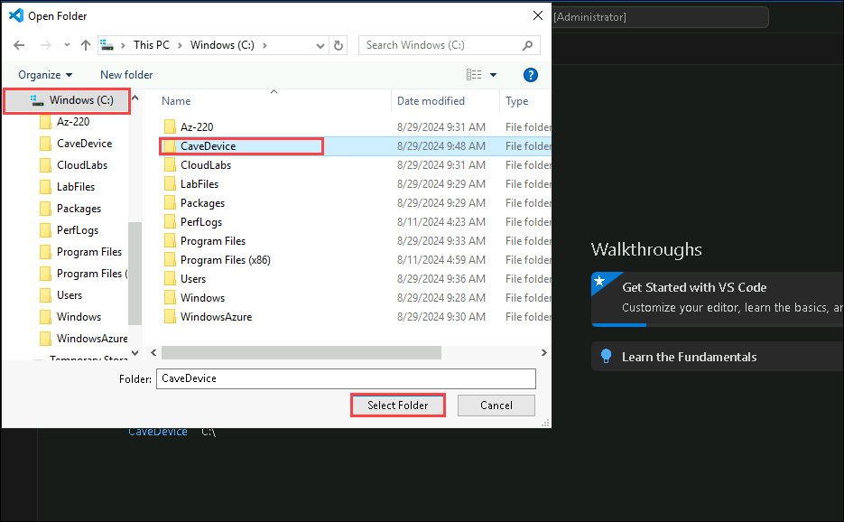

1. If the pop up appears click on **Yes, I trust the authors**.

    

    The EXPLORER pane of Visual Studio Code should now list two C# project files:

    * CaveDevice.csproj
    * Program.cs

      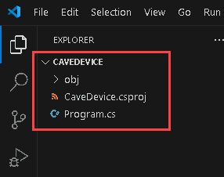

      > **Note**: If you see a message **Required assets to build and debug are missing from CaveDevice. Add them?**, you may click **Yes** to proceed.

### Task 2: Explore the application

In this task, you will be reviewing the starter files after creating a new console.

As noted above, the application currently consists of two files:

* CaveDevice.csproj
* Program.cs

In this task, you will use Visual Studio Code to review the contents and purpose of the two application files.

1. In the **EXPLORER** pane, to open the application project file, click on **CaveDevice.csproj**.

    The **CaveDevice.csproj** file should now be opened in the code editor pane.

1. Take a minute to review the contents of the **CaveDevice.csproj** file.

    Your file contents should be similar to the following:

    ```xml
    <Project Sdk="Microsoft.NET.Sdk">
        <PropertyGroup>
            <OutputType>Exe</OutputType>
            <TargetFramework>netcoreapp3.1</TargetFramework>
        </PropertyGroup>
        <ItemGroup>
            <PackageReference Include="Microsoft.Azure.Devices.Client" Version="1.*" />
        </ItemGroup>
    </Project>
    ```

    > **Note**: The package version numbers in your file may differ from those shown above, that's okay.

    The project file (.csproj) is an XML document that specifies the type of project that you are working on. In this case, the project is an **Sdk** style project.

    As you can see, the project definition contains two sections - a **PropertyGroup** and an **ItemGroup**.

    The **PropertyGroup** defines the type of output that building this project will produce. In this case you will be building an executable file that targets .NET Core 3.1.

    The **ItemGroup** specifies any external libraries that are required for the application. These particular references are for NuGet packages, and each package reference specifies the package name and the version. The **dotnet add package** commands (that you entered in the steps above) added these references to the project file and the **dotnet restore** command ensured that all of the dependencies were downloaded.

    > **Tip**: You can learn more about NuGet [here](https://docs.microsoft.com/en-us/nuget/what-is-nuget).

1. In the **EXPLORER** pane, click on **Program.cs**.

    The **Program.cs** file should now be opened in the code editor pane.

1. Take a minute to review the contents of the **Program.cs** file.

    Your file contents should be similar to the following:

    ```csharp
     Console.WriteLine("Hello, World!");
    ```

    This program simply writes "Hello World!" to the command line window. Even though there isn't much code here, there are still some things worth noting:

1. On the Visual Studio Code, click on **Terminal** and select **New Terminal**.

    

    This will open the integrated Terminal at the bottom of the Visual Studio Code window. You will be using the Terminal window to compile and run your console application.

1. In the Terminal pane, ensure that the current directory path is set to the **CaveDevice** folder.

    

    The Terminal command prompt includes the current directory path. The commands that you enter are run at the current location, so be sure that you are located in the **CaveDevice** folder.

1. To build and run the **CaveDevice** project, enter the following command:

    ```cmd/sh
    dotnet run
    ```

1. Notice that **Hello World!** is displayed.

    

    After a moment, you should see **Hello World!** displayed on the line directly below the **dotnet run** command that you entered.

    You will be using the same **Console.WriteLine** approach in your simulated device application to display information locally, which will help you see the information being sent to IoT Hub and keep track of processes that are being completed by your device.

    Although this Hello World app demonstrates some basic concepts, it is clearly not a simulated device. In the next task you will replace this code with the code for your simulated device.

### Task 3: Implement the simulated device code

In this task, you will use Visual Studio Code to enter the code that leverages the Azure IoT Device SDK to connect to your IoT Hub resource.

1. In the **EXPLORER** pane, click on **Program.cs**.

1. Select all of the existing code, and then delete it.

    > **Important**: In the next step, you will begin the process ob building your simulated device code. If you are intending to paste the code into a learning environment such as LODS, there are a few things to be aware of:
    >
    > * The **Type text -> Type clipboard text** buffer is limited, so it may truncate the code that is copied - double check your work and add any missing characters.
    > * As the **Type clipboard text** simulates typing, the default settings in Visual Studio Code will automatically indent code and insert closing braces - **)**, **}** and **]** - resulting in duplicate characters and incorrect indentation. These actions can be turned off in Visual Studio code settings (**File -> Preferences -> Settings**) with the following settings:
    >    * **Editor: Auto Closing Brackets** - set to **never**
    >    * **Editor: Auto Indent** - set to **none**
    > * The source can be reformatted at any time by using **F1** and entering **Format Document** or by pressing **SHIFT + ALT + F**

1. In the code editor pane, to create the basic structure of your simulated device application, enter the following code:

    ```csharp
    // INSERT using statements below here

    namespace CaveDevice
    {
        class Program
        {
            // INSERT variables below here
            // INSERT Main method below here
            // INSERT SendDeviceToCloudMessagesAsync method below here
            // INSERT CreateMessageString method below here
        }
        // INSERT EnvironmentSensor class below here
    }
    ```

    > **Note:** As you can see, the namespace and the class have been retained, however, the other items are placeholder comments. In the following steps you will be inserting code into the file below specific comments.

    > **Tip**: To reformat the pasted text in Visual Studio Code, press **SHIFT + ALT + F**, or press **F1** to open the command palette and search for **Format Document**.

1. Locate the **// INSERT using statements below here** comment, and then position the cursor on a blank line below the comment.

1. To specify the namespaces that the application code will be using, enter the following code:

    ```csharp
    using System;
    using System.Text;
    using System.Threading.Tasks;
    using Microsoft.Azure.Devices.Client;
    using Newtonsoft.Json;
    ```

    Notice that as well as specifying **System**, you are also declaring other namespaces that the code will be using, such as **System.Text** for encoding strings, **System.Threading.Tasks** for asynchronous tasks, and the namespaces for the two packages you added earlier.

    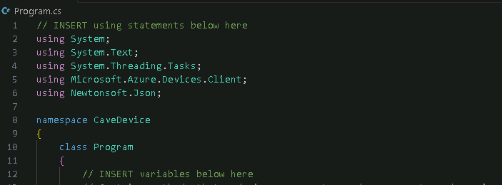

    > **Tip**: When inserting code, the code layout may not be ideal. You can have Visual Studio Code format the document for you by right-clicking in the code editor pane and then clicking **Format Document**. You can achieve the same result by opening the **Task** pane (press **F1**) and typing **Format Document** and then pressing **Enter**. And on Windows, the shortcut for this task is **SHIFT+ALT+F**.

1. Locate the **// INSERT variables below here** comment, and then position the cursor on a blank line below the comment.

1. To specify the variables that the program is using, enter the following code:

    ```csharp
    // Contains methods that a device can use to send messages to and receive from an IoT Hub.
    private static DeviceClient deviceClient;
    // The device connection string to authenticate the device with your IoT hub.
    // Note: in real-world applications you would not "hard-code" the connection string
    // It could be stored within an environment variable, passed in via the command-line or
    // stored securely within a TPM module.
    private readonly static string connectionString = "{Your device connection string here}";
    ```

1. Take a moment to review the code (and code comments) that you just entered.

    The **deviceClient** variable is used to store an instance of **DeviceClient** - this class comes from the Azure IoT Device SDK and contains methods that a device can use to send messages to and receive from an IoT Hub.

    The **connectionString** variable will contain the connection string for the device we created earlier. This value is used by the **DeviceClient** to connect to the IoT Hub. You will specify the connectionString value in the next step.

    > **Important**: You will see examples in this and other IoT labs on MS Learn where connection strings, passwords and other configuration information is hard-coded into the application. This is done solely to simplify the labs and **is not** a recommended practice. As much as possible, security issues like this will be addressed as they come up.

    As noted within the code comments, connection strings and similar configuration values should be supplied via alternative means such as environment variables, command-line parameters or, better still, stored in secured hardware such as Trusted Platform Modules (TPM).

1. In the code that you just entered, update the value for **connectionString** using the Primary Connection String that you copied from IoT Hub.

    Once updated, the **connectionString** variable line should be similar to the following:

    ```csharp
    private readonly static string connectionString = "HostName=iot-az220-training-dm200420.azure-devices.net;DeviceId=sensor-th-0001;SharedAccessKey=hfavUmFgoCPA9feWjyfTx23SUHr+dqG9X193ctdEd90=";
    ```

    

1. Locate the **// INSERT Main method below here** comment, and then position the cursor on a blank line below the comment.

1. To construct the **Main** method of your simulated device application, enter the following code:

    ```csharp
    private static void Main(string[] args)
    {
        Console.WriteLine("IoT Hub C# Simulated Cave Device. Ctrl-C to exit.\n");
        // Connect to the IoT hub using the MQTT protocol
        deviceClient = DeviceClient.CreateFromConnectionString(connectionString, TransportType.Mqtt);
        SendDeviceToCloudMessagesAsync();
        Console.ReadLine();
    }
    ```

    The **Main** method is the first part of your application that runs once your app is started.

1. Take a minute to review the code (and code comments) that you just entered.

    The basic structure of a simple device app is as follows:

    * Connect to the IoT Hub
    * Send telemetry to the app (Device to Cloud messages)

    Notice that the **deviceClient** variable is initialized with the result of the **DeviceClient** static method, **CreateFromConnectionString**. This method uses the connection string you specified earlier, as well as selecting the protocol that the device will use to the send telemetry -  in this case MQTT.

    > **Note**: In a production application, the **CreateFromConnectionString** method call would be wrapped in exception handling code to gracefully deal with any connection issues. This and other lab code is kept as simple as possible to highlight the key points, so most error-handling is omitted for brevity.

    Once connected, the **SendDeviceToCloudMessagesAsync** method is called. You may notice that the method name is underlined with "red squiggles" - this is because Visual Studio Code has noticed that **SendDeviceToCloudMessagesAsync** is not yet implemented. We will add the method shortly.

    Finally, the application waits for user input.

    > **Information**: The **DeviceClient** class is documented [here](https://docs.microsoft.com/en-us/dotnet/api/microsoft.azure.devices.client.deviceclient?view=azure-dotnet).
    >
    > **Information**: The **CreateFromConnectionString** method is documented [here](https://docs.microsoft.com/en-us/dotnet/api/microsoft.azure.devices.client.deviceclient.createfromconnectionstring?view=azure-dotnet#Microsoft_Azure_Devices_Client_DeviceClient_CreateFromConnectionString_System_String_Microsoft_Azure_Devices_Client_TransportType_).
    >
    > **Information**: The supported transport protocols are documented [here](https://docs.microsoft.com/en-us/azure/iot-hub/iot-hub-devguide-protocols).

1. Locate the **// INSERT - SendDeviceToCloudMessagesAsync below here** comment, and then position the cursor on a blank line below the comment.

1. To construct the **SendDeviceToCloudMessagesAsync** method, enter the following code:

    ```csharp
    private static async void SendDeviceToCloudMessagesAsync()
    {
        // Create an instance of our sensor
        var sensor = new EnvironmentSensor();
        while (true)
        {
            // read data from the sensor
            var currentTemperature = sensor.ReadTemperature();
            var currentHumidity = sensor.ReadHumidity();
            var messageString = CreateMessageString(currentTemperature, currentHumidity);
            // create a byte array from the message string using ASCII encoding
            var message = new Message(Encoding.ASCII.GetBytes(messageString));
            // Add a custom application property to the message.
            // An IoT hub can filter on these properties without access to the message body.
            message.Properties.Add("temperatureAlert", (currentTemperature > 30) ? "true" : "false");
            // Send the telemetry message
            await deviceClient.SendEventAsync(message);
            Console.WriteLine("{0} > Sending message: {1}", DateTime.Now, messageString);
            await Task.Delay(1000);
        }
    }
    ```

    Notice that the declaration for the **SendDeviceToCloudMessagesAsync** method includes the keyword **async**. This specifies that the method contains asynchronous code that uses the **await** keyword and instructs the compiler to handle the callback plumbing for you.

1. Take a minute to review the code (and code comments) that you just entered.

    This method implements a typical message loop:

    * Read from one or more sensors
    * Create a message to send
    * Send the message
    * Wait for some time, or for an event to occur, etc.
    * Repeat the loop

    The following description explains the method code in more detail:

    * The first thing that your code does is create an instance of the **EnvironmentSensor** class. This is done outside the loop and is used to support simulating the sensor data inside the loop. You will add the **EnvironmentSensor** class shortly.

    * You then start an infinite loop - **while(true) {}** will repeat until the user hits **CTRL+C**.

    * Within the loop, the first thing you do is read the temperature and humidity from your sensor and use those values to create a message string - you will add the code for **CreateMessageString** in a moment as well.

    * Then you create the actual **message** that will be sent to IoT Hub. You do this by creating an instance of the **Message** class from the Azure IoT Device SDK - the data structure that represents the message that is used for interacting with Iot Hub (IoT Hub expects a specific message format). The constructor that you use for the **Message** class requires that the message string be encoded as a byte array.

    * Next, you augment the message with additional properties - here, for example, you set the **temperatureAlert** property to true if the **currentTemperature** is greater than 30, otherwise false.

    * You then send the telemetry message via the **await deviceClient.SendEventAsync(message);** call. Note that this line contains an **await** keyword. This instructs the compiler that the following code is asynchronous and will complete some time in the future - when it does complete, this method will continue executing on the next line.

    * Finally, you write the message string to the local console window to show that telemetry has been sent to IoT Hub, and then wait for 1000 milliseconds (1 second) before repeating the loop.

    > **Information**: You can learn more about **async**, **await** and asynchronous programming in C# [here](https://docs.microsoft.com/en-us/dotnet/csharp/async).

    > **Information**: The **Message** class is documented [here](https://docs.microsoft.com/en-us/dotnet/api/microsoft.azure.devices.client.message?view=azure-dotnet)

1. Locate the **// INSERT CreateMessageString method below here** comment, and then position the cursor on a blank line below the comment.

1. To construct the **CreateMessageString** method that creates a JSON string from the sensor readings, enter the following code:

    ```csharp
    private static string CreateMessageString(double temperature, double humidity)
    {
        // Create an anonymous object that matches the data structure we wish to send
        var telemetryDataPoint = new
        {
            temperature = temperature,
            humidity = humidity
        };
        // Create a JSON string from the anonymous object
        return JsonConvert.SerializeObject(telemetryDataPoint);
    }
    ```

    This method creates an anonymous object with the temperature and humidity properties and assigns it to **telemetryDataPoint**.

    The value of **telemetryDataPoint** is then converted to a JSON string via the **JsonConvert** class that is part of the **Newtonsoft.Json** package you added earlier. The JSON string value is then returned to be used as the payload in the message.

1. Locate the **// INSERT EnvironmentSensor class below here** comment, and then position the cursor on a blank line below the comment.

1. To construct the **EnvironmentSensor** class, enter the following code:

    ```csharp
    /// <summary>
    /// This class represents a sensor
    /// real-world sensors would contain code to initialize
    /// the device or devices and maintain internal state
    /// a real-world example can be found here: https://bit.ly/IoT-BME280
    /// </summary>
    internal class EnvironmentSensor
    {
        // Initial telemetry values
        double minTemperature = 20;
        double minHumidity = 60;
        Random rand = new Random();
        internal EnvironmentSensor()
        {
            // device initialization could occur here
        }
        internal double ReadTemperature()
        {
            return minTemperature + rand.NextDouble() * 15;
        }
        internal double ReadHumidity()
        {
            return minHumidity + rand.NextDouble() * 20;
        }
    }
    ```

    This is a very simple class that uses random numbers to return values that represent temperature and humidity. In reality, it is often much more complex to interact with sensors, especially if you have to communicate with them at a low-level and derive the measurement value (rather than getting a direct reading in the appropriate units).

    > **Information**: You can view a more representative example of the code that interacts with a simple temperature, humidity and pressure sensor [here](https://bit.ly/IoT-BME280).

1. Final code should look like this. Make sure you replace the `<Connection_String>` with the connection string you copied earlier.

    ```csharp
     using System;
     using System.Text;
     using System.Threading.Tasks;
     using Microsoft.Azure.Devices.Client;
     using Newtonsoft.Json;

     namespace CaveDevice
     {
         class Program
         {
             // Contains methods that a device can use to send messages to and receive from an IoT Hub.
             private static DeviceClient deviceClient;

             // The device connection string to authenticate the device with your IoT hub.
             // Note: in real-world applications you would not "hard-code" the connection string
             // It could be stored within an environment variable, passed in via the command-line or
             // stored securely within a TPM module.
             private readonly static string connectionString = "<Con_STR>";

             private static void Main(string[] args)
             {
                 Console.WriteLine("IoT Hub C# Simulated Cave Device. Ctrl-C to exit.\n");

                 // Connect to the IoT hub using the MQTT protocol
                 deviceClient = DeviceClient.CreateFromConnectionString(connectionString, TransportType.Mqtt);
                 SendDeviceToCloudMessagesAsync();
                 Console.ReadLine();
             }

             private static async void SendDeviceToCloudMessagesAsync()
             {
                 // Create an instance of our sensor
                 var sensor = new EnvironmentSensor();

                 while (true)
                 {
                     // read data from the sensor
                     var currentTemperature = sensor.ReadTemperature();
                     var currentHumidity = sensor.ReadHumidity();

                     var messageString = CreateMessageString(currentTemperature, currentHumidity);

                     // create a byte array from the message string using ASCII encoding
                     var message = new Message(Encoding.ASCII.GetBytes(messageString));

                     // Add a custom application property to the message.
                     // An IoT hub can filter on these properties without access to the message body.
                     message.Properties.Add("temperatureAlert", (currentTemperature > 30) ? "true" : "false");

                     // Send the telemetry message
                     await deviceClient.SendEventAsync(message);
                     Console.WriteLine("{0} > Sending message: {1}", DateTime.Now, messageString);

                     await Task.Delay(1000);
                 }
             }

             private static string CreateMessageString(double temperature, double humidity)
             {
                 // Create an anonymous object that matches the data structure we wish to send
                 var telemetryDataPoint = new
                 {
                     temperature = temperature,
                     humidity = humidity
                 };

                 // Create a JSON string from the anonymous object
                 return JsonConvert.SerializeObject(telemetryDataPoint);
             }

         }

         /// <summary>
     /// This class represents a sensor
     /// real-world sensors would contain code to initialize
     /// the device or devices and maintain internal state
     /// a real-world example can be found here: https://bit.ly/IoT-BME280
     /// </summary>
     internal class EnvironmentSensor
         {
             // Initial telemetry values
             double minTemperature = 20;
             double minHumidity = 60;
             Random rand = new Random();

             internal EnvironmentSensor()
             {
                 // device initialization could occur here
             }

             internal double ReadTemperature()
             {
                 return minTemperature + rand.NextDouble() * 15;
             }

             internal double ReadHumidity()
             {
                 return minHumidity + rand.NextDouble() * 20;
             }
         }

     }

    ```

1. On the **File** menu, click on **Save**.

1. Take a minute to scan through your completed application.

    Your completed application represents a simple simulated device. It demonstrates how to connect a device to an IoT Hub and send Device to Cloud messages.

    You are now ready to test the application

### Task 4: Test the application

In this task, you will be testing the application that you have built in the previous tasks.

1. In the Visual Studio Code Explorer pane, on the **Terminal** menu, click on **New Terminal**.

    

1. In the Terminal view, at the command prompt, enter the following command:

    ```cmd/sh
    dotnet run
    ```

    This command will build and run the Simulated Device application. Be sure the terminal location is set to the directory with the `CaveDevice.cs` file.

    > **Note**:  If the command outputs a **Malformed Token** or other error message, then make sure the **Primary Connection String** value is configured correctly as the value of the **connectionString** variable.

1. Observe the message string output displayed in the Terminal.

    Once the Simulated Device application is running, it will be sending event messages to the Azure IoT Hub that include **temperature** and **humidity** values, and displaying message string output in the console.

    The terminal output will look similar to the following:

    ```text
    IoT Hub C# Simulated Cave Device. Ctrl-C to exit.

    10/25/2019 6:10:12 PM > Sending message: {"temperature":27.714212817472504,"humidity":63.88147743599558}
    10/25/2019 6:10:13 PM > Sending message: {"temperature":20.017463779085066,"humidity":64.53511070671263}
    10/25/2019 6:10:14 PM > Sending message: {"temperature":20.723927165718717,"humidity":74.07808918230147}
    10/25/2019 6:10:15 PM > Sending message: {"temperature":20.48506045736608,"humidity":71.47250854944461}
    10/25/2019 6:10:16 PM > Sending message: {"temperature":25.027703996760632,"humidity":69.21247714628115}
    10/25/2019 6:10:17 PM > Sending message: {"temperature":29.867399432634656,"humidity":78.19206098010395}
    10/25/2019 6:10:18 PM > Sending message: {"temperature":33.29597232085465,"humidity":62.8990878830194}
    10/25/2019 6:10:19 PM > Sending message: {"temperature":25.77350195766124,"humidity":67.27347029711747}
    ```

    > **Note**: Leave the simulated device app running for now. Your next task will be to verify that your IoT Hub is receiving the telemetry messages.

    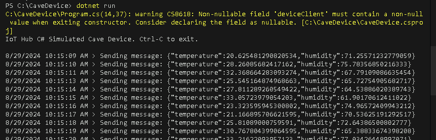

### Task 5: Verify Telemetry Stream sent to Azure IoT Hub

In this task, you will use the Azure CLI to verify telemetry sent by the simulated device is being received by Azure IoT Hub.

1. In the Azure portal, Click on the **Cloudshell** icon to open Cloudshell.

    

1. When the **Welcome to Azure Cloud Shell** message is displayed, select **Bash**.

    

1. Select **No Storage Azzount Required** and  Under **Subscription**, ensure the correct subscription is selected. Click on **Apply**

    

1. Run the following Azure CLI command. Make sure to replace `{IoTHubName}` with the actual name which looks similar to **iot-az220-training-<inject key="DeploymentID" enableCopy="false" />**.

   
    ```cmd/sh
    az iot hub monitor-events --hub-name {IoTHubName} --device-id sensor-th-0001
    ```
    
    > **Note**: If prompted **Do you want to install it now? The command will continue to run after the extension is installed. (Y/n): Y**.
    
    > **Note**: **Dependency update (uamqp 1.2) required for IoT extension version: 0.24.0 
Continue? (y/n) -> y**
    
    You should see messages displayed that are similar to the following:

    ```cmd/sh
     Starting event monitor, filtering on device: sensor-th-0001, use ctrl-c to stop...
     {
         "event": {
             "origin": "sensor-th-0001",
             "payload": "{\"temperature\":25.058683971901743,\"humidity\":67.54816981383979}"
         }
     }
     {
         "event": {
             "origin": "sensor-th-0001",
             "payload": "{\"temperature\":29.202181296051563,\"humidity\":69.13840303623043}"
         }
     }
     ```

1. Once you have verified that IoT hub is receiving the telemetry, press **Ctrl-C** in the Azure Cloud Shell and Visual Studio Code windows.

    Ctrl-C is used to stop the running apps. Always remember to shut down unneeded apps and jobs.

## Summary 

In this exercise, you have created a simulator using c# to simulate telemetry data and send to IoT Hub and verified it.

### You have successfully completed the lab !!


