# Lab 04: Device Message Routing

### Estimated Duration: 120 minutes

## Overview

In this lab, you will begin by ensuring that your Azure subscription includes the required resources for this lab. You will then create a simulated device that sends vibration telemetry to your IoT hub. With your simulated data arriving at IoT hub, you will implement an IoT hub message route and Azure Stream Analytics job that can be used to process device messages (in both cases data will be delivered to a Blob storage container that is used to verify successful implementation).

## Lab Scenario

Contoso Management is impressed with your implementation of automatic device enrollment using DPS. They are now interested in having you develop an IoT-based solution related to product packaging and shipping.

The cost associated with packaging and shipping cheese is significant. To maximize cost efficiency, Contoso operates an on-premises packaging facility. The workflow is straightforward - cheese is cut and packaged, packages are assembled into shipping containers, containers are delivered to specific bins associated with their destination. A conveyor belt system is used to move the product through this process. The metric for success is the number of packages leaving the conveyor belt system during a given time period (typically a work shift).

The conveyor belt system is a critical link in this process and is visually monitored to ensure that the workflow is progressing at maximum efficiency. The system has three operator controlled speeds: stopped, slow, and fast. Naturally, the number of packages being delivered at the low speed is less than at the higher speed. However, there are a number of other factors to consider:

* The vibration level of the conveyor belt system is much lower at the slow speed
* High vibration levels can cause packages to fall from the conveyor
* High vibration levels are known to accelerate wear-and-tear of the system
* When vibration levels exceed a threshold limit, the conveyor belt must be stopped to allow for inspection (to avoid more serious failures)


## Lab Objectives
 
 - Exercise 1: Write Code to generate Vibration Telemetry
 - Exercise 2: Create a Message Route to Azure Blob Storage
 - Exercise 3: Create an Azure Stream Analytics Job

The following resources will be created:

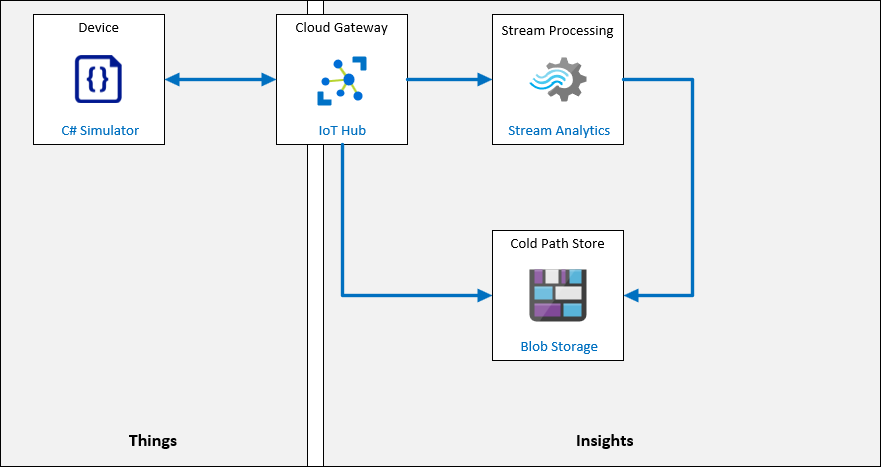

## Exercise 1: Write Code to generate Vibration Telemetry

Both long term and real-time data analysis are required to automate the monitoring of Contoso's conveyor belt system and enable predictive maintenance. Since no historical data exists, your first step will be to generate simulated data that mimics vibration data and data anomalies in a realistic manner. Contoso engineers have developed an algorithm to simulate vibration over time and embedded the algorithm within a code class that you will implement. The engineers have agreed to support any future updates required to adjust the algorithms.

During your initial prototype phase, you will implement a single IoT device that generates telemetry data. In addition to the vibration data, your device will create some additional values (packages delivered, ambient temperature, and similar metrics) that will be sent to Blob storage. This additional data simulates the data that will be used to develop machine learning modules for predictive maintenance.

In this exercise, you will:

* Open the simulated device project
* Update the connection string for your simulated device and review the project code
* Test your simulated device connection and telemetry communications
* Ensure that telemetry is arriving at your IoT hub

### Task 1: Open your simulated device project

In this task, you will be opening the Simulated device project using visual studio code.

1. In the virtual machine environment, open **Visual Studio Code** from the Desktop.

   

1. In Visual Studio Code, on the **File** menu, click on **Open Folder**.

   

1. In the **Open Folder** dialog, navigate to `C:\LabFiles\az-220\MSLearnLabs-AZ-220-Microsoft-Azure-IoT-Developer-stage-rowancollege\Allfiles\Labs\07-Device Message Routing\Starter\VibrationDevice` and click on **Select folder.**

   

1. If the pop up appears click on **Yes, I trust the authors**.

   

    You should see the following files listed in the EXPLORER pane of Visual Studio Code:

    * Program.cs
    * VibrationDevice.csproj

1. In the **EXPLORER** pane, click **Program.cs(1)**.

1. On the **Terminal(2)** menu, click **New Terminal(3)**.

   

1. At the terminal command prompt, to verify that the application builds without errors, enter the following command:

    ```cmd
    dotnet build
    ```

    The output will be similar to:

    ```text
    ❯ dotnet build
    Microsoft (R) Build Engine version 16.5.0+d4cbfca49 for .NET Core
    Copyright (C) Microsoft Corporation. All rights reserved.

    Restore completed in 39.27 ms for D:\Az220-Code\AllFiles\Labs\07-Device Message Routing\Starter\VibrationDevice\VibrationDevice.csproj.
    VibrationDevice -> D:\Az220-Code\AllFiles\Labs\07-Device Message Routing\Starter\VibrationDevice\bin\Debug\netcoreapp3.1\VibrationDevice.dll

    Build succeeded.
        0 Warning(s)
        0 Error(s)

    Time Elapsed 00:00:01.16
    ```

In the next task, you will configure the connection string and review the application.

### Task 2: Configure connection and review code

In this task, you will be reviewing your code and also configure it with connection string.

The simulated device app that you will build in this task simulates an IoT device that is monitoring the conveyor belt. The app will simulate sensor readings and report vibration sensor data every two seconds.

1. On your Resources tile of your resource group, click on **iot-az220-training-<inject key="DeploymentID" enableCopy="false" />**.

   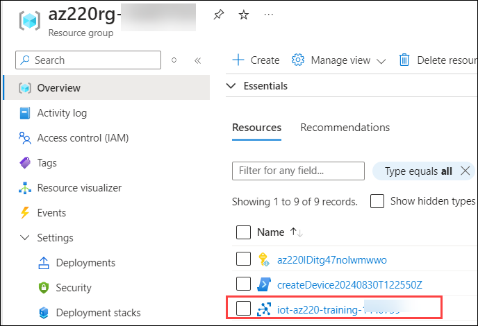

1. On the IoT hub blade, under **Device management**, click on **Devices(1)** and then click on **+ Add Device(2)**.

   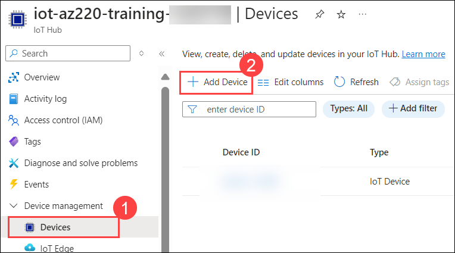

1. On the Create a device page, under **Device ID**, enter **sensor-v-3000**. click **Save**.

   

1. On the Devices page, under **Device ID**, click on **sensor-v-3000**.

1. On the sensor-v-3000 page, to the right of the **Primary Connection String** value, click **Copy**.

   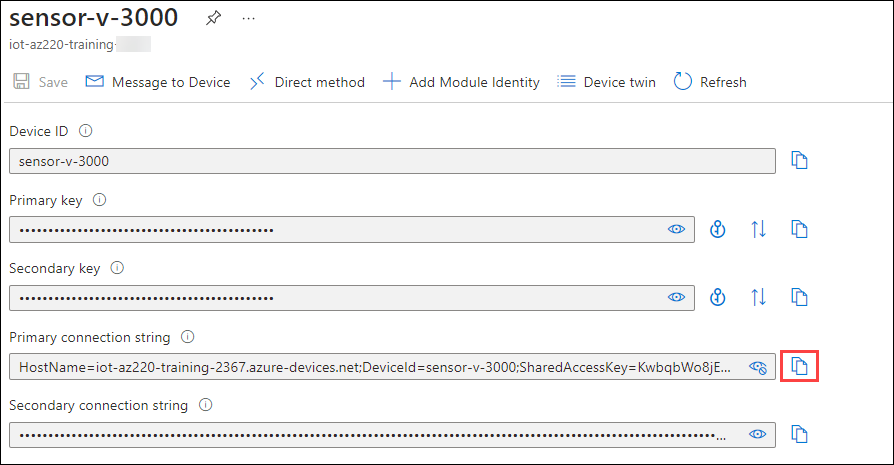

1. Save the copied device connection string value to Notepad for later use.

1. Navigate back to your IoT hub blade.

1. On the left side menu, under **Security settings**, click on **Shared access policies(1)** and then select **iothubowner(2)**.

   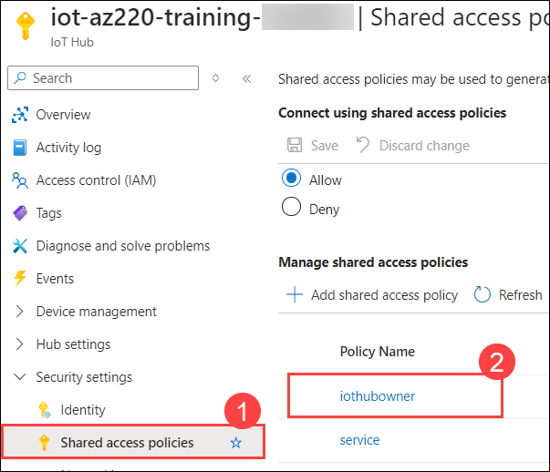

1. Notice that the IoT hub **Primary connection string** is listed. Copy the IoT hub **Primary connection string** value and save it to Notepad.

   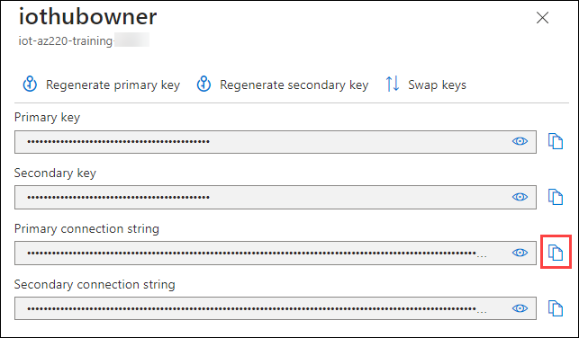

1. Ensure that you have the **Program.cs** file opened in Visual Studio Code.

1. Near the top of the **Program** class, locate the declaration of the **deviceConnectionString** variable:

    ```csharp
    private readonly static string deviceConnectionString = "<your device connection string>";
    ```

1. Replace the **your device connection string** placeholder, including the angle brackets, with the Primary Connection String of the Device ID that you copied earlier.

   

    > **Note**: This is the only change that you are required to make to this code.

1. On the **File** menu, click **Save**.

    The updated device connection string must be saved before running the code. 

### Task 3: Test your code to send telemetry

In this task, you well verify if your code is working or not by running it.

1. At the Terminal command prompt, to run the app, enter the following command:

    ```bash
    dotnet run
    ```

   This command will run the **Program.cs** file in the current folder.

1. Console output should be displayed that is similar to the following:

    ```text
    Vibration sensor device app.

    Telemetry data: {"vibration":0.0}
    Telemetry sent 10:29 AM
    Log data: {"vibration":0.0,"packages":0,"speed":"stopped","temp":60.22}
    Log data sent

    Telemetry data: {"vibration":0.0}
    Telemetry sent 10:29 AM
    Log data: {"vibration":0.0,"packages":0,"speed":"stopped","temp":59.78}
    Log data sent
    ```

    > **Note**:  In the Terminal window, green text is used to show things are working as they should and red text when bad stuff is happening. If you receive error messages, start by checking your device connection string.

1. Leave this app running for the next task.

    If you won't be continuing to the next task, you can enter **Ctrl-C** in the Terminal window to stop the app. You can start it again later by using the **dotnet run** command.

### Task 4: Verify the IoT Hub is Receiving Telemetry

In this task, you will use the Azure portal to verify that your IoT Hub is receiving telemetry.

1. On your Resources tile of your resource group, click **iot-az220-training-<inject key="DeploymentID" enableCopy="false" />**.

   

1. On the **Overview** pane, scroll down to view the metrics tiles.

   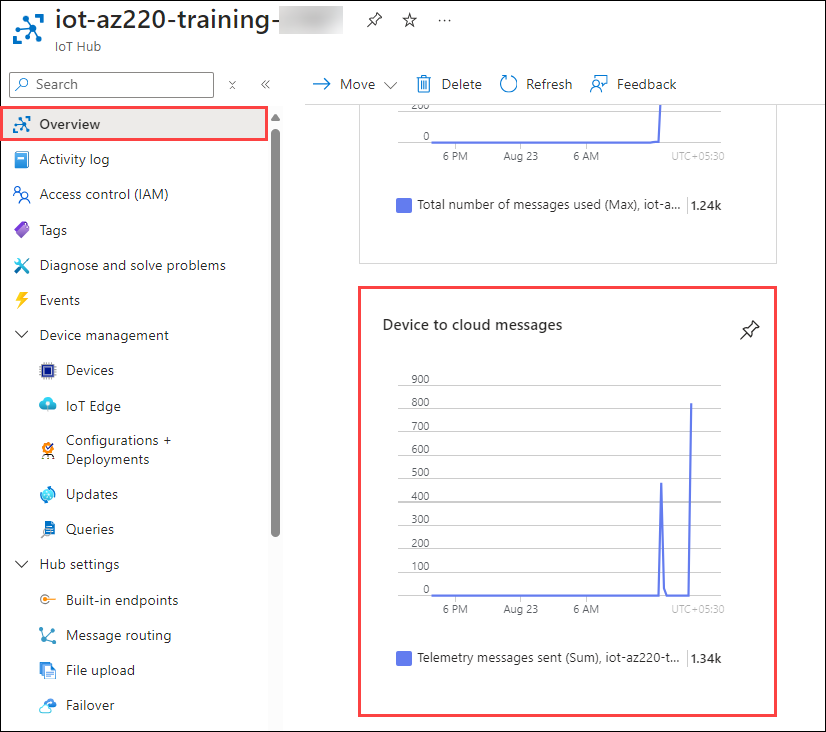

    The **Device to cloud messages** tile should be plotting some current activity. If no activity is shown, wait a short while, as there's some latency.

    With your device sending telemetry, and your hub receiving it, the next step is to route the messages to their correct endpoints.

<validation step="bd650436-fe95-498d-8865-1fdc920015e0" />

>**Congratulations** on completing the Task! Now, it's time to validate it. Here are the steps:

  > - Hit the Validate button for the corresponding task. If you receive a success message, you have successfully validated the lab. 
  > - If not, carefully read the error message and retry the step, following the instructions in the lab guide.
  > - If you need any assistance, please contact us at labs-support@spektrasystems.com.

## Exercise 2: Create a Message Route to Azure Blob Storage

IoT solutions often require that incoming message data be sent to multiple endpoint locations, either dependent upon the type of data or for business reasons. Azure IoT hub provides the _message routing_ feature to enable you to direct incoming data to locations required by your solution.

The architecture of our system requires data be processed in two ways: routed to a storage location for archiving data, streamed in real-time for immediate analysis.

Contoso's vibration monitoring scenario requires you to create the following message processes:

* the first process is an IoT hub route that delivers message data to an Azure Blob storage location for data archiving
* the second process is an Azure Stream Analytics job for real-time analysis


One of the easiest ways to filter data is to evaluate a message property. The code in your simulated device app configures the device-to-cloud messages as follows:

```csharp
...
telemetryMessage.Properties.Add("sensorID", "VSTel");
...
loggingMessage.Properties.Add("sensorID", "VSLog");
```

With the messaged tagged in this way, you can embed a SQL query within your IoT hub message route that uses the **sensorID** property as a criteria for choosing the messages that are processed by the route. In this case, when the value assigned to **sensorID** is **VSLog** (vibration sensor log), the message is intended for the storage archive (logging).

In this exercise, you will create and test the logging route.

### Task 1: Define the message routing endpoint

In this task, you will creating a routes using the message routing tab in the Azure IoT Hub.

1. In the Azure portal window, ensure that your IoT hub blade is open.

1. On the left-hand menu, under **Hub settings**, click **Message routing**. Ensure that the **Routes** tab is selected.

    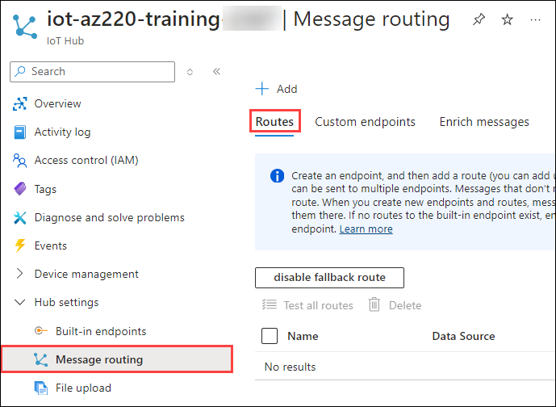

1. To add a new route, click **+ Add**.

    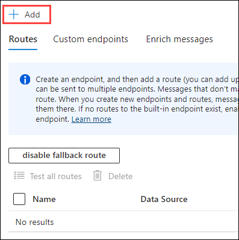

1. On the **Add a route** blade,

    - Endpoint type: Select **Storage(1)** from the drop down.
    - Endpoint name: **vibrationLoggingRoute(2)** 
    - To display a list of Storage accounts associated with your subscription, click on **Pick a container(3)** under Azure Storage Container.

    

    A list of the storage accounts already present in the Azure Subscription is listed. At this point you could select an existing storage account and container, however, for this lab you will create a new one.

1. To begin creating a storage account, click **+ Storage account**.

    The **Create storage account** blade should now be displayed.

1. On the **Create storage account** blade, provide the following details and then click on **OK** **(3)**.

    - Name: Enter **vibrationstore<inject key="DeploymentID" enableCopy="false" /> (1)**
    - Account kind: **StorageV2 (general purpose v2) (2)**
    - Performance: Ensure that **Standard** is selected.
      
    

1. Wait until the request is validated and the storage account deployment has completed.

    Validation and creation can take a minute or two.

    Once completed, the **Create storage account** blade will close and the **Storage accounts** blade will be displayed if it did not appear refresh the page it will appear. The Storage accounts blade should have auto-updated to show the storage account that was just created.

### Task 2: Define the storage account container

In thi stask, you will create a storage account and a container for route.

1. On the **Storage accounts** blade, click **vibrationstore<inject key="DeploymentID" enableCopy="false" />**.

    

    The **Containers** blade should appear. Since this is a new storage account, there are no containers listed.

1. To create a container, click **+ Container**.
   
    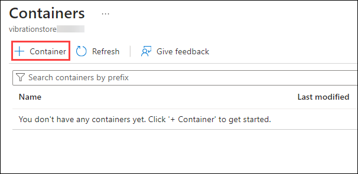

    The **New container** dialog should now be displayed.

1. On the **New container** dialog, under **Name** enter **vibrationcontainer** and then click on **Create** to create the Container.

    
 
1. To choose this container for your solution, click **vibrationcontainer**, and then click **Select**.

    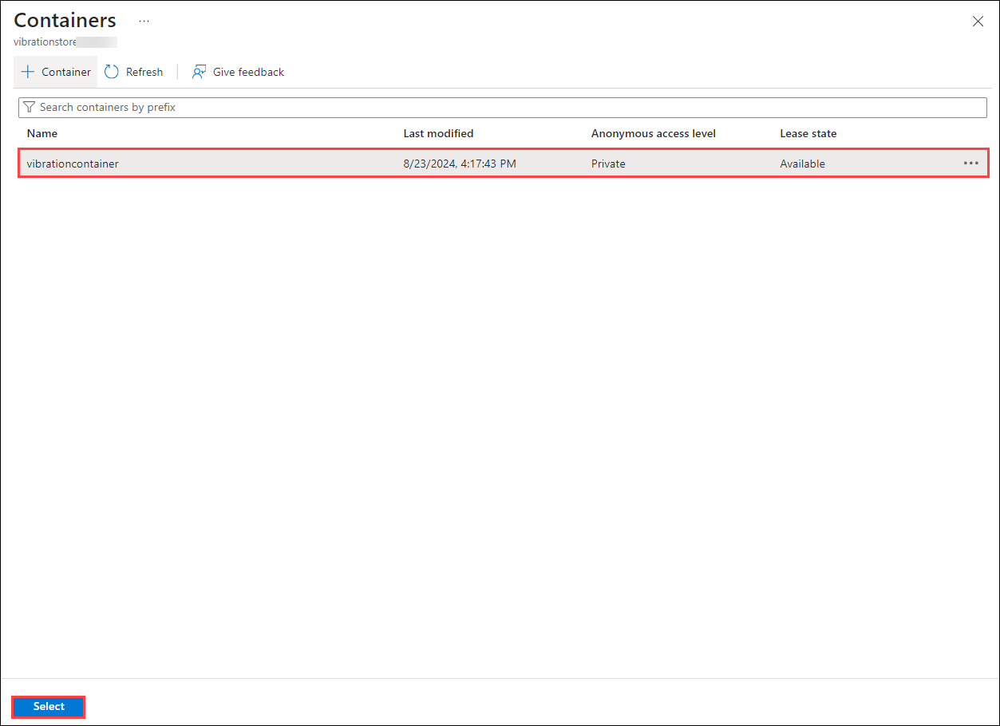

1. Now on the **Add a route** page verify **Endpoint type(1)**, **Endpoint name(2)**, **Azure storage container(3)** and then click on **Create + next**.

    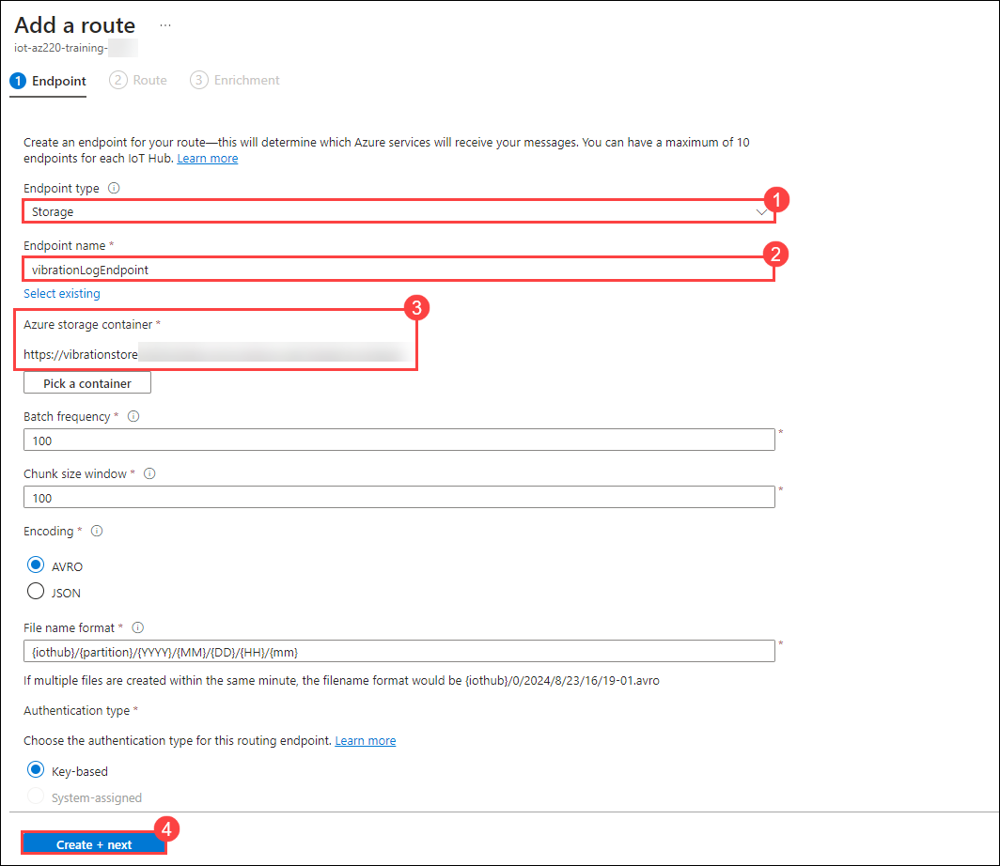

      Notice that the **Endpoint** is now populated.

### Task 3: Define the routing query

In this task, you will define a route for storage account.

1. On the **Add a route** blade, under **Data source**, ensure that **Device Telemetry Messages** is selected.

    - Under Name: Enter **vibrationLoggingRoute**
    - Under **Data source**, ensure that **Device Telemetry Messages** is selected.
    - Under **Enable route**, ensure that **Enable** is selected.
    - Under **Routing query**, replace **true** with the query below:

    ```sql
    sensorID = 'VSLog'
    ```

    This query ensures that only messages with the **sensorID** application property set to **VSLog** will be routed to the storage endpoint.

    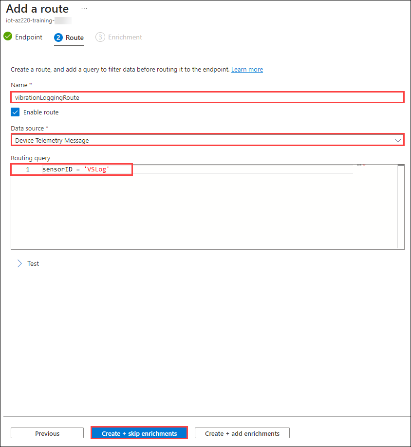

1. To create this route, click on **Create + skip enrichments**.

    Wait for the success message. Once completed, the route should be listed on the **Message routing** pane.

1. Once you see your new route listed on the **Message routing** pane, navigate back to your Azure portal Dashboard.

    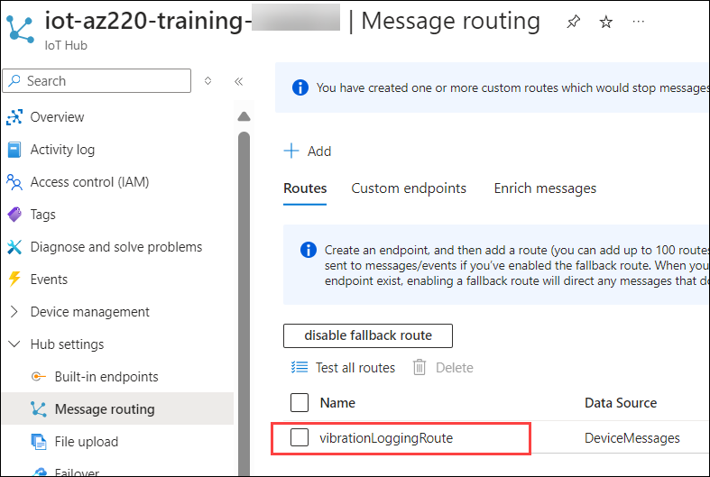   

### Task 4: Verify Data Archival

In this task, you will verify that the data is properly archived or not by looking into your storage account.

1. Ensure that the device app you created in Visual Studio Code is still running.

    If not, run it in the Visual Studio Code terminal using **dotnet run**.

1. On your Resources tile, to open you Storage account blade, click on **vibrationstore<inject key="DeploymentID" enableCopy="false" />**.

    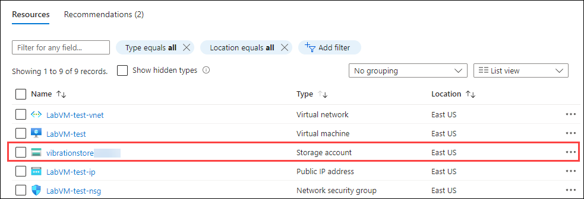
 
1. On the left-side menu of your **vibrationstore<inject key="DeploymentID" enableCopy="false" />** blade, click on **Storage browser(1)** under **vibrationstore<inject key="DeploymentID" enableCopy="false" />** then click on **Blob containers(2)** and then click on **vibrationcontainer(3)**

    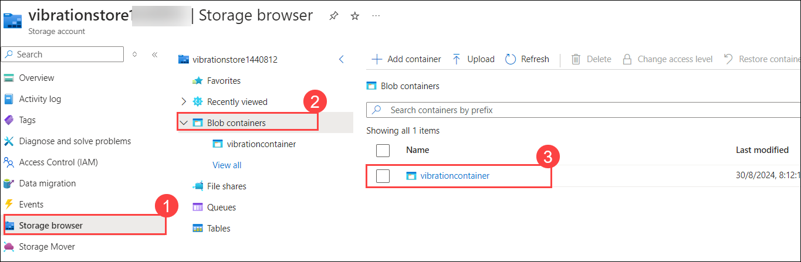

1. In the right-hand pane, under **NAME**, click **iot-az220-training-<inject key="DeploymentID" enableCopy="false" />**, and then use clicks to navigate down into the hierarchy.

    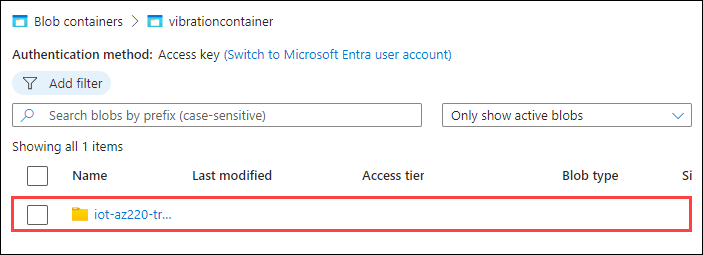

    >**Note**: It may take some time for the folder to appear.

    Under your IoT hub folder, you will see folders for the Partition, then numeric values for the Year, Month, and Day. The final folder represents the Hour, listed in UTC time. The Hour folder will contain a number of Block Blobs that contain your logging message data.

1. Click the Block Blob for the data with the earliest time stamp.

    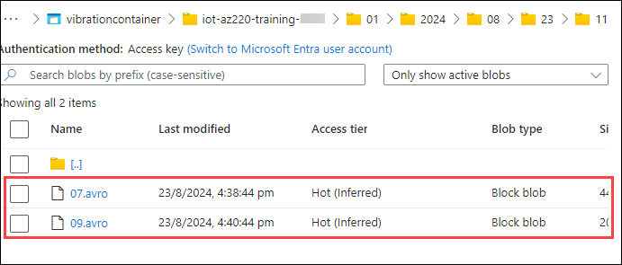

    The .avro files use a naming pattern of **{num}.avro** (i.e. **22.avro**).

<validation step="3b54d486-5079-4a03-9643-9e2f099478d8" />

>**Congratulations** on completing the Task! Now, it's time to validate it. Here are the steps:

  > - Hit the Validate button for the corresponding task. If you receive a success message, you have successfully validated the lab. 
  > - If not, carefully read the error message and retry the step, following the instructions in the lab guide.
  > - If you need any assistance, please contact us at labs-support@spektrasystems.com.

## Exercise 3: Create an Azure Stream Analytics Job

In this exercise, you will create a Stream Analytics job that outputs live stream messages to a Blob storage container. You will then use the Storage browser to verify that your ASA job runs successfully.

This will enable you to verify that your ASA job processes message data to an output location using the following parameters:

* **Name** - vibrationJob
* **ASA job input** - IoT hub Messaging Endpoint
* **ASA job output** - Blob storage container
* **ASA job query** - pass through all messages from input to output

> **Note**: It may seem odd that in this lab you are using IoT hub routing to deliver device data to a storage location, and then also processing your device message data through an Azure Stream Analytics job with output to the same storage location. In a real-world scenario you probably wouldn't use both of these message processing tools for processing device data in this way. Instead, it's more common to use an ASA job to invoke a time sensitive action based on analysis of real-time data. However, since this lab is providing an introduction to both of these data processing tools, the Blob storage container provides an easy way to validate that your IoT hub route is working as expected and to show a simple implementation of Azure Stream Analytics.

### Task 1: Create the Stream Analytics Job

In thi task, you will create a stream analytics job in the Azure portal.

1. On the Azure portal menu, click **+ Create a resource**.

    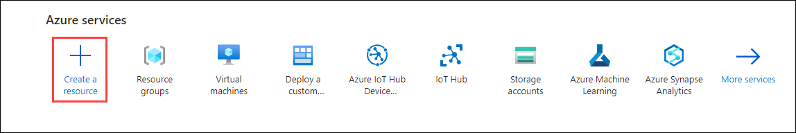

1. On the **New** blade, in the **Search the Marketplace** textbox, type **stream analytics** and then click **Stream Analytics job**.

1. On the **Stream Analytics job** blade, click **Create**.

    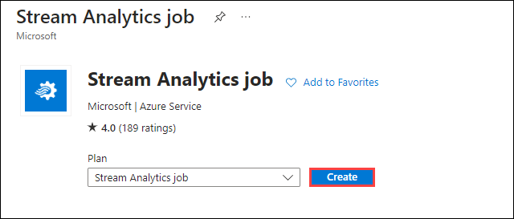

     The **New Stream Analytics job** pane is displayed.

1. On the **New Stream Analytics job** pane, provide the following details and then click on **Review + create**.

    - Subscription: **Select the default Subscription(1)**
    - Ressourse group: **Select the existing Resource group(2)**
    - Name: **vibrationJob(3)**
    - Region: **eastus(4)**

     

1. Wait for the **Your deployment is complete** message, and then click **Go to resource**.

### Task 2: Create the Stream Analytics Job Input

In this task, you will create a input in the Stream Analytics in the Portal.

1. On your Stream Analytics Job blade, on the left-side menu under **Job topology**, click **Inputs**.

    

     The **Inputs** pane will be displayed.

1. On the **Inputs** pane, click on **+ Add input(1)** and then select **IoT Hub(2)**.

    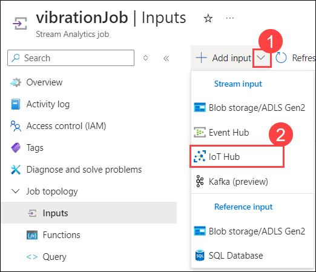

1. On the **IoT Hub - New input** pane, under **Input alias**, enter **vibrationInput (1)**

   - Ensure that **Select IoT Hub from your subscriptions** is selected.

   - Under **Subscription**, ensure that the subscription you used to create the IoT Hub earlier is selected **(2.)**

   - Under **IoT Hub**, ensure that your **iot-az220-training-<inject key="DeploymentID" enableCopy="false" /> (3)** IoT hub is selected.

   - Under **Consumer group**, ensure that **$Default (4)** is selected.

   - Under **Shared access policy name**, ensure that **iothubowner (5)** is selected.

   - Under **Endpoint**, ensure that **Messaging (6)** is selected.

   - Leave **Partition key (7)** blank.

   - Under **Event serialization format**, ensure that **JSON (8)** is selected.

   - Under **Encoding**, ensure that **UTF-8 (9)** is selected.

   - Under **Event compression type**, ensure **None (10)** is selected.

   - To save the new input, click **Save (11)**, and then wait for the input to be created.

     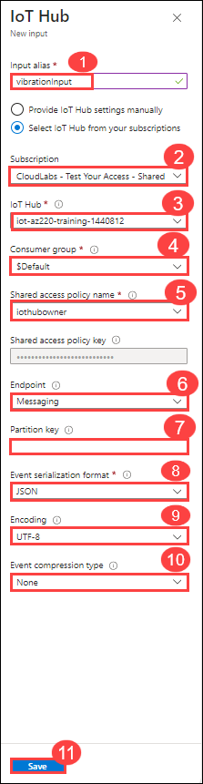

### Task 3: Create the Stream Analytics Job Output

In this task, you will create a output in the Stream Analytics in the Portal.

1. To create an output, on the left-side menu under **Job topology**, click on **Outputs(1)**. On the **Outputs** pane, click on **+ Add output(2)** and then select **Blob storage/ADLS Gen2(3)**.

    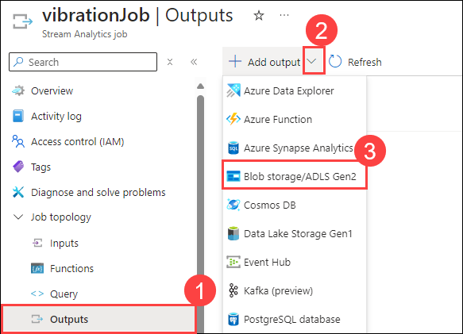

1. On the **Blob storage/ADLS Gen2 - New output** pane, under **Output alias**, enter **vibrationOutput (1)**.

   - Ensure that **Select Blob storage/ADLS Gen2 from your subscriptions** is selected.

   - Under **Subscription**, select the subscription you are using for this lab **(2)**.

   - Under **Storage account**, ensure that **vibrationstore<inject key="DeploymentID" enableCopy="false" /> (3)** is selected.

   - Under **Container**, ensure that **Use existing** is selected and that **vibrationcontainer (4)** is selected from the dropdown list.

   - Under **Authentication Mode**, select **Connection string (5)**

   - Under **Event serialization format**, ensure that **JSON (6)** is selected.

   - Under **Format**, ensure that **Line separated (7)** is selected.

   - Under **Encoding**, ensure that **UTF-8 (8)** is selected.

   - Leave the **Path pattern** blank.

   - Leave the **Date format** and **Time format** at their defaults.

   - Leave **Minimum rows** blank.

   - Under **Maximum time**, leave **Hours** and **Minutes** blank.

   - To create the output, click **Save(9)**, and then wait for the output to be created.

     

### Task 4: Create the Stream Analytics Job Query

In this task, you will create query in Stream Analytics.

1. To edit the query, on the left-side menu under **Job topology**, click **Query**.

    

1. In the query editor pane, replace the existing query with the query below:

    ```sql
    SELECT
        *
    INTO
        vibrationOutput
    FROM
        vibrationInput
    ```

1. Directly above the query editor pane, click **Save Query**.

1. On the left-side menu, click **Overview**.

### Task 5: Test the Logging Route

In this task, you will test the route that you have set in the previous task.

Now for the fun part. Is the telemetry from your device app being processed through your ASA job and delivered to the storage container?

1. Ensure that the device app you created in Visual Studio Code is still running.

    If not, run it in the Visual Studio Code terminal using **dotnet run**.

1. On the **Overview** pane of your Stream Analytics job, click **Start job**.

1. In the **Start job** pane, leave the **Job output start time** set to **Now**, and then click **Start**.

    

     It can take a few moments for the job to start.

1. On your Resources tile, click **vibrationstore<inject key="DeploymentID" enableCopy="false" />**.

    If your Storage account is not visible, use the **Refresh** button at the top of the resource group tile.

1. On the **Overview** pane of your Storage account, select the **Monitoring** section. Under **Key metrics**, adjacent to **Show data for last**, change the time range to **1 hour**.

    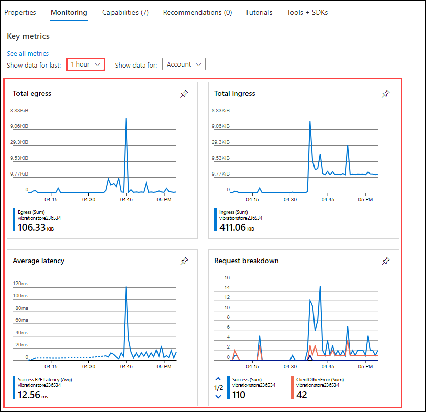

1. On the left-side menu, click on **Storage browser(1)**. In **Storage browser**, under **vibrationstore<inject key="DeploymentID" enableCopy="false" />**, click on **Blob containers(2)**  then click on  **vibrationcontainer(3)** and then select the json file **(4)**

    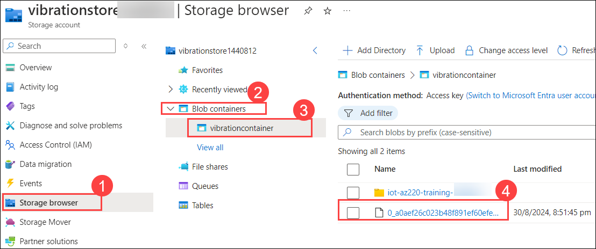

1. On the page displaying file details for the json file, click **Download**.

       

1. Open the downloaded file in **Visual Studio Code**, and review the JSON data.

1. If **Do you wanr to allow untrusted files in the workspace** pop up appears then click on **Open.**

    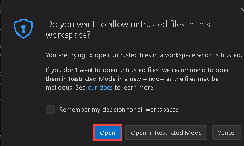   

     The data in your json file should appear similar to the following:

    ```json
    {"vibration":-0.025974767991863323,"EventProcessedUtcTime":"2021-10-22T22:03:10.8624609Z","PartitionId":3,"EventEnqueuedUtcTime":"2021-10-22T22:02:09.1180000Z","IoTHub":{"MessageId":null,"CorrelationId":null,"ConnectionDeviceId":"sensor-v-3000","ConnectionDeviceGenerationId":"637705296662649188","EnqueuedTime":"2021-10-22T22:02:08.7900000Z"}}
    {"vibration":-2.6574811793183173,"EventProcessedUtcTime":"2021-10-22T22:03:10.9718423Z","PartitionId":3,"EventEnqueuedUtcTime":"2021-10-22T22:02:11.1030000Z","IoTHub":{"MessageId":null,"CorrelationId":null,"ConnectionDeviceId":"sensor-v-3000","ConnectionDeviceGenerationId":"637705296662649188","EnqueuedTime":"2021-10-22T22:02:11.0720000Z"}}
    {"vibration":3.9654399589335796,"EventProcessedUtcTime":"2021-10-22T22:03:10.9718423Z","PartitionId":3,"EventEnqueuedUtcTime":"2021-10-22T22:02:13.3060000Z","IoTHub":{"MessageId":null,"CorrelationId":null,"ConnectionDeviceId":"sensor-v-3000","ConnectionDeviceGenerationId":"637705296662649188","EnqueuedTime":"2021-10-22T22:02:13.1500000Z"}}
    {"vibration":0.99447803871677132,"EventProcessedUtcTime":"2021-10-22T22:03:10.9718423Z","PartitionId":3,"EventEnqueuedUtcTime":"2021-10-22T22:02:15.2910000Z","IoTHub":{"MessageId":null,"CorrelationId":null,"ConnectionDeviceId":"sensor-v-3000","ConnectionDeviceGenerationId":"637705296662649188","EnqueuedTime":"2021-10-22T22:02:15.2120000Z"}}
    ```

    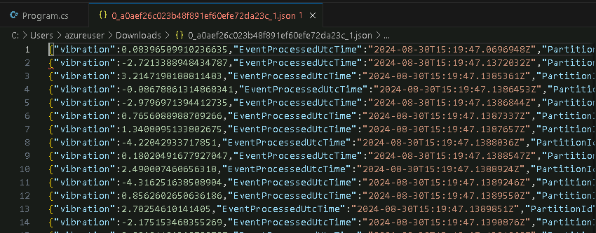
   
1. In Visual Studio Code, close the document containing your json data.

1. Return to your Azure portal window and navigate to your Dashboard.

1. On your Resources tile, click **vibrationJob**.

    

1. On the **vibrationJob** blade, click on **Stop job**, and then click **Yes**.

    

1. Switch to the Visual Studio Code window.

1. At the Terminal command prompt, to exit the device simulator app, press **CTRL-C**.

<validation step="16dcb93f-8112-4954-949e-39fae6826bf7" />

>**Congratulations** on completing the Task! Now, it's time to validate it. Here are the steps:

  > - Hit the Validate button for the corresponding task. If you receive a success message, you have successfully validated the lab. 
  > - If not, carefully read the error message and retry the step, following the instructions in the lab guide.
  > - If you need any assistance, please contact us at labs-support@spektrasystems.com.

## Summary 

In this lab, you began by writing code to generate vibration telemetry data. Next, you created a message route to direct this data to Azure Blob Storage. Finally, you set up an Azure Stream Analytics job to process and analyze the incoming telemetry data in real time.

## You have successfully completed the Lab!!
