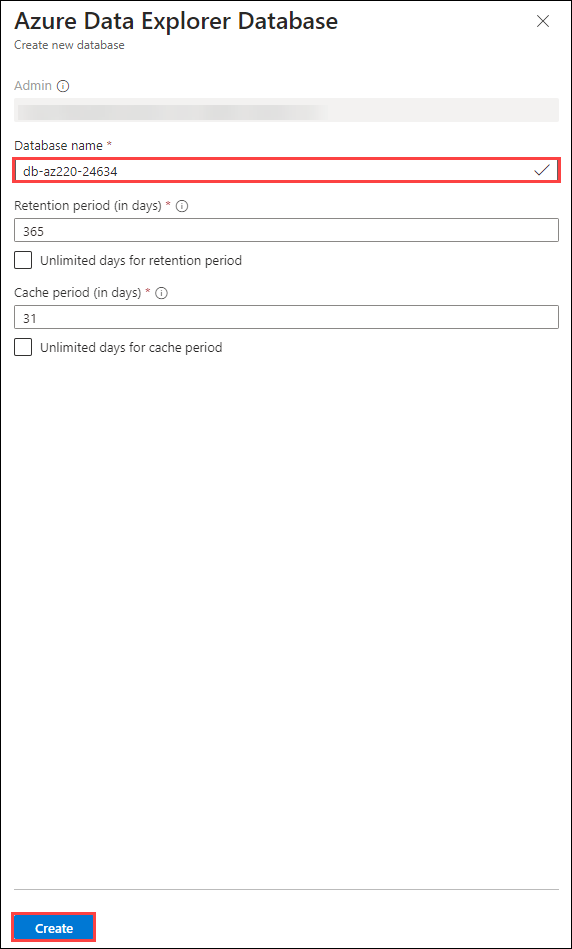

# Lab 06: Explore and analyze time stamped data with Azure Data Explorer.

## Overview

Your hard work implementing Azure IoT services and tools has paid off. Contoso has rolled out their "Asset Condition Tracking System" that monitors the environmental conditions of cheese containers during shipment.

Two weeks after launching the new system it has revealed a temperature spike in-transit for a specific shipment. Some of the cheese in the shipment was ruined, but the new system did ensure that the affected cheese wasn't delivered to the customer. Since you know the Azure IoT side of the monitoring system better than anyone, you will lead the investigation.

Management has asked you to determine if the system can be improved, hopefully to the point where it will prevent the loss of product in the future. You correlate the IoT devices' sensor data taken from the trucks and planes used during the shipment. It appears that the temperature in one of the trucks rose unexpectedly in a particular area of the vehicle and created the heat spike in one of the transport containers (which was equipped with an IoT device monitoring temperature and humidity).

Your team decides that further improvements to the monitoring system will require near real-time data exploration and root-cause analysis.

You propose adding Azure Data Explorer to the Azure IoT solution. This will enable Contoso to quickly store, visualize, and query the large amounts of time series data that are generated by the IoT devices in the trucks, planes, and containers, and to visualize changes over time.

## Lab Objectives
In this lab, you will complete the following activities:

 - Exercise 1: Configure Lab Prerequisites
 - Exercise 2: Setup Azure Data Explorer
 - Exercise 3: Run Simulated IoT Devices
 - Exercise 4: Visualize Data using Azure Data Explorer Queries

The following resources will be created:


In this lab, you will complete the following activities:


## Exercise 1: Setup Azure Data Explorer

Azure Data Explorer is an end-to-end platform-as-a-service offering used to collect, process, store, analyze, and query data from IoT solutions at scale. Azure Data Explorer is designed for ad hoc data exploration and operational analysis of data that's highly contextualized and optimized for time series.

In this exercise, you will setup Azure Data Explorer integration with Azure IoT Hub.

1. In the Azure Portal, navigate to your resource group. Under resources select **iot-az220-training-<inject key="DeploymentID" enableCopy="false" />**.

    

2. On the IoT Hub lefy hand menu, select **Built-in-endpoints**. Create a new consumer group **adxevents**.

   

1. On the Azure portal menu, click **+ Create a resource**.

1. On the **New** blade, in the **Search the Marketplace** textbox, enter **Azure Data Explorer**. In the search results, click **Azure Data Explorer**. On the **Azure Data Explorer** blade, click **Create**.

   

1. On the **Create an Azure Data Explorer Cluster** blade, ensure that correct **Resource group** is selected. Provide the cluster name as **adx-az220-<inject key="DeploymentID" enableCopy="false" />**. and also select the workload as **Dev/test**. Click on **Review + create**.

   

1. On the **Azure Data Explorer** overview page, click on **Create** under Database Creation.

   

1. On the **Azure Data Explorer Database**, provide the database name as **db-az220-<inject key="DeploymentID" enableCopy="false" />** and click on **Create**. 

   

1. On the **Azure Data Explorer** overview pane and under **Data ingestion**, click on **Create

   

1. 

   

1. In the **IoT Hub name** dropdown, select **iot-az220-training-{your-id}**.

1. In the **IoT Hub access policy name** dropdown, click **iothubowner**.

    In a production environment, it's best practice to create a new _Access Policy_ within Azure IoT Hub to use for configuring Time Series Insights (TSI) access. This will enable the security of TSI to be managed independently of any other services connected to the same Azure IoT Hub.  You are not doing that here for convenience reasons.

1. To the right of the **IoT Hub consumer group** dropdown, click **New**.

    The IoT Hub consumer group dropdown will convert to a text entry field so that you can enter a value.

1. In the **IoT Hub consumer group** box, enter **tsievents** and then click **Add**.

    +++tsievents+++

    This will add a new _Consumer Group_ to use for this Event Source. The Consumer Group needs to be used exclusively for this Event Source, as there can only be a single active reader from a given Consumer Group at a time.

1. Under the **Start options** section, in the **Start time** dropdown, ensure that **Beginning now (default)** is selected.

1. Under the **TIMESTAMP** section, leave the **Property Name** blank.

1. At the bottom of the blade, click **Review + create**.

    > **Note**: If you are returned immediately to the *Event Source* pane, double check that you clicked **Add** to the right of the **IoT Hub consumer group** field - you cannot create the TSI resource until you have created the consumer group.

1. Notice the alert message informing you that Time Series Insights will no longer be supported after March 2025.

1. At the bottom of the blade, click **Review + create**, and then click **OK**.

1. Once your Time Series Insights deployment is complete, navigate back to your dashboard.

1. Refresh your resource group tile, and then click **tsi-az220-training-{your-id}**.

    You may need to resize your dashboard to see all of your resources.

    > **Note**: You gave the **Time Series Insights environment** resource the name **tsi-az220-training-{your-id}**. You should also see the *Time Series Insights event source* that you created, but for now you want to have the TSI environment opened.

1. On the **Time Series Insights environment** blade, on the left-side menu under **Settings**, click **Event Sources**.

1. On the **Event Sources** pane, notice the **iot-az220-training-{your-id}** Event Source in the list.

    This is the event source that you configured when the TSI resource was created.

1. To view the event source details, click **iot-az220-training-{your-id}**.

    Notice that the configuration of the event source matches what you specified when the Time Series Insights resource was created.

## Exercise 2: Run Simulated IoT Devices

In this exercise, you will run the simulated devices so that they start sending telemetry events to Azure IoT Hub.

1. In your virtual machine environment, use the **Start** menu to open **Visual Studio Code**.

    > **Tip**: You may find it helpful to maximize the Visual Studio Code window.

1. On the **File** menu, click **Open Folder**.

1. In the **Open Folder** dialog, navigate to the lab 10 Starter folder.

    Before starting the lab instructions, you downloaded a copy of the GitHub repository containing lab resources to the lab virtual machine environment. The folder structure includes the following folder path:

    * Allfiles
        * Labs
            * 10-Explore and analyze time stamped data with Time Series Insights
                * Starter

    > **Note**: If you have trouble locating the **Allfiles** folder, check your Windows **Desktop** folder.

1. In the **Open Folder** dialog, click **ContainerSimulation**, and then click **Select Folder**.

    If prompted, load the C# extension and/or perform a restore.

1. In the EXPLORER pane, to open the Program.cs file, click **Program.cs**.

1. Locate the variables used to assign the connections strings

    ```csharp
    private readonly static string connectionStringTruck = "{Your Truck device connection string here}";
    private readonly static string connectionStringAirplane = "{Your Airplane device connection string here}";
    private readonly static string connectionStringContainer = "{Your Container device connection string here}";
    ```

1. Update the variable assignments with the connection strings that you saved earlier in the lab.

    Be sure to replace the placeholder values with the Connection String for the corresponding IoT device.

1. On the **File** menu, click **Save**.

1. On the **View** menu, click **Terminal**.

1. Within the **Terminal** pane, ensure that the command prompt specifies the path to the lab 10 **/Starter/ContainerSimulation** directory.

1. At the command prompt, to build and run the **ContainerSimulation** app, enter the following command:

    ```cmd/sh
    dotnet run
    ```

1. Notice the messages displayed in the Terminal pane.

    Once the **ContainerSimulation** app is running, it will begin outputting telemetry data to the terminal. This is the telemetry data that it is sending to Azure IoT Hub.

    When the **ContainerSimulation** app is running, the **Terminal** output will look similar to the following:

    ```text
    12/27/2019 8:51:30 PM > Sending TRUCK message: {"temperature":35.15660452608195,"humidity":48.422323938240865}
    12/27/2019 8:51:31 PM > Sending AIRPLANE message: {"temperature":17.126545186374237,"humidity":36.46941012936869}
    12/27/2019 8:51:31 PM > Sending CONTAINER message: {"temperature":21.986403302500637,"humidity":47.847680384455096}
    12/27/2019 8:51:32 PM > Sending TRUCK message: {"temperature":36.10474464823629,"humidity":48.82029906486022}
    12/27/2019 8:51:32 PM > Sending AIRPLANE message: {"temperature":16.55005930170971,"humidity":36.49988437459935}
    12/27/2019 8:51:32 PM > Sending CONTAINER message: {"temperature":21.811727088543286,"humidity":50.0}
    ```

1. Leave the **ContainerSimulation** app running for the remainder of this lab.

    This will ensure device telemetry from the three devices (Container, Truck, and Airplane) is being sent to Azure IoT Hub.

1. After the **ContainerSimulation** app has been running for 30 seconds, you will see a message telling you that the **Container** device is changing transport methods.

    The transport method will change between **Truck** and **Airplane** every 30 seconds. The **Terminal** output will look like the following when this happens:

    ```text
    12/27/2019 8:51:40 PM > CONTAINER transport changed to: TRUCK
    ```

    > **Note**:  In production the shipping container would only change transport methods during the normal course of shipping. For the simulated scenario in this lab, it's performed every 30 seconds to give a short enough data duration that will fit during the course of performing the steps in this lab.

## Exercise 4: Visualize Data using Azure Data Explorer Queries

In this exercise, you will get a quick introduction to working with time series data using Azure Data Explorer.

1. Switch to the window containing your Azure portal and navigate to your Dashboard.

    If needed, log in to the Azure portal using your Azure account credentials.

1. On your Resource group tile, click **tsi-az220-training-{your-id}**.

1. On the **Time Series Insights environment** blade, at the top of the **Overview** pane, click **Go to TSI Explorer**.

    This will open the **Time Series Insights Explorer** in a new browser tab.

1. On the left-side menu, ensure that **Analyze** is selected.

    You can expand the navigation menu to display the button names. The two options are "Analyze" and "Model". Choose Analyze.

    Collapse the navigation menu to ensure that you can see the query edit area on the left side of the page.

1. To begin to edit a query, click **Add new query**.

1. In the left-side pane, under **Query 1**, open the **MEASURE** dropdown, and then click **temperature**.

1. Open the **SPLIT BY** dropdown, and then click **iothub-connection-device-id**.

    When you run the query, this will split the graph to show the telemetry from each of the IoT Devices separately on the graph.

1. One the menu bar just above the data graph, click **Settings**.
 
1. On the settings dialog, click **Auto refresh** and configure the display to refresh the most recent 30 minutes of data every 15 seconds.

1. Notice that the graph displays the **temperature** sensor event data from the IoT Devices within Azure IoT Hub in a _Line Chart_.

1. Notice the list of Device IDs to the left of the graph.

    Hovering the mouse over a specific Device ID will highlight it's data on the graph display.

1. Take a moment to examine the temperature data (graphs) for the telemetry streaming into the system from the three simulated devices.

1. To add a second query to the display, click **Add new query**.

1. Under **Query 2**, set the **MEASURE** dropdown to **humidity**, and then set the **SPLIT BY** dropdown to **iothub-connection-device-id**.

    Notice that there are now two graphs displayed. The top graph shows **temperature** while the lower graph shows **humidity**, both using their own Y-axis scale.

1. Position your mouse pointer over one of the graph lines.

    Notice that when you hover the mouse cursor over the graph, a popup will display the details for a point on the graph. The popup displays the minimum (**min**), average (**avg**), and maximum (**max**) values for the data points in the graph (over the short time represented by that point). The time range associated with the selected data point is displayed along the time axis at the bottom of the display.

1. Along the top of the graph area, notice the options that you can use to control graph settings.

1. Click **Settings**, and then change the Interval setting to 15 seconds.

    Notice how the appearance of the data changes as you increase the interval.

1. Take a minute to explore the other chart settings options.

1. Once you have completed exploring the data, switch to the Visual Studio Code window.

1. In Visual Studio Code, stop the container simulator app by pressing **CTRL+C** in the terminal.

## Summary

In this lab, you have noted the connection strings of devices that are pre deployed and created a Azure Data Explorer cluster and created a database and connected it to the IoT Hub which was pre-deployed ran the simulator and visualized the data in it.

## You have successfully completed the lab!!
