# Lab 08: Setup an IoT Edge Gateway

## Lab Scenario

This lab is theoretical and will walk you through how an IoT Edge device can be used as a gateway.

There are three patterns for using an IoT Edge device as a gateway: transparent, protocol translation, and identity translation:

**Transparent** – Devices that theoretically could connect to IoT Hub can connect to a gateway device instead. The downstream devices have their own IoT Hub identities and are using any of the MQTT, AMQP, or HTTP protocols. The gateway simply passes communications between the devices and IoT Hub. The devices are unaware that they are communicating with the cloud via a gateway, and a user interacting with the devices in IoT Hub is unaware of the intermediate gateway device. Thus, the gateway is transparent. Refer to Create a transparent gateway for specifics on using an IoT Edge device as a transparent gateway.

**Protocol translation** – Also known as an opaque gateway pattern, devices that do not support MQTT, AMQP, or HTTP can use a gateway device to send data to IoT Hub on their behalf. The gateway understands the protocol used by the downstream devices, and is the only device that has an identity in IoT Hub. All information looks like it is coming from one device, the gateway. Downstream devices must embed additional identifying information in their messages if cloud applications want to analyze the data on a per-device basis. Additionally, IoT Hub primitives like twins and methods are only available for the gateway device, not downstream devices.

**Identity translation** - Devices that cannot connect to IoT Hub can connect to a gateway device, instead. The gateway provides IoT Hub identity and protocol translation on behalf of the downstream devices. The gateway is smart enough to understand the protocol used by the downstream devices, provide them identity, and translate IoT Hub primitives. Downstream devices appear in IoT Hub as first-class devices with twins and methods. A user can interact with the devices in IoT Hub and is unaware of the intermediate gateway device.

## Lab Objectives
In this lab, you will perform:

 - Exercise 1: Deploy and configure a Linux VM  as an IoT Edge Gateway
 - Exercise 2: Download Device CA Certificate
 - Exercise 3: Create a Downstream Device

The following resources will be created:

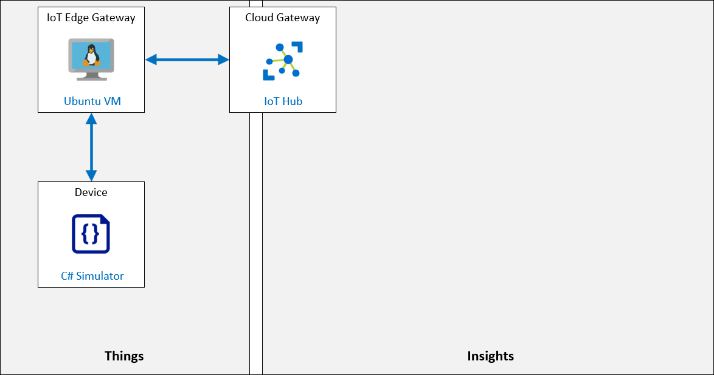

## Exercise 1: Deploy and configure a Linux VM  as an IoT Edge Gateway

In this exercise, you will deploy an Ubuntu Server VM and configure it as an IoT Edge Gateway.

### Task 1: Create IoT Edge Gateway Device Identity

In this task, you will use Azure IoT Hub to create a new IoT Edge device identity that you will use for the IoT Edge Transparent Gateway (your IoT Edge VM).

1. On the Azure portal, naviagate to Resource group and then select the resource group named **az220rg-<inject key="DeploymentID" enableCopy="false"></inject>**.

      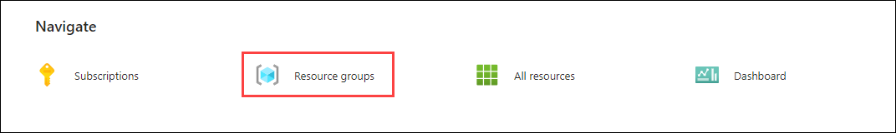
   
1. On the All resources tile, to open your IoT hub, click on **iot-az220-training-<inject key="DeploymentID" enableCopy="false" />**.

      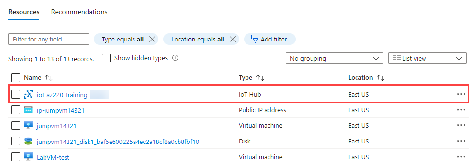

1. On the **IoT Hub** blade, on the left-side menu under **Device management**, click **IoT Edge**. On the IoT Edge pane, click **Add an IoT Edge device**

      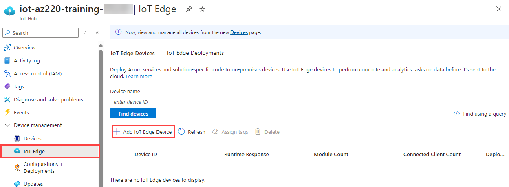

1. On the **Create a device** blade, in the **Device ID** field, enter **sensor-<inject key="DeploymentID" enableCopy="false" />** **(1)**, leave other setting as default and click on **save (2)**.

      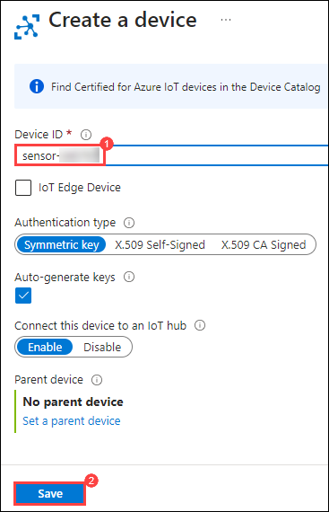

1. Under **Device ID**, click **sensor-<inject key="DeploymentID" enableCopy="false" />**.

      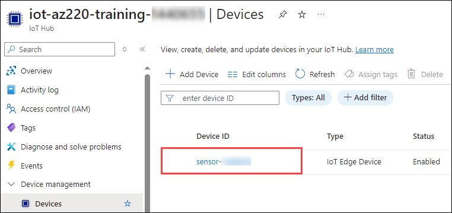
 
1. On the **sensor-<inject key="DeploymentID" enableCopy="false" />** blade, copy the **Primary Connection String**.

      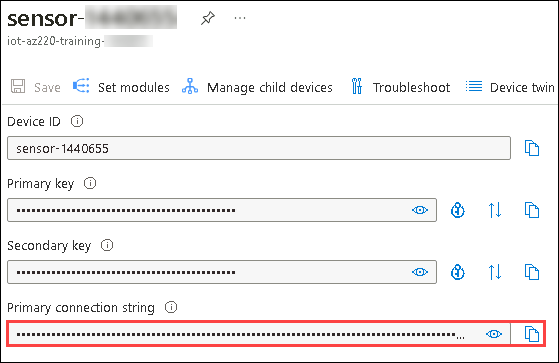

1. Save the **Primary Connection String** value in a notepad for future use.

1. On the **sensor-<inject key="DeploymentID" enableCopy="false" />** blade, scroll down and notice that the list of **Modules (1)** is limited to **\$edgeAgent** and **\$edgeHub**. At the top of the blade, click **Set Modules (2)**.

      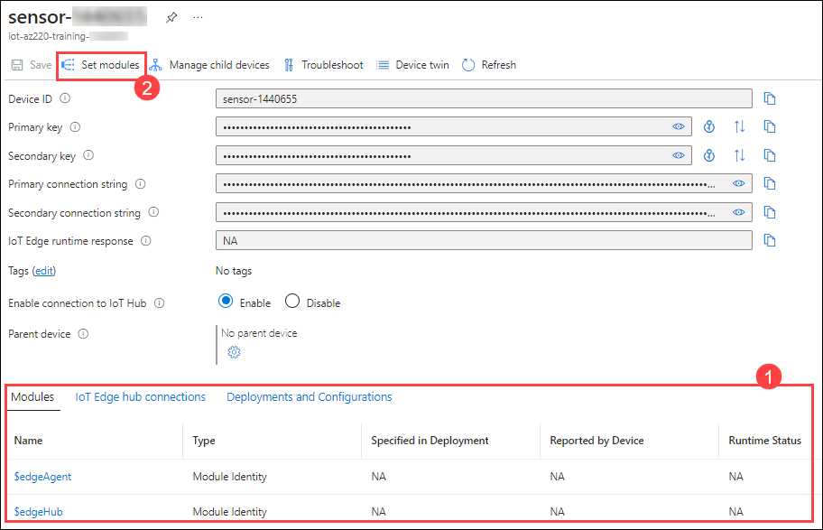

1. At the top of the **Set module on device** blade, click **Routes**.

    Under **Routes**, the editor displays a configured default route for the IoT Edge Device. At this time, it should be configured with a route that sends all messages from all modules to Azure IoT Hub. If the route configuration doesn't match this, then update it to match the following route:

    * **NAME**: `route`
    * **VALUE**: `FROM /messages/* INTO $upstream`

         

    The `FROM /messages/*` part of the message route will match any device-to-cloud message sent by a module through some or no output, or by a leaf device. Then, the `INTO $upstream` tells the route to send those messages to the Azure IoT Hub.

1. At the bottom of the blade, click **Review + create**.

1. Take a moment to review the deployment manifest.

1. At the bottom of the blade, click **Create**.

### Task 2: Open IoT Edge Gateway Device Ports for Communication

Standard IoT Edge devices don't need any inbound connectivity to function, because all communication with IoT Hub is done through outbound connections. Gateway devices are different because they need to receive messages from their downstream devices. If a firewall is between the downstream devices and the gateway device, then communication needs to be possible through the firewall as well. For the Azure IoT Edge Gateway to function, at least one of the IoT Edge hub's supported protocols must be open for inbound traffic from downstream devices. The supported protocols are MQTT, AMQP, and HTTPS.

The IoT communication protocols supported by Azure IoT Edge have the following port mappings:

| Protocol | Port Number |
| --- | --- |
| MQTT | 8883 |
| AMQP | 5671 |
| HTTPS<br/>MQTT + WS (Websocket)<br/>AMQP + WS (Websocket) | 443 |

The IoT communication protocol chosen for your devices will need to have the corresponding port opened for the firewall that secures the IoT Edge Gateway device. In the case of this lab, an Azure Network Security Group (NSG) is used to secure the IoT Edge Gateway, so Inbound security rules for the NSG will be opened on these ports.

In a production scenario, you will want to open only the minimum number of ports for your devices to communicate. If you are using MQTT, then only open port 8883 for inbound communications. Opening additional ports will introduce addition security attack vectors that attackers could exploit. It is a security best practice to only open the minimum number of ports necessary for your solution.

In this task, you will configure the Network Security Group (NSG) that secures access to the Azure IoT Edge Gateway from the Internet. The necessary ports for MQTT, AMQP, and HTTPS communications will be opened so that the downstream IoT device(s) can communicate with the gateway using all three of the communication ports.

1. Open a new tab in the VM and navigate to the following address:

   [](https://portal.azure.com/#create/Microsoft.Template/uri/https%3A%2F%2Fraw.githubusercontent.com%2FCloudLabs-MOC%2FMSLearnLabs-AZ-220-Microsoft-Azure-IoT-Developer%2Fstage%2FAllfiles%2FARM%2Flab12a.json)

1. In the **Custom deployment** page, under **Project details**, enter the following details:

   - Subscription: **Select the default subscription (1)**
   - Resource Group: **Select the existing resource group (2)**
   - Region: **Select the default region (3)**
   - Virtual Machine Name: Provide the name as **vm-az220-training-gw0001-<inject key="DeploymentID" enableCopy="false" />** **(4)**
   - Device Connection string: Paste the **device primary connection string** you copied earlier in your notepad **(5)**
   - Virtual Machine Size: **Standard_DS1_v2 (6)**
   - Ubuntu OS Version: 18.04-LTS **(7)**
   - Admin Username: Provide the name as **demouser (8)**
   - Authentication Type: Select **Password (9)**
   - Admin Password Or Key: Provide the password as **Password!123** **(10)**
   - Allow SSH: **True (11)**
   - Click on **Review + Create (12)**

        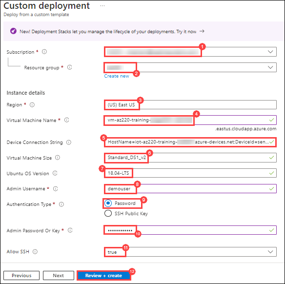

1. Once validation is passed, click on **Create**.

   > **Note**: Deployment can take as much as 5 minutes to complete.

1. Once the deployment has been completed, navigate to the **Outputs** pane, copy the values for **publicFQDN** and **publicSSH** in a notepad for future use.

      

1. Navigate to **Overview (1)** and click on **Go to resource group (2)**.

      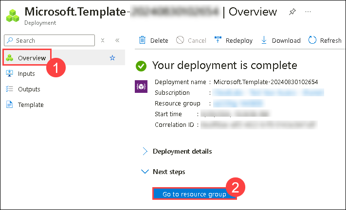
   
1. On the All resources tile, click **nsg-vm-az220-training-gw0001-<inject key="DeploymentID" enableCopy="false" />**.

      

1. On the **Network security group** blade, on the left-side menu under **Settings**, click **Inbound security rules**. At the top of the **Inbound security rules** pane, click on **Add**.

      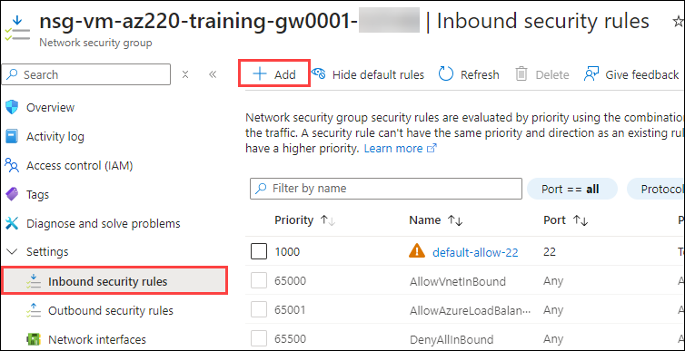

1. On the **Add inbound security rule** pane, ensure **Source** is set to **Any**. Under **Destination port ranges**, change the value to **8883 (1)** and name as **MQTT (2)**. Leave all other settings at the default, and then click **Add**.

      

1. After the MQTT rule is added, to open ports for the **AMQP** and **HTTPS** communication protocols, please repeat step number 5 by replacing the following **name** and **port** and click on **Add**:

    | Destination port ranges | Protocol | Name |
    | :--- | :--- | :--- |
    | 5671 | TCP | AMQP |
    | 443 | TCP | HTTPS |

      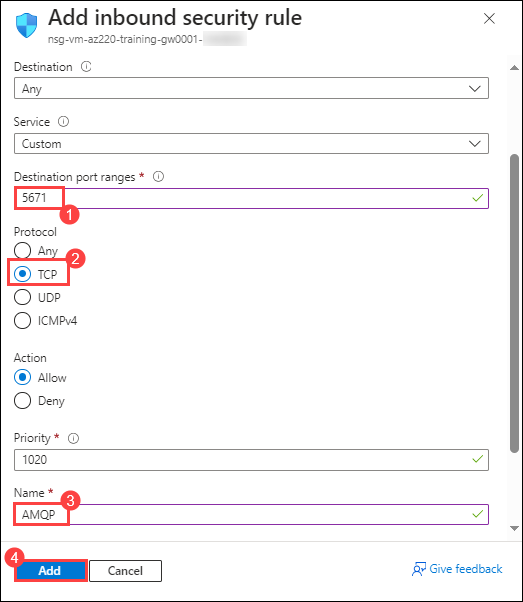

      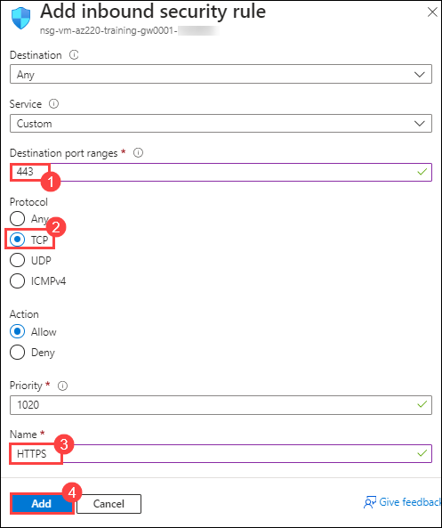

   > **Note**: You may need to use the **Refresh** button in the toolbar at the top of the pane to see the new rules appear.

1. With these three ports open on the Network Security Group (NSG), the downstream devices will be able to connect to the IoT Edge Gateway using the MQTT, AMQP, or HTTPS protocols.

### Exercise 2: Download Device CA Certificate

In this exercise, you will explore the **vm-az220-training-gw0001-{your-id}** Virtual Machine that you just created and download the generated test certificates to the cloud shell.

#### Task 1: Connect to the VM

In this task, you will verify that your Linux VM (IoT edge) device is deployed successfully.

1. Verify that the IoT Edge virtual machine has been deployed successfully.

    

1. On the Azure portal toolbar, to open the Azure Cloud Shell, click **Cloud Shell**.

    A Cloud Shell window will open near the bottom of the display screen.

      

1. Click on **Bash** when prompted.

      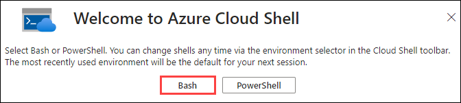

1. Select the checkbox for **Mount Storage account (1)**, select the existing **subscription (2)** and click on **Apply (3)**.

      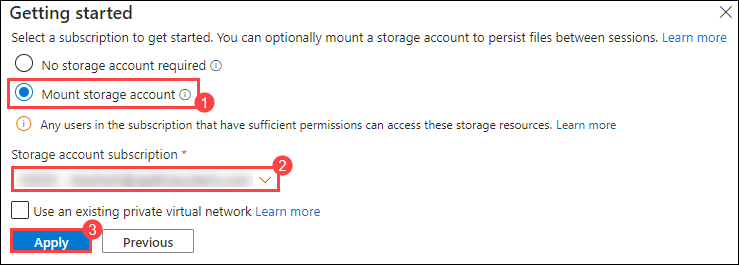

1. Select **I want to create a storage account (1)** and click on **Next (2)**.

      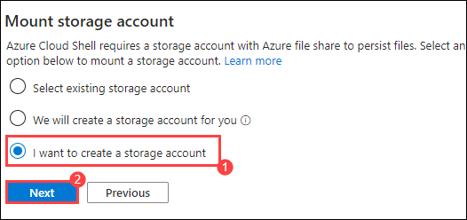

1. In the create a storage account page, provide the following details and click on **Create (6)**.

   - Subscription: **Select the default subscription (1)**
   - Resource Group: **Select the existing resource group (2)**
   - Region: Select **EAST US (3)**
   - Storage Account Name: Provide the name as **stoaz220<inject key="DeploymentID" enableCopy="false"></inject>** **(4)**
   - File Share: Provide the name as **cloudshell (5)**

       
    
1. In the upper left corner of the Cloud Shell window, ensure that **Bash** is selected as the environment option.

    > **Note**: Both *Bash* and *PowerShell* interfaces for the Azure Cloud Shell support the use of **OpenSSL**.

1. At the Cloud Shell command prompt, paste the **ssh** command that you saved to your text editor, and then press **Enter**.

    The command should look similar to the following:

    **ssh vmadmin@vm-az220-training-edge0001-dm080321.centralus.cloudapp.azure.com**.

1. When prompted with **Are you sure you want to continue connecting?**, type **yes** and then press **Enter**.

    This prompt is a security confirmation since the certificate used to secure the connection to the VM is self-signed. The answer to this prompt will be remembered for subsequent connections, and is only prompted on the first connection.

1. When prompted to enter the password, enter the administrator password `Password!123` that you created when the Edge Gateway VM was provisioned.

    > **Note**: The typed characters will not be displayed on screen as you enter the password. 

1. Once connected, the terminal will change to show the name of the Linux VM that you are connected to.

    The command prompt will now look similar to the following:

    ``` bash
    username@vm-az220-training-gw0001-{your-id}:~$
    ```

1. To determine the virtual machine's public IP address, enter the following command:

    ```bash
    nslookup {Public FQDN of your VM}
    ```

    > **Note**: Replace the value of FQDN which you had copied earlier.

    The output from the nslookup command will be similar to:

    ```bash
    Server:         127.0.0.53
    Address:        127.0.0.53#53

    Non-authoritative answer:
    Name:   vm-az220-training-gw0001-{your-id}.{your location}.cloudapp.azure.com
    Address: 168.61.181.131
    ```

    The public IP of the VM is the final **Address** value - in this case **168.61.181.131**.

    > **Note**: If the nslookup command is unable to display the public IP address of the VM, open the vm-az220-training-gw0001-{your-id} virtual machine in the portal to find and record the value of the public IP address. 

    > **Important**: Make a note of this IP address - you will need it later. The IP Address will usually change every time the VM is restarted.

### Task 2: Explore the IoT Edge configuration

During the initial launch of the VM, a script was executed that configured IoT Edge. This script performed the following operations:

* Installed **aziot-identity-service** package
* Installed **aziot-edge** package
* Downloaded an initial version of **config.toml** (the config file for IoT Edge) to **/etc/aziot/config.toml**
* Added the device connection string supplied when the ARM template was executed to **/etc/aziot/config.toml**
* Cloned the [Iot Edge git repository](https://github.com/Azure/iotedge.git) to **/etc/gw-ssl/iotedge**
* Created a directory **/tmp/lab12** and copied the IoT Edge gateway SSL test tools from **/etc/gw-ssl/iotedge**
* Generated the test SSL certs in **/tmp/lab12** and copied them to **/etc/aziot**
* Added the certs to the **/etc/aziot/config.toml**
* Applied the updated **/etc/aziot/config.toml** to the IoT Edge runtime

In this task, you will explore the IoT edge configuration inside your vm.

1. To determine the version of IoT Edge that was installed, enter the following command:

    ```bash
    iotedge --version
    ```

    The version installed at the time of writing is **iotedge 1.2.9**

1. To view the IoT Edge configuration, enter the following command:

    ```bash
    cat /etc/aziot/config.toml
    ```

    The output will be similar to:

    ```s
        [provisioning]
    source = "manual"
    connection_string = "HostName=iot-az220-training-dm080221.azure-devices.net;DeviceId=sensor-th-0067;SharedAccessKey=2Zv4wruDViwldezt0iNMtO1mA340tM8fnmxgoQ3k0II="

    [agent]
    name = "edgeAgent"
    type = "docker"

    [agent.config]
    image = "mcr.microsoft.com/azureiotedge-agent:1.2"

    [connect]
    workload_uri = "unix:///var/run/iotedge/workload.sock"
    management_uri = "unix:///var/run/iotedge/mgmt.sock"

    [listen]
    workload_uri = "fd://aziot-edged.workload.socket"
    management_uri = "fd://aziot-edged.mgmt.socket"

    [moby_runtime]
    uri = "unix:///var/run/docker.sock"
    network = "azure-iot-edge"

    trust_bundle_cert = 'file:///etc/aziot/azure-iot-test-only.root.ca.cert.pem'

    [edge_ca]
    cert = 'file:///etc/aziot/iot-edge-device-ca-MyEdgeDeviceCA-full-chain.cert.pem'
    pk = 'file:///etc/aziot/iot-edge-device-ca-MyEdgeDeviceCA.key.pem'
    ```

    During the setup, the **connection_string**, **trust_bundle_cert**, **cert** and **pk** values were updated.

1. To ensure the IoT Edge daemon is running, enter the following command:

    ```bash
    sudo iotedge system status
    ```

    This command will display output similar to:

    ```bash
    System services:
        aziot-edged             Running
        aziot-identityd         Running
        aziot-keyd              Running
        aziot-certd             Running
        aziot-tpmd              Ready

    Use 'iotedge system logs' to check for non-fatal errors.
    Use 'iotedge check' to diagnose connectivity and configuration issues.
    ```

1. To verify the IoT Edge runtime has connected, run the following command:

    ```bash
    sudo iotedge check --verbose
    ```

    This runs a number of checks and displays the results. For this lab, ignore the **Configuration checks** warnings/errors. The **Connectivity checks** should succeed and be similar to:

    ```bash
    Connectivity checks (aziot-identity-service)
    --------------------------------------------
    √ host can connect to and perform TLS handshake with iothub AMQP port - OK
    √ host can connect to and perform TLS handshake with iothub HTTPS / WebSockets port - OK
    √ host can connect to and perform TLS handshake with iothub MQTT port - OK

    Configuration checks
    --------------------
    ** entries removed for legibility **

    Connectivity checks
    -------------------
    √ container on the default network can connect to IoT Hub AMQP port - OK
    √ container on the default network can connect to IoT Hub HTTPS / WebSockets port - OK
    √ container on the default network can connect to IoT Hub MQTT port - OK
    √ container on the IoT Edge module network can connect to IoT Hub AMQP port - OK
    √ container on the IoT Edge module network can connect to IoT Hub HTTPS / WebSockets port - OK
    √ container on the IoT Edge module network can connect to IoT Hub MQTT port - OK
    ```

    If the connection fails, double-check the connection string value in **config.toml**.

1. To exit the VM shell, enter the following command:

    ```bash
    exit
    ```

    > **Important**: The connection to the VM should close and the cloud shell prompt should be displayed.

### Task 3: Download SSL certs from VM to Cloud Shell

Next, you need to "download" the **MyEdgeDeviceCA** certificate from the **vm-az220-training-gw0001-{your-id}** virtual machine so that it can be used to encrypt communications between a leaf device and the IoT Edge gateway.

In this task, you will download SSL certs from that VM to the Cloud Shell.

1. Ensure that the **Cloud Shell** is open in your Azure portal window.

    > **Note**: If Cloud Shell was already open and you are still connected to the Edge device, use an **exit** command to close the SSH session.

1. At the Cloud Shell command prompt, to download the **/tmp/lab12** directory from the **vm-az220-training-gw0001-{your-id}** virtual machine to the **Cloud Shell** storage, enter the following commands:

    ```bash
    mkdir lab12
    scp -r -p {username}@{FQDN}:/tmp/lab12 .
    ```

    >**Important**: The command above has a **space character** followed by a period **.** at the end of the command.

    > **Note**: Replace the **{username}** placeholder with the username of the admin user for the VM, and replace the **{FQDN}** placeholder with the fully qualified domain name for the VM. Refer to the command that you used to open the SSH session if needed.
    >
    > `scp -r -p vmadmin@vm-az220-training-edge0001-dm080321.centralus.cloudapp.azure.com:/tmp/lab12 .`

1. Enter the Admin password for the VM when prompted.

    Once the command has executed, it will have downloaded a copy of the **/tmp/lab12** directory with the certificate and key files over SSH to the Cloud Shell storage.

1. To verify that the files have been downloaded, enter the following commands:

    ```bash
    cd lab12
    ls
    ```

    You should see the following files listed:

    ```bash
    certGen.sh  csr        index.txt.attr      index.txt.old  openssl_root_ca.cnf  serial
    certs       index.txt  index.txt.attr.old  newcerts       private              serial.old
    ```

    Once the files are copied to Cloud Shell storage from the **vm-az220-training-gw0001-{your-id}** virtual machine, you will be able to easily download any of the IoT Edge Device certificate and key files to your local machine as necessary. Files can be downloaded from the Cloud Shell using the `download <filename>` command. You will do this later in the lab.

## Exercise 4: Create a Downstream Device

In this exercise, a downstream device will be created and connected to IoT Hub via the gateway.

### Task 1: Create Device Identity in IoT Hub

In this task, you will create a new IoT device identity in Azure IoT Hub for the downstream IoT device. This device identity will be configured so that the Azure IoT Edge Gateway is a parent device for this downstream device.

1. On your Azure dashboard, to open your IoT Hub, click **iot-az220-training-<inject key="DeploymentID" enableCopy="false" />**.

   

1. On the **iot-az220-training-<inject key="DeploymentID" enableCopy="false" />** blade, on the left-side menu under **Device management**, click **Devices**. To begin configuring a new IoT device, click **Add Device**

   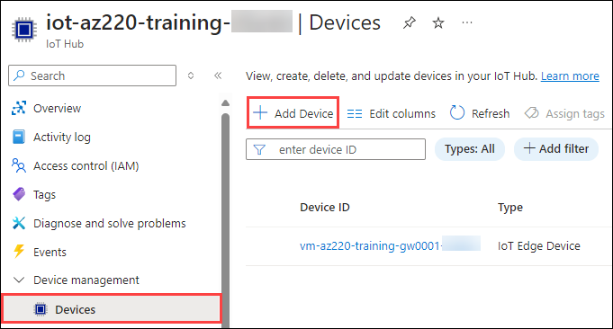

1. On the **Create a device** blade, under **Device ID**, enter **sensor-th-0072**

   

1. Under **Parent device**, click **Set a parent device**.

   

1. On the **Set an Edge device as a parent device** blade, under **Device ID**, click **vm-az220-training-gw0001-{your-id}**, and then click **OK**.

   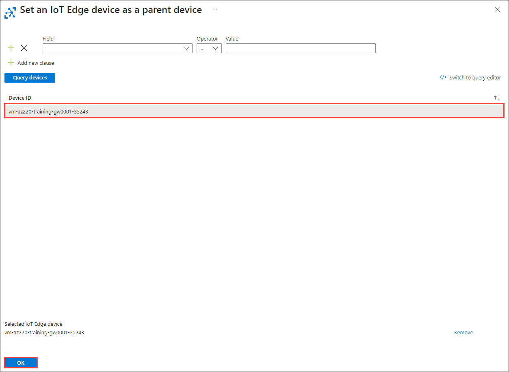

1. On the **Create a device** blade, to create the IoT Device identity for the downstream device, click **Save**.

1. On the **IoT devices** pane, click **Refresh**.

1. Under **Device ID**, click **sensor-th-0072**.

   

1. On the IoT Device summary pane, to the right of the **Primary Connection String** field, click **Copy**.

   

1. Save the Primary Connection String value of your leaf IoT device to your text file for later reference.

    Be sure to note that this connection string is for the sensor-th-0072 leaf device.

### Task 2: Download device x509 certificate

In this task, you will configure the connection between a pre-built downstream device and your Edge gateway device.

1. On the Azure portal toolbar, click **Cloud Shell**.

    Ensure that the environment is set to **Bash**.

1. At the Cloud Shell command prompt, to download the root CA X.509 certificate for the IoT Edge Gateway virtual machine, enter the following command:

    ```bash
    download lab12/certs/azure-iot-test-only.root.ca.cert.pem
    ```

    > **Note**: Your browser UI may prompt you to save the download file.

    The Azure IoT Edge Gateway was previously configured in the **/etc/aziot/config.toml** file to use this root CA X.509 certificate for encrypting communications with any downstream devices connecting to the gateway. This X.509 certificate will need to be copied to the downstream devices so they can use it to encrypt communications with the gateway.

1. Copy the **azure-iot-test-only.root.ca.cert.pem** X.509 certificate file to the **DownstreamDevice** directory folder (under the Starter folder for lab 12) where the source code for the downstream IoT device is located.

    The Lab 12 **Starter** folder is part of the lab resources that you downloaded before starting this lab. The folder path is:

    * Allfiles
        * Labs
            * 12-Setup an IoT Edge Gateway
                * Starter

    > **Note**: If you have trouble finding the Allfiles folder, check your Windows Desktop folder.

    > **Important**: Make sure the file has that exact name. Rename the file after copying it if necessary.

### Task 3: Create hosts file entry

In earlier versions of this lab, the FQDN would be used as the value from the **GatewayHostName** in the device connectionstring, however the test x509 certificate generated by the current versions of the test scripts no longer supports this. Instead, only the hostname is used and an entry must be created in the local machine's **hosts** file to resolve the hostname to an IP Address. 

In this task, you will add the required entry to the hosts file.

1. Open Visual Studio Code.

    > **Note**: You may find it helpful to maximize the Visual Studio Code window.

1. On the **File** menu, click **Open File**.

1. Navigate to the following folder location: **c:\\Windows\\System32\\Drivers\\etc\\**, and then open the **hosts** file.

    > **Note**: the **hosts** file has no extension.

1. Add the following line to the **hosts** file, followed by an empty line:

    ```text
    {VM Public IP Address} vm-az220-training-gw0001-{your-id}
    {blank line}
    ```

    For example,

    ```text
    168.61.181.131 vm-az220-training-gw0001-dm090821

    ```

1. On the Visual Studio Code **File** menu, click **Save**, and when prompted that the save operation failed, click **Retry as Admin...** and in the **User Account Control** dialog, click **Yes**.

   

The local machine can now resolve the VM name to the appropriate IP Address.

### Task 4: Connect Downstream Device to IoT Edge Gateway

In this task, you will connect the IoT edge device to the IoT Edge Gateway.

1. On the Visual Studio Code **File** menu, click **Open Folder**.

1. In the **Open Folder** dialog, navigate to the Starter folder for lab 12, click **DownstreamDevice**, and then click **Select Folder**.

    The Lab 12 **Starter** folder is part of the lab resources that you downloaded before starting this lab. The folder path is:

    * Allfiles
        * Labs
            * 12-Setup an IoT Edge Gateway
                * Starter

    You should see the azure-iot-test-only.root.ca.cert.pem file listed in the EXPLORER pane along with the Program.cs file.

    > **Note**: If you see messages to restore dotnet and/or load the C# extension, you can complete the installs.

1. In the EXPLORER pane, click **Program.cs**.

    Take a minute to review the code.

1. Locate the declaration for the **connectionString** variable, and then replace the placeholder value with the Primary Connection String for the **sensor-th-0072** IoT device.

1. Append the assigned **connectionString** value with a **GatewayHostName** property, and then set the value of GatewayHostName to the name of your IoT Edge gateway device.

    > **Note**: In the previous task, you updated the local machine's **hosts** file to resolve the IoT Edge device's hostname to an IP Address. As a result, the fully qualified domain name (DNS name) of your Edge gateway device is not required.

    The completed connection string values should match the following format:

    ```text
    HostName={IoT-Hub-Name}.azure-devices.net;DeviceId=sensor-th-0072;SharedAccessKey={Primary-Key-for-IoT-Device};GatewayHostName={Name-of-your-IoT-Edge-Device}
    ```

    > **Important**: The **GatewayHostName** must be resolvable to an IP address, which often requires the full DNS name.

    Be sure to replace the placeholders shown above with the appropriate values:

    * **{IoT-Hub-Name}**: The Name of the Azure IoT Hub.
    * **{Primary-Key-for-IoT-Device}**: The Primary Key for the **sensor-th-0072** IoT device in Azure IoT Hub.
    * **{Name-of-your-IoT-Edge-Device}**: The name of your IoT Edge device: **vm-az220-training-gw0001-{your-id}**

    The **connectionString** variable with the assembled connection string value will look similar to the following:

    ```csharp
    private readonly static string connectionString = "HostName=iot-az220-training-abc201119.azure-devices.net;DeviceId=sensor-th-0072;SharedAccessKey=ygNT/WqWs2d8AbVD9NAlxcoSS2rr628fI7YLPzmBdgE=;GatewayHostName=vm-az220-training-gw0001-{your-id}";
    ```

1. On the **File** menu, click **Save**.

1. Scroll down to locate the **Main** method, and then take a minute to review the code.

    This method contains the code that instantiates the **DeviceClient** using the configured Connection String, and specifies **MQTT** as the transport protocol to use for communicating with the Azure IoT Edge Gateway.

    ```csharp
    deviceClient = DeviceClient.CreateFromConnectionString(connectionString, TransportType.Mqtt);
    SendDeviceToCloudMessagesAsync();
    ```

    The Main method also:

    * calls the **InstallCACert** method which includes the code to automatically install the root CA X.509 certificate to the local machine.
    * calls the **SendDeviceToCloudMessagesAsync** method that sends event telemetry from the simulated device.

1. Locate the **SendDeviceToCloudMessagesAsync** method, and then take a minute to review the code.

    This method contains the code that generates the simulated device telemetry, and sends the events to the IoT Edge Gateway.

1. Locate the **InstallCACert** and browse the code that installs the root CA X.509 certificate to the local machine certificate store.

    > **Note**: Remember that this certificate is used to secure the communication from the device to the Edge Gateway. The device uses the symmetric key within the connection string for authentication with the IoT Hub.

    The initial code within this method is responsible for ensuring the **azure-iot-test-only.root.ca.cert.pem** file is available. In production applications you might consider using an alternative mechanism to specify the path to the X.509 certificate, such as an environment variable, or using TPM.

    Once the presence of the X.509 certificate has been verified, the **X509Store** class is used to load the certificate into the current user's certificate store. The certificate will then be available on-demand to secure communication to the gateway - this occurs automatically within the device client, so there is no additional code.

    > **Information**: You can learn more about the **X509Store** class [here](https://docs.microsoft.com/en-us/dotnet/api/system.security.cryptography.x509certificates.x509store?view=netcore-3.1).

1. On the **Terminal** menu, click **New Terminal**.

1. At the TERMINAL command prompt, enter the following command:

    ```bash
    dotnet run
    ```

    This command will build and run the code for the **sensor-th-0072** simulated device, which will start sending device telemetry.

    > **Note**: When the app attempts to install the X.509 certificate on the local machine (so that it can use it to authenticate with the IoT Edge Gateway), you may see a Security Warning asking about installing the certificate. You will need to click **Yes** to allow the app to continue.

1. If you are asked if you want to install the certificate, click **Yes**.

1. Once the simulated device is running, the console output will display the events being sent from the downstream leaf device to the parent IoT Edge gateway device.

    The terminal output will look similar to the following:

    ```text
    IoT Hub C# Simulated Cave Device. Ctrl-C to exit.

    User configured CA certificate path: azure-iot-test-only.root.ca.cert.pem
    Attempting to install CA certificate: azure-iot-test-only.root.ca.cert.pem
    Successfully added certificate: azure-iot-test-only.root.ca.cert.pem

    10/25/2019 6:10:12 PM > Sending message: {"temperature":27.714212817472504,"humidity":63.88147743599558}
    10/25/2019 6:10:13 PM > Sending message: {"temperature":20.017463779085066,"humidity":64.53511070671263}
    10/25/2019 6:10:14 PM > Sending message: {"temperature":20.723927165718717,"humidity":74.07808918230147}
    10/25/2019 6:10:15 PM > Sending message: {"temperature":20.48506045736608,"humidity":71.47250854944461}
    ```

    > **Note**: If the message send operation on the device seems to pause for longer than a second on the first send, you likely did not add the network security group (NSG) incoming rules correctly earlier in hte lab, so your MQTT traffic is being blocked. Check your NSG configuration.

1. Leave the simulated device running while you move on to the next task.

### Task 5: Verify Event Flow

In this task, you will use the Azure CLI to monitor the events being sent to Azure IoT Hub from the downstream IoT Device through the IoT Edge Gateway. This will validate that the communication between the IoT Edge devices and IoT hub is working correctly.

1. If necessary, log in to your Azure portal using your Azure account credentials.

    If you have more than one Azure account, be sure that you are logged in with the account that is tied to the subscription that you will be using for this lab.

1. If Cloud Shell is not running, on the Azure portal toolbar, click **Cloud Shell**.

1. If you are connected to the Edge device with an SSH connection in Cloud Shell, exit that connection.

1. At the Cloud Shell command prompt, to monitor the stream of events flowing to your IoT hub, run the following command:

    ```bash
    az iot hub monitor-events -n iot-az220-training-{your-id}
    ```

    Be sure to replace the **{your-id}** placeholder with your unique ID when specifying the name of your Azure IoT Hub.

    The **az iot hub monitor-events** command enables you to monitor device telemetry & messages sent to an Azure IoT Hub. This will verify that events from the simulated device, being sent to the IoT Edge Gateway, are being received by the Azure IoT Hub.

    > **Note**: If prompted **Dependency update (uamqp 1.2) required for IoT extension version: 0.10.13.**, enter **Y**.

1. With the IoT Edge device communication working correctly, the output from the **az iot hub monitor-events** command will look similar to the following:

    ```text
    chris@Azure:~$ az iot hub monitor-events -n iot-az220-training-1119
    Starting event monitor, use ctrl-c to stop...
    {
        "event": {
            "origin": "sensor-th-0072",
            "module": "",
            "interface": "",
            "component": "",
            "payload": "{\"temperature\":29.995470051651573,\"humidity\":70.47896838303608}"
        }
    }
    {
        "event": {
            "origin": "sensor-th-0072",
            "module": "",
            "interface": "",
            "component": "",
            "payload": "{\"temperature\":28.459910635584922,\"humidity\":60.49697355390386}"
        }
    }
    ```

1. Verify that the message data displayed by the leaf device in Visual Studio Code is being received by IoT hub as reflected in the Cloud Shell.

    You have successfully configured an IoT Edge transparent gateway to support communication from a downstream leaf device in support of a simple device-side architecture.

    > **NOTE**: Once you have completed this lab and verified the event flow, exit the Cloud Shell and console application by pressing **CTRL+C**.

1. Delete the Azure resources that you created during the lab.

    If you have one or more Azure resource groups dedicated to this lab, it is recommended that you delete them before exiting the lab environment.

    > **Note**: Resources that your created during this lab include an associated fee. If you are using your own Azure account, be sure to clean up your resources to minimize any charges.

## Summary

In this lab, you have created an Linux based Virtual Machine as an IoT Edge Device. and you have connected to that VM and check regarding IoT edge modules and download CA certificate and also created a downstream device.

## You have successfully completed this Lab!!
