# Lab 09: Develop, Deploy, and debug a custom module on Azure IoT Edge with VS Code

### Estimated Duration: 120 minutes

## Lab Scenario

To help manage fluctuations in consumer demand, Contoso maintains a small inventory of ripened cheeses in a warehouse at each cheese making facility. These ripened wheels are sealed in wax and the storage environment is carefully controlled to ensure that the cheese remains in perfect condition. Contoso uses a conveyor system to move the large wax-sealed cheese wheels from the warehouse to the packaging facilities.

In the past, Contoso has run their packaging process at full capacity, processing all the cheese that is placed in the system. Any excess volume of packaged cheese was not an issue because it could be used for promotional offers, and additional cheese could be pulled from inventory as needed. However, with the significant growth that Contoso is experiencing, and with growing fluctuations due to worldwide demand, the company needs to automate the system in a way that helps to manage the volume of cheese being packaged.

Since you have already implemented the IoT solution that monitors the conveyor belt system in the packaging and shipping area, you have been tasked with developing a solution that helps to manage/control packaging volumes.

To ensure that the correct number of packages have been processed, you decide to create (and deploy to an IoT Edge device) a simple module that counts the number of packages detected on the conveyor belt system. You already have another module available that can be used to detect the packages (both modules be deployed to the same IoT Edge device).

## Lab Objectives

In this lab, you will complete the following activities:

* Exercise 1: Install Azure IoT EdgeHub Dev Tool
* Exercise 2: Create an Azure Container Registry
* Exercise 3: Create Custom Edge Module in C#
* Exercise 4: Debug in Attach Mode with IoT Edge Simulator
* Exercise 5: Deploy the IoT Edge Solution

## Architecture Diagram

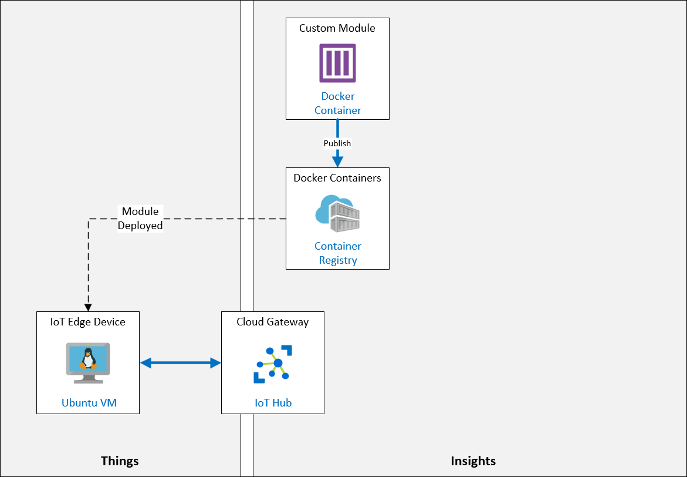

## Exercise 1: Install Azure IoT EdgeHub Dev Tool

In this exercise, you will ensure docker engine is running and install the Azure IoT EdgeHub Dev Tool.

1. Navigate to your desktop and locate the **Docker Desktop** icon. Double-click the icon to launch the application.

   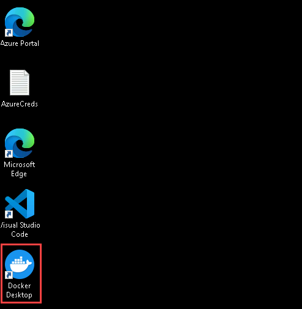

1. On the **Docker Subscription Service Agreement**, select **Accept** and click on **finish** in the next pane.

   

1. In **Welcome to Docker** pane click on **skip** to skip all the panes.

   

1. Wait for sometime in the  **docker desktop**, ensure that **Engine running** status as shown. Close the docker desktop, continue with further steps.

   

1. To open Visual Studio Code, locate the **Visual Studio Code** icon on your desktop. Double-click the icon to launch the application.

   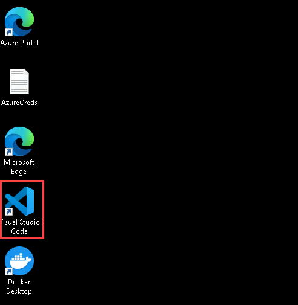

1. Open **New Terminal** in Visual Studio Code, which will open the integrated terminal.

   

1. At the terminal, to install the package manager for Python (Pip), run the following commands:

    ```cmd/sh
    curl https://bootstrap.pypa.io/get-pip.py -o get-pip.py
    python get-pip.py
    ```

1. To verify that the Azure IoT EdgeHub Dev Tool is installed, run the following command:

    ```cmd/sh
    pip install iotedgehubdev --user
    ```

## Exercise 2: Create an Azure Container Registry

Azure Container Registry provides storage of private Docker images for container deployments. The service is a managed, private Docker registry service based on the open-source Docker Registry 2.0. Azure Container Registry is used to store and manage your private Docker container images.

When a new module instance is created by the IoT Edge runtime, it gets a corresponding module identity. The module identity is stored in IoT Hub and is used as the addressing and security scope for all local and cloud communications for that module instance. In implementation, modules images exist as container images in a repository, and module instances are containers on devices. The only supported container engine for IoT Edge devices in production is Moby.

In this exercise, you will use the Azure portal to create a new Azure Container Registry resource.

### Task 1: Create the container registry

In this task, you will create a Container Registry from Azure Portal.

1. On the Azure Portal, search for **Container registries** and select it.

   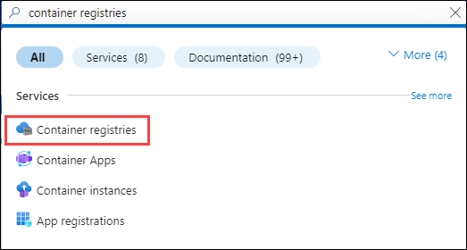

1. On the **Container registries** blade, click on **Create**.

   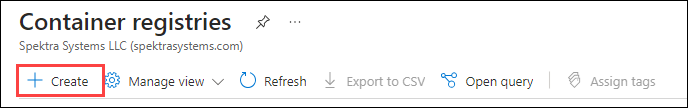

1. On the **Create container registry** blade, enter the followig details and click on Reviee + **Create (4)**

    | Settings | Values |
    |  -- | -- |
    | **resource group** | **Select the existing resource group (1)** |
    | **Registry name** |**acraz220trainingcah<inject key="DeploymentID" enableCopy="false" />** **(2)**|
    | **Pricing Plan** | **Standard (3)** |
   
      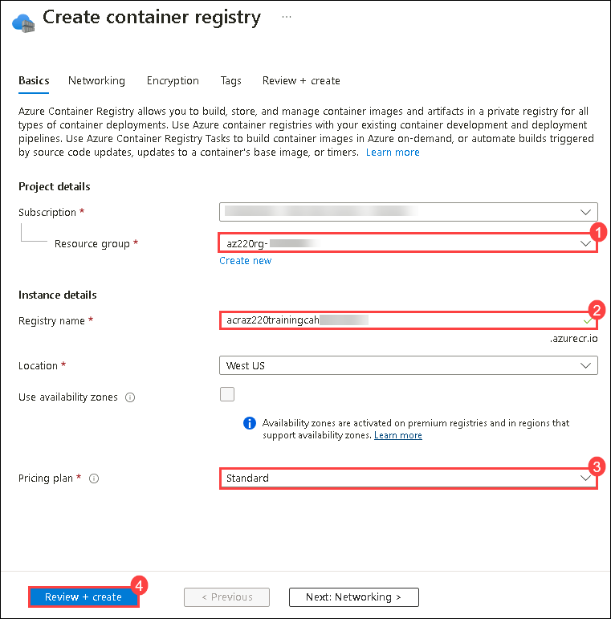

### Task 2: Connect Docker to the container registry

In this task, you will be connecting your Docker to Container Registry.

1. From the resources tab of your resource group, open your container registry, click **acraz220training<inject key="DeploymentID" enableCopy="false" />**.

1. On the left side navigation menu, under **Settings**, click **Access keys**. Under **Admin user**, check the box to enable it. Make a record of the following values, paste it in a notepad. You will be using these values further in this lab:

    * **Login server**
    * **Username**
    * **password**

      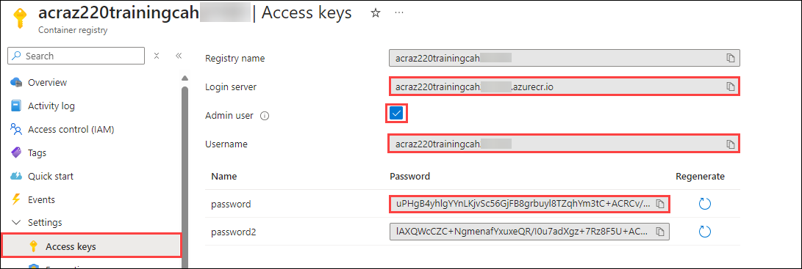

1. Navigate back to **Visual Studio Code** terminal which you have opened earlier, and then run the following command:

    ```cmd/sh
    docker login <loginserver>
    ```

   >**Note:** Replace `<loginserver>` with the name you recorded, and enter the username and password you recorded when prompted. For example:

    ```cmd/sh
    docker login az220acrcah191204.azurecr.io
    ```

1. You will be prompted for the Username and Password values that you recorded. Once these values are entered and verified, you will see a **Login Succeeded** message.

  >**Congratulations** on completing the Task! Now, it's time to validate it. Here are the steps:

  > - Hit the Validate button for the corresponding task. If you receive a success message, you have successfully validated the lab. 
  > - If not, carefully read the error message and retry the step, following the instructions in the lab guide.
  > - If you need any assistance, please contact us at labs-support@spektrasystems.com.

   <validation step="50eea306-3342-453b-9f11-b1721b9ac260" />

## Exercise 3: Create Custom Edge Module in C#

In this exercise, you will create an Azure IoT Edge Solution that contains a custom Azure IoT Edge Module written in C#.

### Task 1: Create the solution

In this task, you will be using Visual Studio Code setup the IoT Edge Solution.

1. In the **Visual Studio Code** open, select **View** menu, and click on **Command Palette**.

      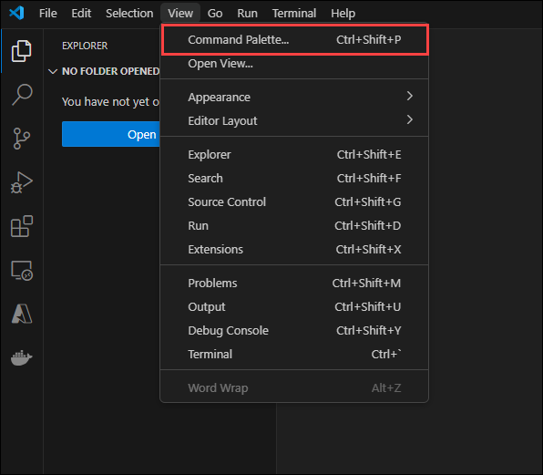

1. At the command prompt, type **Azure IoT Edge: New**, and then click **Azure IoT Edge: New IoT Edge Solution**.

      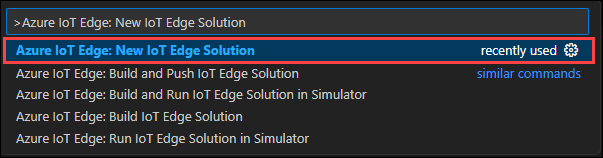

1. Browse to the folder `C:\Labfiles`, and then click **Select folder**.

1. When prompted for a solution name, enter **EdgeSolution**. This name will be used as the directory name for the new **IoT Edge Solution** that will be created.

1. When prompted to select a module template, click **C# Module**. This will define **C#** as the development language for the custom IoT Edge Module added to the solution.

1. When prompted for the name of the custom IoT Edge Module, enter **ObjectCountingModule**.

1. When prompted for name of the Docker image repository for the module, replace the **localhost:5000** part of the default "localhost:5000/objectcountingmodule" repository location with the name of the Azure Container Registry server - similar to **acraz220training<inject key="DeploymentID" enableCopy="false" />.azurecr.io**.
   
    ```text
    <acr-name>.azurecr.io/<module-name>
    ```

    > **Note**: Be sure to replace the placeholders with the appropriate values:
              - `<acr-name>`: Replace with the name of the Azure Container Registry service.
              - `<module-name>`: Replace with the name of the custom Azure IoT Edge Module that's being created.

    > **Note**:  The default Docker image repository in Visual Studio Code is set to `localhost:5000/<your module name>`. If you were to use a local Docker registry for testing, then **localhost** is fine.

    > **Important**: Make sure to remove any reference to port **5000** from your ACR references!  That port is used for a local Docker repository, but it not used in the ACR case.

1. Wait for Visual Studio Code to create the solution. Once the new **IoT Edge Solution** has been created, Visual Studio Code will open the solution.

    > **Note**: If Visual Studio Code prompts you to load required resources or C# extension, click **Yes**

    > **Note**: If Visual Studio Code prompts you to configure the **.env** file, select **Yes** and proceed to Task 2 below.

### Task 2: Configure the solution

In this task, you will be setting up your username and password in the solution.

1. In the **Explorer** pane, to open the .env file, click **.env**. The .env file is located in the root directory of the IoT Edge Solution. This is where the username and password are configured for accessing your Docker registry. The username and password are stored in this file using the following format:

    ```text
    CONTAINER_REGISTRY_USERNAME_<registry-name>=<registry-username>
    CONTAINER_REGISTRY_PASSWORD_<registry-name>=<registry-password>
    ```
    >**Note**: Within your version of .env file, notice that the `<registry-name>` has already been added to the configuration values. The value that has been added should match the name of the Docker registry that you specified when creating the IoT Edge Solution.

1. Within the **.env** file, replace the placeholder values with the username and password values that you saved earlier. Save the updated **.env** file.

      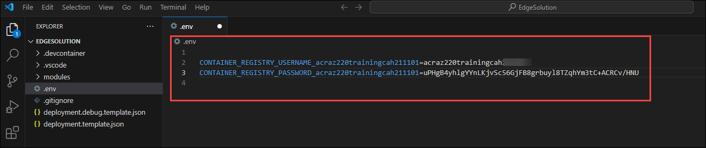

1. In the **Explorer** pane, to open the deployment.template.json file, click **deployment.template.json**, ensure that the **image** is mentioned properly with the actual image name in both - **deployment.template.json** and **deployment.debug.template.json** files.

      

      >**Note**: You can use the same image name from the below configurations and paste it here.

1. In the same file, ensure that the **Schema version** is mentioned properly with **1.2** or later in both - **deployment.template.json** and **deployment.debug.template.json** files.

      

1. In Visual Studio Code, on the **View** menu, click **Command Palette**

     

1. At the command prompt, type **Azure IoT Edge: Set Default** and then click **Azure IoT Edge: Set Default Target Platform for Edge Solution**.

1. To select the target platform, click **windows-amd64**.

## Exercise 4: Debug in Attach Mode with IoT Edge Simulator

In this exercise, you will build and run a custom IoT Edge Module solution using the IoT Edge Simulator from within Visual Studio Code.

### Task 1: Create a test IoT Edge device

In this task, you will test the IoT Edge device.

1. In the Azure Portal, on your Resource group tile, to open your IoT hub, click **iot-az220-training-<inject key="DeploymentID" enableCopy="false" />**.

     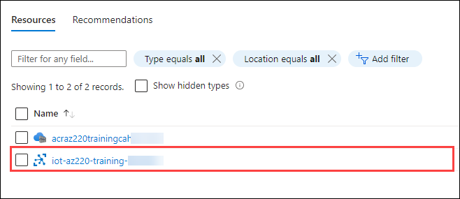

1. On the left side navigation menu, under **Security settings**, click **Shared access policies**. In the list of policies, click **iothubowner**.  copy the value for **Primary connection string**.

     

      >**Note**: Record this value, as you will need it below.

1. On the left side navigation menu, under **Device management**, click **IoT Edge**. Click **Add an IoT Edge device**.

     

1. On the **Create a device** blade, under **Device ID**,  enter **SimulatedDevice**. Leave all other settings as default, click on **save**.

     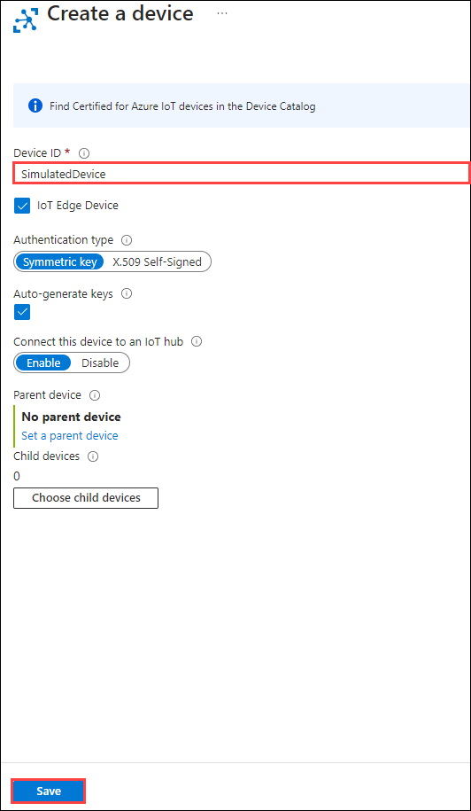

### Task 2: Configure the test module

In this task, you will be configuring the module using the connection string of device.

1. Switch to the **Visual Studio Code** instance containing your IoT Edge solution.

1. In the **Explorer** pane, right-click **deployment.debug.template.json**, and then click **Build and Run IoT Edge Solution in Simulator**.

      

1. This file is the debugging deployment manifest file. It is located in the root directory of the IoT Edge Solution.

1. When the process begins, you will see a dialog open in the lower right corner of the windows that says, **Please setup iotedgehubdev first before starting simulator**.

1. When you see the prompt to setup iotedgehubdev, click **Setup**.

1. When prompted for the **IoT Hub Connection String**, enter the **Primary Connection string** you recorded earlier.

1. When prompted to **Select an IoT Edge Device**, click **SimulatedDevice**.

    > **Note**: If you get an **Unauthorized** error in the lower-right-hand corner, run the **Azure IoT Hub: Set IoT Hub Connection String** command from the Command Palette to reconfigure your simulator connection string, then run **Azure IoT Edge: Setup IoT Edge Simulator** from the command palette and try to select your device again.

    > **Note**: It is possible that you will be prompted for your Admin password on your local machine (in the Visual Studio Code **TERMINAL** window), particularly on Linux or macOS. Enter your password at the prompt and press **Enter**. The reason it might ask for your password is that the setup command for **iotedgehubdev** is being run using **sudo** as it requires elevated privileges.

1. Once the IoT Edge Simulator is set up successfully, a **Setup IoT Edge Simulator successfully** message will be displayed in the Visual Studio Code TERMINAL. Now when you build and run the module in the IoT Edge Simulator, it will run as expected.

### Task 3: Build and run the module

In this task, you will build the solution and run it as IoT Edge device which send telemetry data.

1. In the **Explorer** pane, right-click **deployment.debug.template.json**, and then click **Build and Run IoT Edge Solution in Simulator**.

     

1. Observe the build process reporting in your TERMINAL window. It can take quite a few minutes to download and build everything that is required to simulate the IoT Edge device and run your modules, so be patient. Notice that once the **IoT Edge Simulator** is running, the Modules that you built will begin sending message output that is reported to the TERMINAL window:

    ```text
    SimulatedTemperatureSensor    |         12/09/2019 15:05:08> Sending message: 4, Body: [{"machine":{"temperature":23.023276334173641,"pressure":1.2304998355387693},"ambient":{"temperature":20.56235126408858,"humidity":24},"timeCreated":"2019-12-09T15:05:08.4596891Z"}]
    ObjectCountingModule           | Received message: 4, Body: [{"machine":{"temperature":23.023276334173641,"pressure":1.2304998355387693},"ambient":{"temperature":20.56235126408858,"humidity":24},"timeCreated":"2019-12-09T15:05:08.4596891Z"}]
    ObjectCountingModule           | Received message sent
    SimulatedTemperatureSensor    |         12/09/2019 15:05:13> Sending message: 5, Body: [{"machine":{"temperature":23.925331861560853,"pressure":1.3332656551145274},"ambient":{"temperature":20.69443827876562,"humidity":24},"timeCreated":"2019-12-09T15:05:13.4856557Z"}]
    ObjectCountingModule           | Received message: 5, Body: [{"machine":{"temperature":23.925331861560853,"pressure":1.3332656551145274},"ambient":{"temperature":20.69443827876562,"humidity":24},"timeCreated":"2019-12-09T15:05:13.4856557Z"}]
    ObjectCountingModule           | Received message sent
    ```

1. Notice the output from the **ObjectCountingModule** contains the text **Received message: #** where **#** is the total message count that has been received by the custom **ObjectCountingModule** IoT Edge Module that was created.

1. With the IoT Edge Simulator still running, open the Azure portal window.

1. At the top of the portal window, to open the Azure Cloud Shell, click **Cloud Shell**.

      

1. On the **Welcome to Azure Cloud Shell** pane, click on **Bash**.

      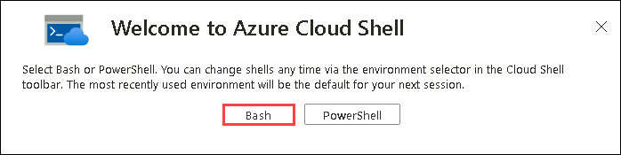

1. On the **Getting started** pane, select **Mount storage account** **(1)** and select the **subscription** **(2)** and click on **Apply** **(3)**.

      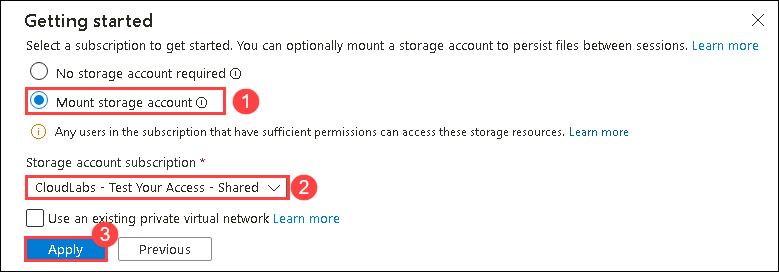
 
1. On the **Mount storage account** pane select **I want to create a storage account** and click on **Next**.

      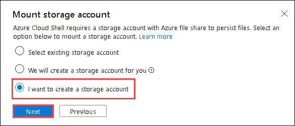

1. In the **Create storage account** page and click on **Create** **(5)**: 

   | Settings | Values |
   |  -- | -- |
   | **Resource group**  | **Select the default** **(1)** |
   | **Region**  | **East US** **(2)** |
   | **Storage account name** | **stoaz220<inject key="DeploymentID" enableCopy="true" />** **(3)** |
   | **File share** | **cloudshell** **(4)** |

      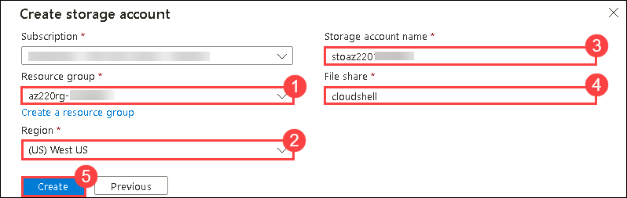

1. At the Cloud Shell command prompt, to monitor the messages being sent to Azure IoT Hub from the **SimulatedDevice** running in the IoT Edge Simulator on your local machine, enter the following command:

    ```cmd/sh
    az iot hub monitor-events --hub-name "iot-az220-training-<DeploymentID>"
    ```

   >**Note:** Be sure to replace the **<DeploymentID>** value with <inject key="DeploymentID" enableCopy="true" />.

1. Observe the output displayed in the Cloud Shell. With everything still running, notice the output of the previous command in the Cloud Shell will display a JSON representation of the messages being received by the Azure IoT Hub. The output should look similar to the following:

      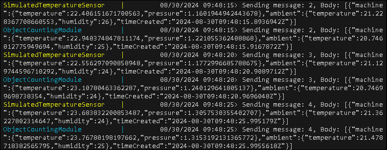

1. Close the **Cloud Shell** window.

  >**Congratulations** on completing the Task! Now, it's time to validate it. Here are the steps:

  > - Hit the Validate button for the corresponding task. If you receive a success message, you have successfully validated the lab. 
  > - If not, carefully read the error message and retry the step, following the instructions in the lab guide.
  > - If you need any assistance, please contact us at labs-support@spektrasystems.com.

   <validation step="976bf7db-9c4f-4611-9bfc-f4c533696c10" />

## Exercise 5: Deploy the IoT Edge Solution

In this exercise, you will build and publish the custom IoT Edge Module into the Azure Container Registry (ACR) service. Once published to ACR, the custom module will then be made available to be deployed to any IoT Edge Device.

### Task 1:  Publish module to the Azure Container Registry

In this task, you will push the image to container registry.

In this task, you will use Docker commands to tag and publish the image to container registry.

1. Navigate back to **Visual Studio Code**. and open **New Terminal**.

     

1. On the terminal, run commands to tag and push the image to **Azure Container Registries**.

1. Run the following command to check the images and note the **REPOSITORY** and **TAG** value of the image that you have built.

   ```
   docker images
   ```

     

1. Run the following command to tag the image.

   ```
   docker tag <local_image_name><version> <acr_address>/<module_name>:<version>
   ```
   >**Note**: Ensure to change the placeholders with actual values, such as `<local_image_name>` with the name of the image you copied earlier and `<acr_address>` with login server url of the registry, `<module_name>:<version>` with actual module name and version. For example, the command look similar to this:
   
   ```
   docker tag mcr.microsoft.com/azureiotedge-hub:1.4 acraz220trainingcah211101.azurecr.io/objectcountingmodule:1.4
   ```
   >**Note**: Ensure to you use lowercase letters in the command.
  
1. Run the following command to push the image to **Container Registry**.

   ```
   docker push <acr_address>/<module_name>:<version>
   ```

1. Switch to your Azure portal window. On your Resource group tile, to open your Azure Container Registry (ACR) service, click **acraz220training<inject key="DeploymentID" enableCopy="false" />**.
 
     

1. On the left side navigation menu, under **Services**, Under **Repositories**, select **objectcountingmodule** and click on **1.4** which is the tag that we have provided.

     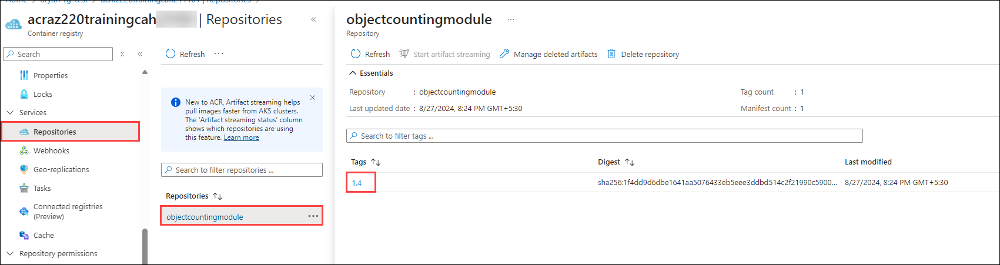

1. Save a copy of the Image URI. The format of the Docker image Repository and Tag names combined will be in the following format:

    ```text
    <registry-name>/<repository-name>:<tag>
    ```

1. Here's an example of a full Docker image URI for the **objectcountingmodule** IoT Edge Module:

    ```text
    acraz220training1440646/objectcountingmodule:1.4
    ```

### Task 2: Configure an IoT Edge device to use the module

In this task, you will configure the IoT edge device and set the IoT Edge Module. 

1. Navigate to your Azure IoT Hub resource.

     

1. On the **iot-az220-training-<inject key="DeploymentID" enableCopy="false" />** blade, on the left side navigation menu under **Device management**, click **IoT Edge**. On the **IoT Edge** pane, click **Add an IoT Edge device**.

     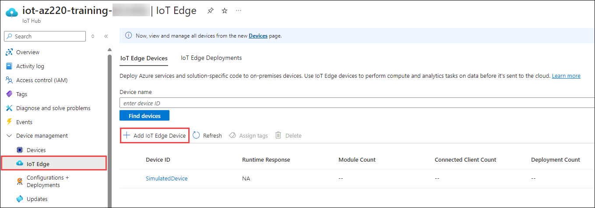

1. On the **Create a device** blade, under **Device ID**, enter **objectcountingdevice**. click **Save**.

1. On the **IoT Edge** pane, under **Device ID**, click **objectcountingdevice**.

     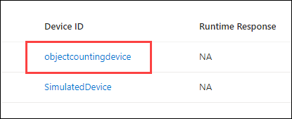

1. At the top of the **objectcountingdevice** blade, click **Set Modules**.

     

1. On the **Set modules on device: objectcountingdevice** blade, under **Container Registry Settings**, enter the following values:

    | Setting | Value |
    | --- | --- |
    | Name | Enter the **Registry name** of the Azure Container Registry (e.g. **acraz220trainingcah191204**)  |
    | Address | Enter the **Login server** (or DNS name) of the Azure Container Registry service (e.g. **acraz220trainingcah191204.azurecr.io**) |
    | User Name | Enter the **Username** for the Azure Container Registry service |
    | Password | Enter the **password** for the Azure Container Registry service |

    > **Note**: The Azure Container Registry (ACR) service _Registry name_, _Login server_, _Username_, and _Password_ can be found on the **Access keys** pane for the service.

      

1. On the **Set modules on device: objectcountingdevice** blade, under **IoT Edge Modules**, click **Add**, and then click **IoT Edge Module**.

      

1. On the **Add IoT Edge Module** pane, under **IoT Edge Module Name**, enter **objectcountingmodule** **(1)**. Under **Image URI** **(2)** paste the image URI you have copied earlier. Click on **Add** **(3)**.

      

1. On the **Set modules on device: objectcountingdevice** blade, at the bottom of the blade, click **Next: Routes >**.

      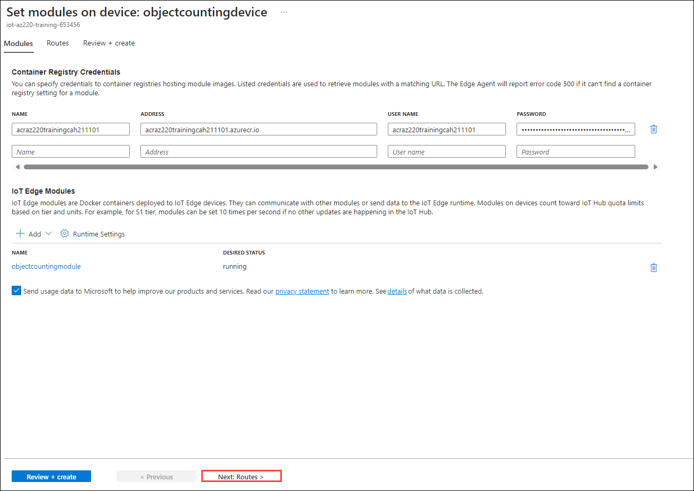

1. On the **Routes** tab, add the following two routes:

    | NAME | VALUE |
    | --- | --- |
    | `AllMessagesToObjectCountingModule` | `FROM /* INTO BrokeredEndpoint("/modules/objectcountingmodule/inputs/input1")` |
    | `ObjectCountingModuleToIoTHub` | `FROM /messages/modules/objectcountingmodule/outputs/* INTO $upstream` |

      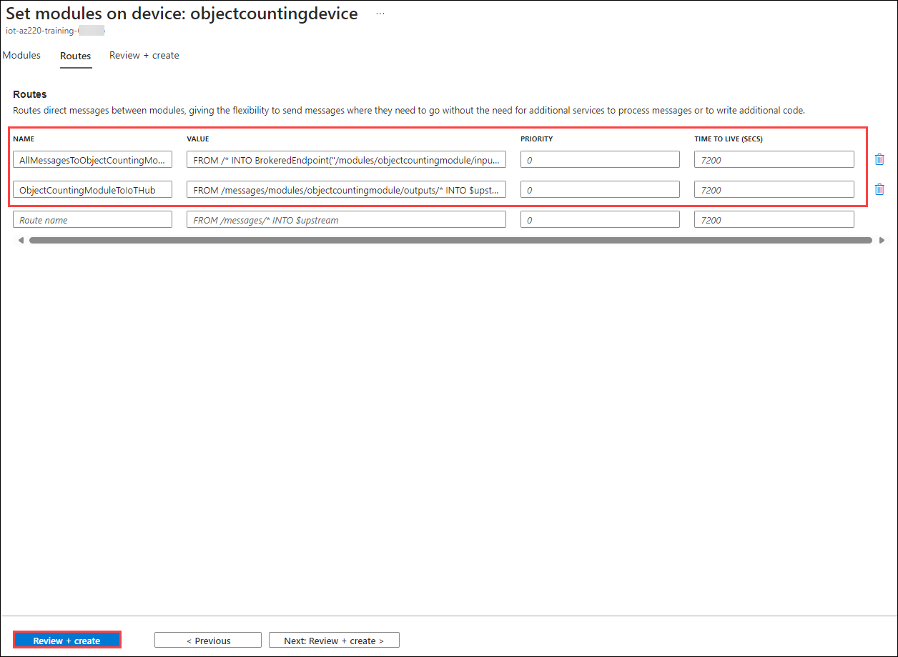

1. At the bottom of the blade, click **Next: Review + create >**.

1. Review the Deployment Manifest for the device, and then click **Create**.

  >**Congratulations** on completing the Task! Now, it's time to validate it. Here are the steps:

  > - Hit the Validate button for the corresponding task. If you receive a success message, you have successfully validated the lab. 
  > - If not, carefully read the error message and retry the step, following the instructions in the lab guide.
  > - If you need any assistance, please contact us at labs-support@spektrasystems.com.

   <validation step="702e474b-50e3-4fa6-8d7e-864560f327f6" />

## Summary

In this lab, you have deployed an azure container registry and docker desktop to manage the container which is built using .NET Simulator project. You have used the build commands to build the image from the project. You have pushed the image to registry and created a IoT Edge Device and added the Docker Image as module to it.

### You have successfully completed the Lab
