# Lab 10: Remotely monitor and control devices with Azure IoT Hub

### Estimated Duration: 120 minutes

## Lab Scenario

Contoso is proud of its award-winning cheeses and is careful to maintain the perfect temperature and humidity during the entire manufacturing process, but conditions during the aging process have always received special attention.

In recent years, Contoso has used environmental sensors to record the conditions within their natural cheese caves where aging occurs, and has used that data to identify a near perfect environment. Data from the most successful (aka award producing) locations indicates that the ideal temperature for aging cheese is approximately 50 degrees Fahrenheit +/- 5 degrees (10 degrees Celsius +/- 2.8 degrees). The ideal humidity value, measured in percentage of maximum saturation, is approximately 85% +/- 10%.

These ideal temperature and humidity values work well for most types of cheese. However, minor variations are required for especially hard or especially soft cheeses. The environment must also be adjusted at critical times/phases within the aging process to achieve specific results, such as a desired condition for the cheese rind.

Contoso is lucky enough to operate cheese caves (in certain geographic regions) that naturally maintain ideal conditions almost year-round. However, even in these locations, managing the environment during the aging process is critical. Also, natural caves often have a number of different chambers, each of which can have a slightly different environment. Cheese varieties are placed in a chamber (zone) that matches their specific requirements. To keep environmental conditions within desired limits, Contoso uses an air processing/conditioning system that controls both temperature and humidity.

Currently, an operator monitors the environmental conditions within each zone of a cave facility and adjusts the air processing system settings when required to maintain the desired temperature and humidity. Operators are able to visit each zone and check the environmental conditions every 4 hours. In locations where temperature changes dramatically between the daytime high and nighttime low, conditions can slip outside of the desired limits.

Contoso has tasked you with implementing an automated system that keeps the cave environment within control limits.

In this lab, you will be prototyping a cheese cave monitoring system that implements IoT devices. Each device is equipped with temperature and humidity sensors, and is connected to the air processing system that controls temperature and humidity for the zone where the device is located.

## Lab Objectives

In this lab, you will complete the following:

- Exercise 1: Configure Lab Prerequisites
- Exercise 2: Review Code to Send and Receive Telemetry
- Exercise 3: Complete a Second App to Receive Telemetry
- Exercise 4: Include Code to Invoke a Direct Method
- Exercise 5: Implement the Device Twin functionality

## Architecture Diagram

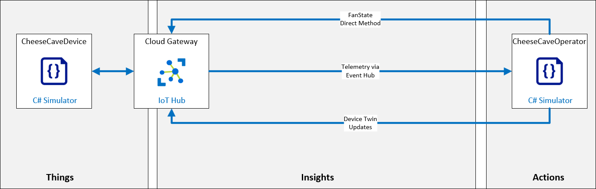

### Exercise 1: Configure Lab Prerequisites

1. Navigate to the **Environment (1)** Details tab in your VM and copy the following values:

   - **deviceConnectionString (2)**
   - **eventHubsCompatibleEndpoint (3)**
   - **eventHubsCompatiblePath (4)**
   - **iotHubSasKey (5)**
   - **serviceConnectionString (6)**

        

## Exercise 2: Review Code to Send and Receive Telemetry

In this exercise, you will be completing the simulated device app (for the sensor-th-0055 device) that sends telemetry to your IoT Hub.

### Task 1: Open a simulated device that generates telemetry

1. Open **Visual Studio Code** from the desktop.

      

1. Click on **File (1)** and select **Open Folder (2)**.

     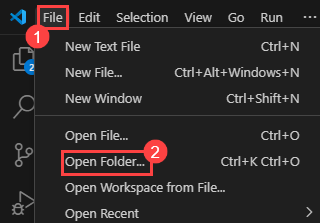

1. Navigate to `C:\LabFiles\az-220\MSLearnLabs-AZ-220-Microsoft-Azure-IoT-Developer-stage-rowancollege\Allfiles\Labs\15-Remotely monitor and control devices with Azure IoT Hub\Final` and select the **CheeseCaveDevice** folder.

1. Click on **Yes, i trust the authors** when prompted.

      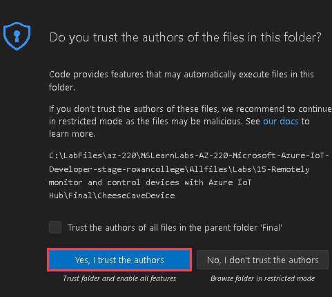

1. You should see the following files listed in the EXPLORER pane of Visual Studio Code:

     - CheeseCaveDevice.csproj
     - Program.cs

         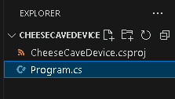

1. To open the code file, click **Program.cs**.
   
      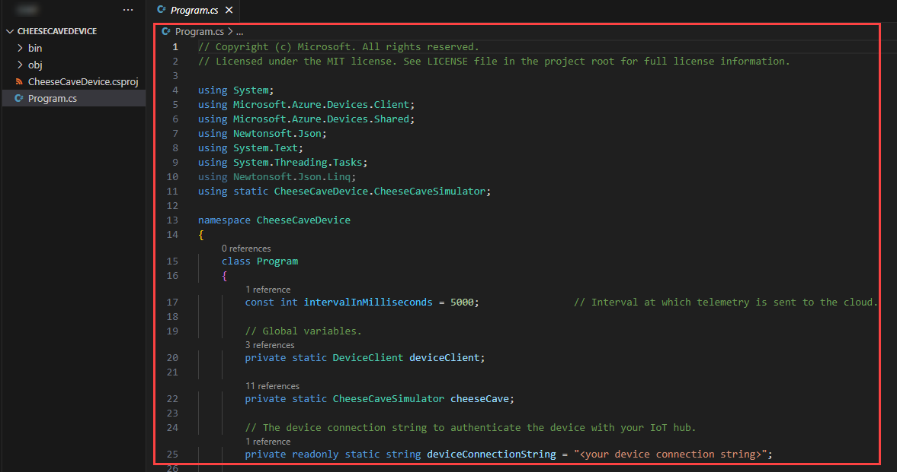

1. In Vs code, click on **Terminal (1)** and click on **New Terminal (2)**. Notice that the directory path is indicated as part of the command prompt.

   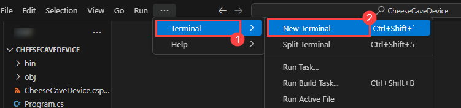

1. At the terminal command prompt, to verify the application builds, enter the following command:

    ```bash
    dotnet build
    ```

      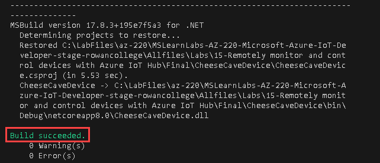

### Task 2: Configure connection and review code

The simulated device app that you will build in this task simulates an IoT device that monitors temperature and humidity. The app will simulate sensor readings and communicate sensor data every two seconds.

1. In visual studio code, open **Program.cs**. Replace the **assigned placeholder** value (including the angle braces) with the device **connection string** that you saved earlier.
   
      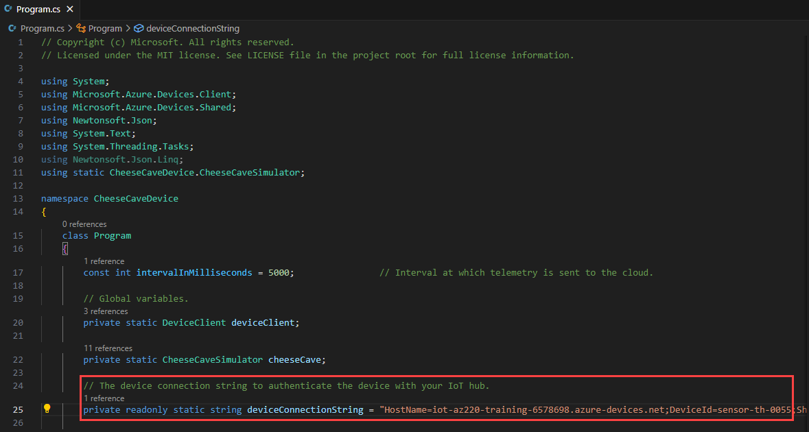

1. Press `Ctrl + S` to save.

### Task 3: Test your Code to Send Telemetry

1. In Vs code, click on **Terminal (1)** and click on **New Terminal (2)**.

      

1. At the Terminal command prompt, to run the simulated device app, enter the following command:

    ```bash
    dotnet run
    ```

    > **Note**: This command will run the **Program.cs** file in the current folder.

1. Notice the output being sent to the Terminal.

      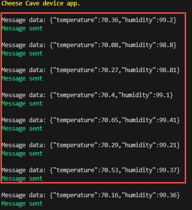

    > **Note**:  Green text is used to indicate when things are working as they should be. Red text is used to indicate when there is a problem. If you don't get a screen similar to the image above, start by checking your device connection string.

1. Leave this app running.

## Exercise 3: Complete a Second App to Receive Telemetry

Now that you have your (simulated) cheese cave device sending telemetry to your IoT Hub, you need to complete a back-end app that can connect to IoT Hub and "listen" for that telemetry. Eventually, this back-end app will be used to automate the control of the temperature in the cheese cave.

### Task 1: Complete an app to receive telemetry

In this task, you will begin work on the back-end app that will be used to receive telemetry from the IoT Hub Event Hub endpoint.

1. Open an additional instance of Visual Studio Code.

1. On the **File (1)** menu, click **Open Folder (2)**.

    

1. In the **Open Folder** dialog, navigate to the `C:\LabFiles\az-220\MSLearnLabs-AZ-220-Microsoft-Azure-IoT-Developer-stage-rowancollege\Allfiles\Labs\15-Remotely monitor and control devices with Azure IoT Hub\Final`.

    > **NOTE**: Be sure to open the **Final** folder. You do not want the project in the Starter folder.

1. Click **CheeseCaveOperator**, and then click **Select Folder**.

1. Click on **Yes, i trust the authors** when prompted.

      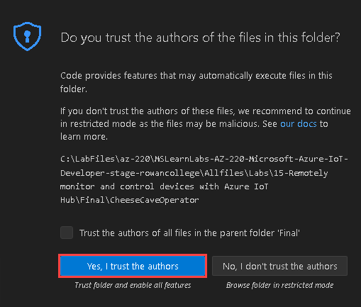

#### Task 2: Enable the telemetry receiver code

1. In the **EXPLORER** pane, click **Program.cs**.

1. Replace the **eventHubsCompatibleEndpoint (1)**, **eventHubsCompatiblePath (2)** ,**iotHubSasKey (3)** and **serviceConnectionString (4)** placeholder values with the values that you saved earlier in the exercise-1.

     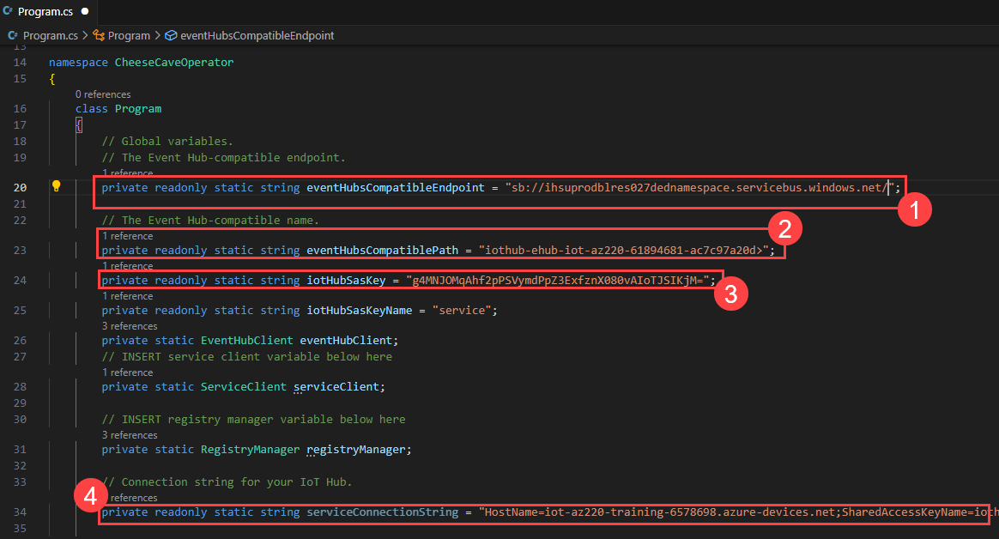
  
1. Press `Ctrl + S` to save.

### Task 3: Test your Code to Receive Telemetry

This test is important, checking whether your back-end app is picking up the telemetry being sent out by your simulated device. Remember your device app is still running, and sending telemetry.

1. In Vs code, click on **Terminal (1)** and click on **New Terminal (2)**.

      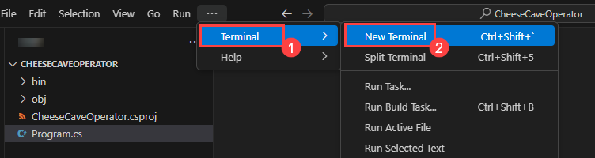

1. To run the **CheeseCaveOperator** back-end app in the terminal, enter the following command:

    ```bash
    dotnet run
    ```

1. Take a minute to observe the output to the Terminal.

    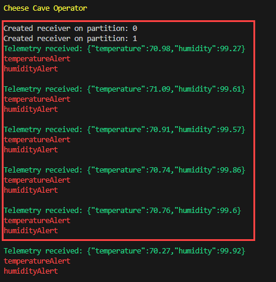

    > **Note**:  Green text is used to show things are working as they should and red text when bad stuff is happening. If you don't get a screen similar to this image, start by checking your device connection string.

1. Leave this app running for a moment longer.

1. You can press **CTRL+C** in the Terminal pane to stop the apps.

## Exercise 4: Include Code to Invoke a Direct Method

Calls from the back-end app to invoke direct methods can include multiple parameters as part of the payload. Direct methods are typically used to turn features of the device off and on, or specify settings for the device.

In the Contoso scenario, you will be implementing a direct method on the device that controls the operation of a fan located in the cheese cave (simulating the control of temperature and humidity by turing the fan On or Off). The Operator application will communicate with your IoT Hub to invoke the direct method on the device.

There are several error conditions that you need to check for when your cheese cave device receives an instruction to run the direct method. One of these checks is simply to respond with an error if the fan is in a failed state. Another error condition to report is when an invalid parameter is received. Clear error reporting is important, given the potential remoteness of the device.

Direct methods require that the back-end app prepares the parameters, then makes a call specifying the single device on which to invoke the method. The back-end app will then wait for, and report, a response.

The device app contains the functional code for the direct method. The function name is registered with the IoT client for the device. This process ensures the client knows what function to run when the call comes from the IoT Hub (there could be many direct methods).

In this Exercise, you will update your device app by adding the code for a direct method that will simulate turning on the fan in the cheese cave. Next, you will add code to the back-end service app to invoke this direct method.

### Task 1: Enable Code to Define a Direct Method in the Device App

1. Return to the Visual Studio Code instance that contains your **CheeseCaveDevice** application.

    > **Note**: If the app is still running, use the Terminal pane to exit the app (click inside the Terminal pane to set the focus and the press **CTRL+C** to exit the running application).

1. Ensure that **Program.cs** is open in the code editor.

1. Locate the **Create a handler for the direct method call** comment line within the code.

1. To register the direct method, uncomment the following code:

    ```csharp
    deviceClient.SetMethodHandlerAsync("SetFanState", SetFanState, null).Wait();
    ```

      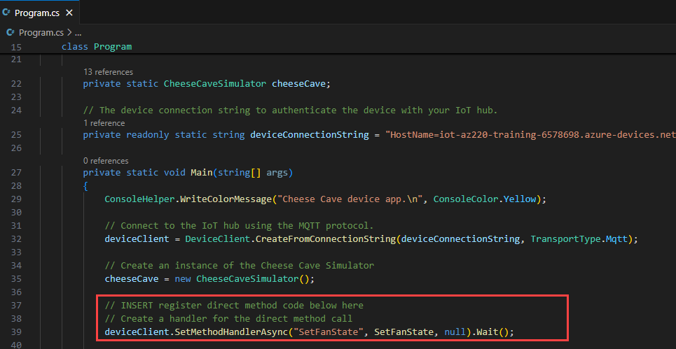

    > **Note**: Notice that the **SetFanState** direct method handler is also set up by this code. As you can see, the **SetMethodHandlerAsync** method of deviceClient takes the remote method name **"SetFanState"** as an argument, along with the actual local method to call, and a user context object (in this case null).

1. Locate the **Handle the direct method call** comment line within the code.

1. Uncomment the **SetFanState** direct method, and review the code and comments.

    `  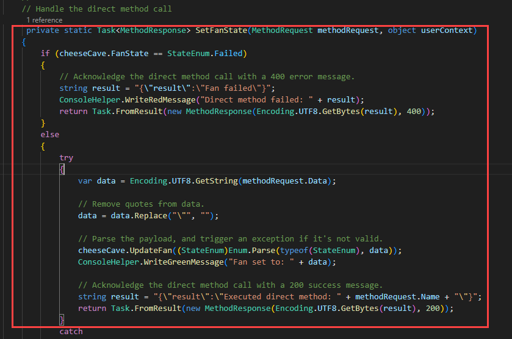

### Task 2: Add Code to Call Your Direct Method

1. Return to the Visual Studio Code instance that contains the **CheeseCaveOperator** application.

    > **Note**: If the app is still running, use the Terminal pane to exit the app (click inside the Terminal pane to set the focus and the press **CTRL+C** to exit the running application).

1. Ensure that **Program.cs** is open in the code editor.

1. Near the top of the file, notice that the application defines a global variable to hold a service client instance:

    ```csharp
    private static ServiceClient serviceClient;
    ```

1. Locate the **Create a ServiceClient to communicate with service-facing endpoint on your hub** comment line within the code.

1. Uncomment the following lines of code:

    ```csharp
    serviceClient = ServiceClient.CreateFromConnectionString(serviceConnectionString);
    
    InvokeMethod().GetAwaiter().GetResult();
    ```

      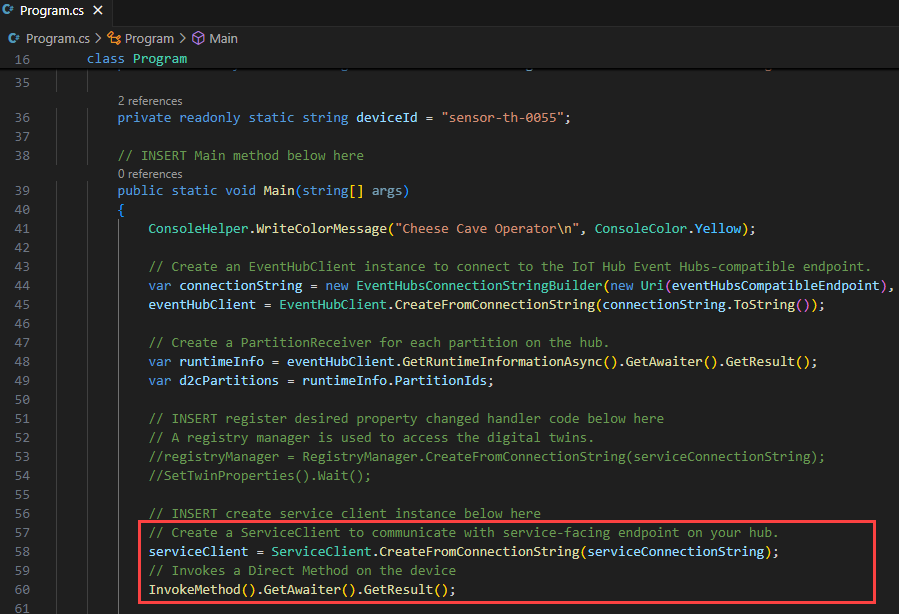

1. Press `Ctrl + S` to save.

### Task 3: Test the direct method

To test the direct method, you will need to start the apps in the correct order. You can't invoke a direct method that hasn't been registered!

1. Switch to the instance of Visual Studio Code that contains the **CheeseCaveDevice** device app.

1. In Vs code, click on **Terminal (1)** and click on **New Terminal (2)**.
   
   

1. To start the **CheeseCaveDevice** device app, open a Terminal pane and then enter a `dotnet run` command.

    It will begin writing to the terminal, and telemetry messages will be displayed.

    ```bash
    dotnet run
    ```
   
1. Switch to the instance of Visual Studio Code that contains the **CheeseCaveOperator** back-end app.

1. In Vs code, click on **Terminal (1)** and click on **New Terminal (2)**.
   
     

1. To start the **CheeseCaveOperator** back-end app, open a Terminal pane and then enter a `dotnet run` command.

    ```bash
    dotnet run
    ```
    
      > **Note**:  If you see the message **Direct method failed: timed-out** then double check you have saved the changes in the **CheeseCaveDevice** and started the app. The CheeseCaveOperator back-end app will immediately call the direct method.

      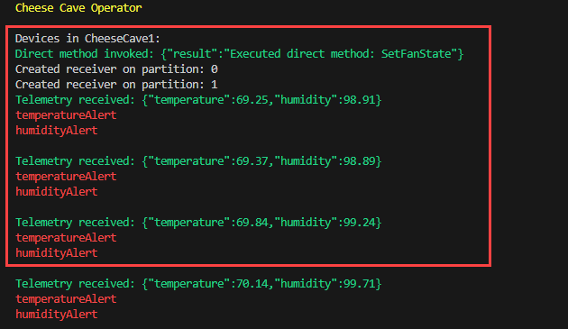

1. Now check the console output for the **CheeseCaveDevice** device app, you should see that the fan has been turned on.

      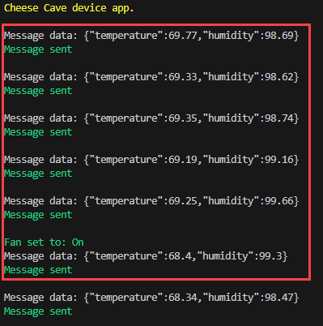

## Exercise 5: Implement the Device Twin functionality

As a reminder, a device twin contains four types of information:

* **Tags**: information on the device that isn't visible to the device.
* **Desired properties**: the desired settings specified by the back-end app.
* **Reported properties**: the reported values of the settings on the device.
* **Device identity properties**: read-only information identifying the device.

Device twins, which are managed through IoT Hub, are designed for querying, and they are synchronized with the real IoT device. The device twin can be queried, at any time, by the back-end app. This query can return the current state information for the device. Getting this data doesn't involve a call to the device, as the device and twin will have synchronized. Much of the functionality of device twins is provided by Azure IoT Hub, so not much code needs to be written to make use of them.

There is some overlap between the functionality of device twins and direct methods. You could set device properties using direct methods, which might seem an intuitive way of doing things. However, using direct methods would require the back-end app to record those settings explicitly, if they ever needed to be accessed. Using device twins, this information is stored and maintained by default.

In this exercise, you will enable some code in the back-end service app, to show device twin synchronization in operation (the device code for twin synchronization is already added and has been covered in earlier labs).

### Task 1: Enable Code To Use Device Twins To Synchronize Device Properties

1. Return to the Visual Studio Code instance that is running the **CheeseCaveOperator** back-end app.

1. If the app is still running, place input focus on the terminal and press **CTRL+C** to exit the app.

1. Ensure that the **Program.cs** is open.

1. Near the top of the file, notice that a global variable for a **RegistryManager** instance is already defined:

    ```csharp
    private static RegistryManager registryManager;
    ```

1. In the **Main** method, locate the **A registry manager is used to access the digital twins** comment line within the code.

1. To enable the functionality that creates the registry manager instance and sets the twin properties, uncomment the following code lines:

    ```csharp
    registryManager = RegistryManager.CreateFromConnectionString(serviceConnectionString);
    SetTwinProperties().Wait();
    ```

      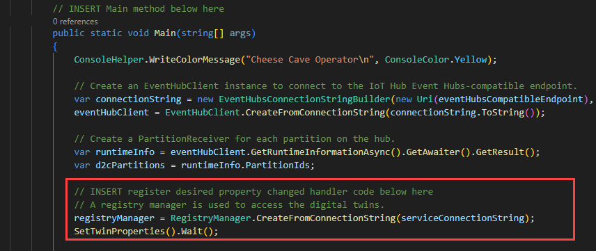

    > **Note**: Notice that the **serviceConnectionString** value is used to connect to the IoT Hub with the appropriate access level. The **SetTwinProperties** is then called.

1. Press `Ctrl+S` to save.

### Task 2: Enable Code to Synchronize Device Twin Settings for the Device

1. Return to the Visual Studio Code instance that contains the **CheeseCaveDevice** app.

1. If the app is still running, place input focus on the terminal and press **CTRL+C** to exit the app.

1. Ensure that the **Program.cs** file is open in the Code Editor pane.

1. In the **Main** method, locate the **Get the device twin to report the initial desired properties** comment line within the code.

1. To register the desired property changed handler, uncomment the following code lines:

    ```csharp
    Twin deviceTwin = deviceClient.GetTwinAsync().GetAwaiter().GetResult();

    ConsoleHelper.WriteGreenMessage("Initial twin desired properties: " + deviceTwin.Properties.Desired.ToJson());

    deviceClient.SetDesiredPropertyUpdateCallbackAsync(OnDesiredPropertyChanged, null).Wait();
    ```

      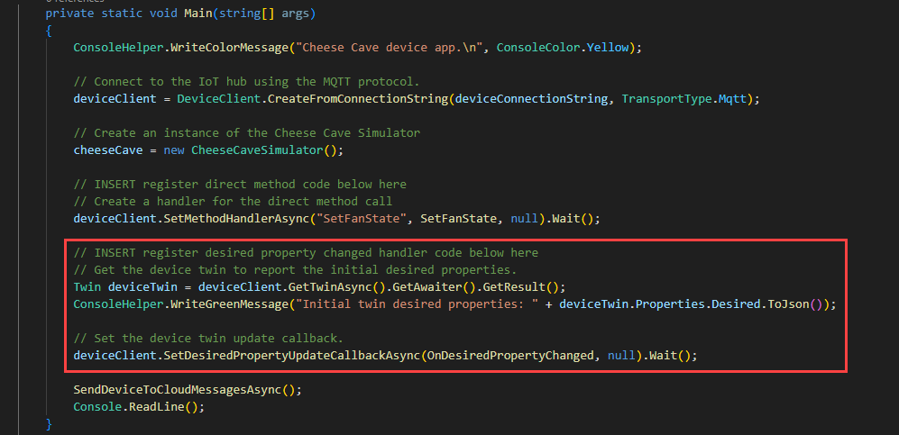

1. Locate the **OnDesiredPropertyChanged is the handler that is invoked when a desired property changes in the device twin** comment line within the code.

1. Take a minute to review the OnDesiredPropertyChanged code.

1. Press `Ctrl+S` to save.

    > **Note**:  Now you have added support for device twins to your app, you can reconsider having explicit variables such as **desiredHumidity**. You could use the variables in the device twin object instead.

### Task 3: Test the Device Twins

To test the code that manages device twin desired property changes, you will start the apps in the correct order, device application first and then back-end application.

1. Switch to the instance of Visual Studio Code that contains the **CheeseCaveDevice** device app.

1. To start the **CheeseCaveDevice** device app, open a Terminal pane and then enter a `dotnet run` command.

    It will begin writing to the terminal, and telemetry messages will be displayed.

    ```bash
    dotnet run
    ```

1. Switch to the instance of Visual Studio Code that contains the **CheeseCaveOperator** back-end app.

1. To start the **CheeseCaveOperator** back-end app, open a Terminal pane and then enter a `dotnet run` command.

    ```bash
    dotnet run
    ```

1. Switch back to the instance of Visual Studio Code that contains the **CheeseCaveDevice** device app.

1. Check the console output and confirm that the device twin synchronized correctly.

    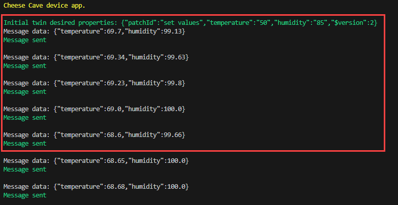

    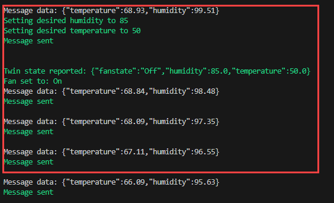

    If you let the fan do its work, you should eventually see red alerts turn off (unless the fan fails)

    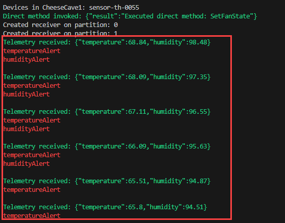

## Summary
In this lab, you have configured the Lab Prerequisites, reviewed Code to Send and Receive Telemetry, completed a Second App to Receive Telemetry, included Code to Invoke a Direct Method and implemented the Device Twin functionality.

### You have successfully completed the lab
