# Lab 11: Automate IoT Device Management with Azure IoT Hub

### Estimated Duration: 60 minutes

## Lab Overview

In this lab, you’ll explore how IoT devices, which may use optimized or minimal operating systems, update their firmware. Firmware updates are essential for maintaining and improving device functionality and are now commonly managed over the air (OTA) rather than manually. The process involves acquiring firmware from an online source, which is identified by a unique version, and storing it locally before applying the update. You'll need to understand device-specific requirements and work with manufacturers or hardware developers to handle these updates effectively. Azure IoT Hub offers advanced support for implementing device management operations on single devices and on collections of devices. The [Automatic Device Management](https://docs.microsoft.com/azure/iot-hub/iot-hub-auto-device-config) feature enables you to simply configure a set of operations, trigger them, and then monitor their progress.

## Lab Scenario

The automated air processing system that you implemented in Contoso's cheese caves has helped the company to raise its already high-quality bar. The company has more award-winning cheeses than ever before.

Your base solution consists of IoT devices that are integrated with sensors and a climate control system to provide real-time control of temperature and humidity within a multi-chamber cave system. You also developed a simple back-end app that demonstrated the ability to manage devices using both direct methods and device twin properties.

Contoso has extended the simple back-end app from your initial solution to include an online portal that operators can use to monitor and remotely manage the cave environment. With the new portal, operators can even customize the temperature and humidity within the cave based on the type of cheese or for a specific phase within the cheese aging process. Each chamber or zone within the cave can be controlled separately.

The IT department will be maintaining the back-end portal that they developed for the operators, but your manager has agreed to manage the device side of the solution.

For you, this means two things:

1. The Operations team at Contoso is always looking for ways to make improvements. These improvements often lead to requests for new features in the device software.

1. The IoT devices that are deployed to cave locations need the latest security patches to ensure privacy and prevent hackers from taking control of the system. In order to maintain system security, you need to keep the devices up to date by remotely updating their firmware.

You plan to implement features of IoT Hub that enable automatic device management and device management at scale.

## Lab Objectives

In this lab, you will complete the following:

- Task 1: Configure Lab Prerequisites
- Task 2: Examine code for a simulated device that implements firmware update
- Task 3: Test firmware update on a single device

## Architecture Diagram

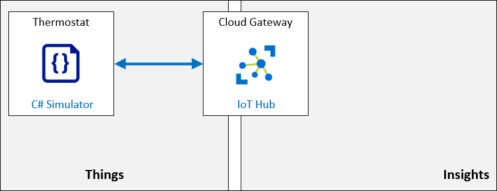

### Task 1: Configure Lab Prerequisites

In this task, you'll set up your Azure IoT environment by accessing your resource group in the Azure portal and selecting the appropriate IoT training resource. From there, you'll navigate to the Devices section, locate the specific device **sensor-th-0155**, and copy its connection string for later use.

1. On the Azure portal, navigate to the Resource group and then select the resource group named **az220rg-<inject key="DeploymentID" enableCopy="false"></inject>**.

    

1. In the **az220rg-<inject key="DeploymentID" enableCopy="false"></inject>** page, select **iot-az220-training-<inject key="DeploymentID" enableCopy="false"></inject>**

    

1. Click on **Devices (1)** under the **Device management** tab in the left pane and select **sensor-th-0155 (2)**.

   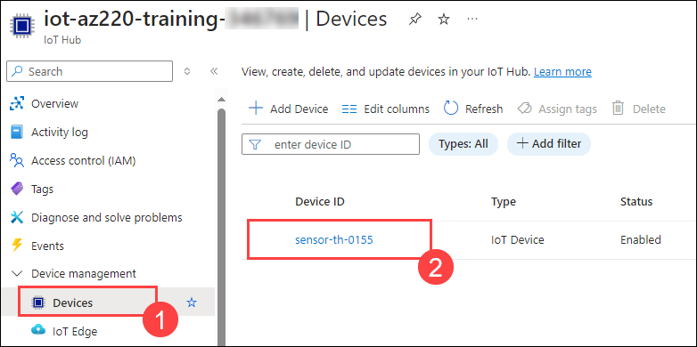

1. Copy the **primary connection string** and paste it into a notepad.

   

### Task 2: Examine code for a simulated device that implements firmware update

In this task, you'll review code for a simulated device that supports firmware updates. Open Visual Studio Code, navigate to the `fwupdatedevice` project folder, and examine the `Program.cs` file, focusing on the device connection string needed for running the app.

1. Open **Visual Studio Code** from the desktop.

      

1. Click on **File (1)** and select **Open Folder (2)**.

      

1. Navigate to `C:\LabFiles\az-220\MSLearnLabs-AZ-220-Microsoft-Azure-IoT-Developer-stage-rowancollege\Allfiles\Labs\16-Automate IoT Device Management with Azure IoT Hub\Final` and select the **fwupdatedevice** folder.

1. Click on **Yes, I trust the authors** when prompted.

      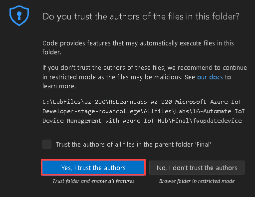

1. You should see the following files listed in the EXPLORER pane of Visual Studio Code:

   - FWUpdateDevice.csproj
   - Program.cs

      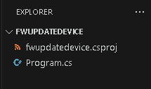

1. In the EXPLORER pane, to open the project file, click **FWUpdateDevice.csproj**. Notice the referenced NuGet packages:

      - Microsoft.Azure.Devices.Client - Device SDK for Azure IoT Hub
      - Microsoft.Azure.Devices.Shared - Common code for Azure IoT Device and Service SDKs
      - Newtonsoft.Json - Json.NET is a popular high-performance JSON framework for .NET

           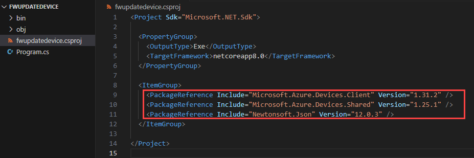

1. Navigate to **Program.cs** and at the top of the code file, locate the code comment line that begins with **The device connection string**.
   
      > **Note**: You will supply the device connection string value as a parameter when you enter the command to run the app later in this lab.

      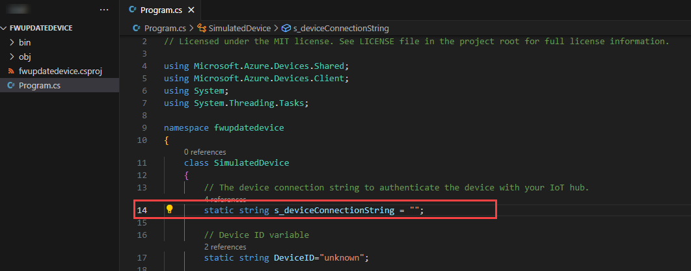

### Task 3: Test firmware update on a single device

In this task, you'll test a firmware update by running the `FWUpdateDevice` app with your device connection string. After observing the initial firmware version, create a firmware update configuration in the Azure portal. Then, monitor the terminal for progress on the firmware update.

1. In Vs code, click on **Terminal (1)** and click on **New Terminal (2)**. The folder location shown within the command prompt should show the FWUpdateDevice project folder.

      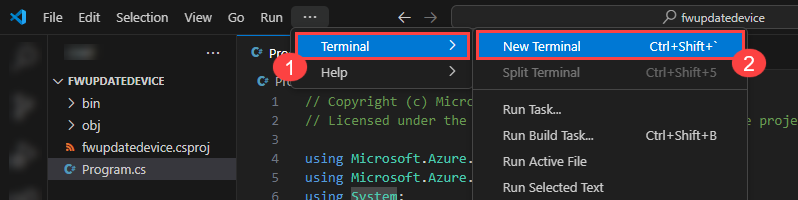

1. To run the FWUpdateDevice app, enter the following command:

      ``` bash
      dotnet run "<your device connection string>"
      ```

      > **IMPORTANT**: Remember to replace the placeholder value with your actual device connection string which you copied earlier in your notepad, and be sure to include "" around your connection string.
      >
      > For example: `dotnet run "HostName=iot-az220-training-{your-id}.azure-devices.net;DeviceId=sensor-th-0155;SharedAccessKey={}="`

1. Review the contents of the Terminal pane. You should see the following output in the terminal:

    ```bash
    sensor-th-0155: Device booted
    sensor-th-0155: Current firmware version: 1.0.0
    ```
    
      

1. Navigate back to `portal.azure.com`.

1. Open **iot-az220-training-<inject key="DeploymentID" enableCopy="false"></inject>**, click on **Devices (1)** under the Device management tab in the left pane and select **sensor-th-0155 (2)**.

      

1. Click on **Device twin** and review the contents of the device twin file.

      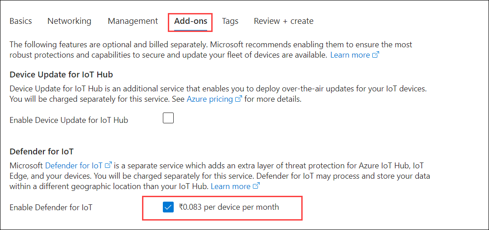

      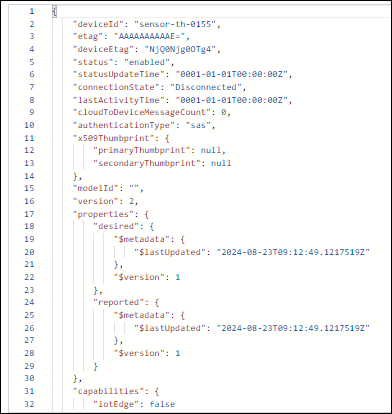

1. Navigate back to **iot-az220-training-<inject key="DeploymentID" enableCopy="false"></inject>** blade, click on **Configurations + Deployments (1)**, click on **+ Add** and select **Device Twin Configuration (2)**.

      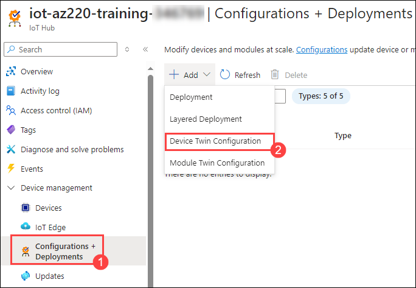

1. In the **Name and Label** tab, provide the name as **firmwareupdate (1)** and click on **Next: Twins Settings > (2)**

      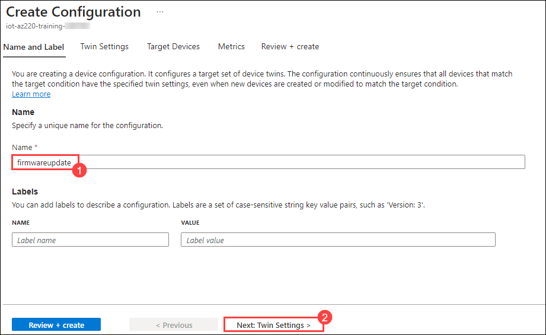

1. Under the **Twin Setting**s tab, in the **Device Twin Property** field, enter **properties.desired.firmware (1)**. In the **Device Twin Property Content (2)** field, replace the existing contents with the following and click on **Next: Target Devices> (3)**:

    ``` json
    {
        "fwVersion":"1.0.1",
        "fwPackageURI":"https://MyPackage.uri",
        "fwPackageCheckValue":"1234"
    }
    ```
      > **Note**: You can right-click in the content field and select **Format Document** to format the JSON if needed.

      

1. On the **Target Devices** tab, under **Priority**, in the **Priority (higher values ...)** field, enter **10 (1)**. Under **Target Condition**, in the **Target Condition** field add **deviceId='sensor-th-0155' (2)**, and click on **Next: Metrics> (3)**:

     

1. On the **Metrics** tab, under **METRIC NAME**, enter **fwupdated (1)**. Under **METRIC CRITERIA (2)**, enter the following and click on **Next: Review + Create> (3)**:

    ``` SQL
    SELECT deviceId FROM devices
        WHERE properties.reported.firmware.currentFwVersion='1.0.1'
    ```

      

1. On the **Review + create** tab, click **Create** after the "Validation passed" pops up.

1. Navigate back to **iot-az220-training-<inject key="DeploymentID" enableCopy="false"></inject>** pane, under **Configuration Name**, verify that your new **firmwareupdate** configuration is listed.

1. Switch to the **Visual Studio Code** window, and review the contents of the Terminal pane. The Terminal pane should include new output generated by your app that lists the progress of the firmware update process that was triggered.

      

## Summary
In this lab, you have configured Lab Prerequisites, examined code for a simulated device that implements firmware update and tested firmware update on a single device.

### You have successfully completed the lab
