# Lab 11: Introduction to Azure IoT Edge

## Introduction to Azure IoT Edge

## Lab Scenario

To encourage local consumers in a global marketplace, Contoso has partnered with local artisans to produce cheese in new regions around the globe.

Each location supports multiple production lines that are equipped with the mixing and processing machines that are used to create the local cheeses. Currently, the facilities have IoT devices connected to each machine. These devices stream sensor data to Azure and all data is processed in the cloud.

Due to the large amount of data being collected and the urgent time response needed on some of the machines, Contoso wants to use an IoT Edge gateway device to bring some of the intelligence to the edge for immediate processing. A portion of the data will still be sent to the cloud. Bringing data intelligence to the IoT Edge also ensures that they will be able to process data and react quickly even if the local network is poor.

You have been tasked with prototyping the Azure IoT Edge solution. To begin, you will be setting up an IoT Edge device that monitors temperature (simulating a device connected to one of the cheese processing machines). You will then deploy a Stream Analytics module to the device that will be used to calculate the average temperature and generate an alert notification if process control values are exceeded.

The following resources will be created:

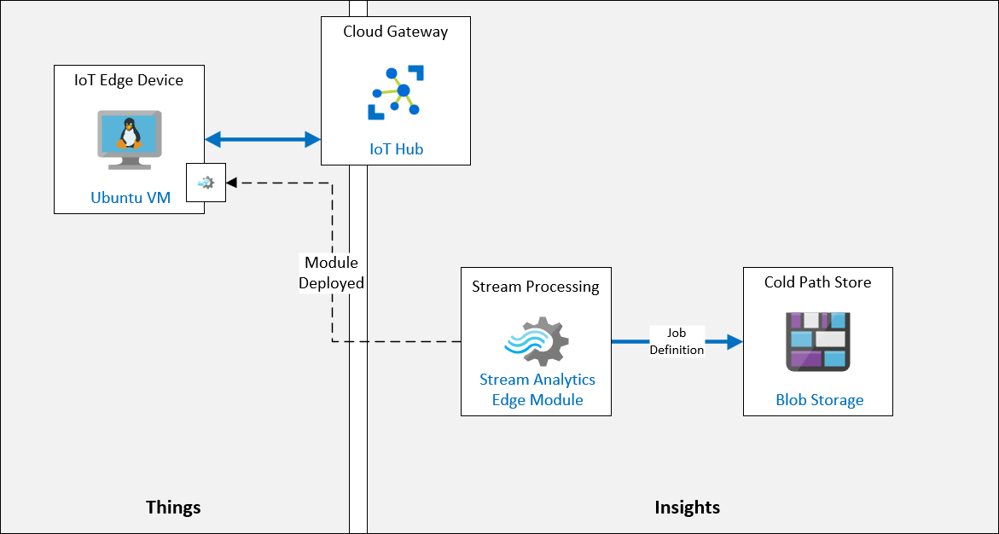

## Lab Objectives

In this lab, you will complete the following:

- Exercise 1: Configure Lab Prerequisites
- Exercise 2: Create and configure an IoT Edge VM
- Exercise 3: Add Edge Module to Edge Device
- Exercise 4: Deploy Azure Stream Analytics as IoT Edge Module


### Exercise 1: Configure Lab Prerequisites

1. Search for Resource Groups and select .

1. Select **Deployments** under the **Settings** tab in the left pane.

      

1. Select the existing deployment, click on **Outputs** and copy the **Connection string**.

      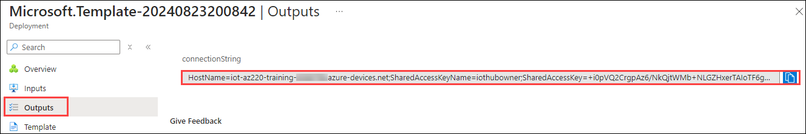

1. Search for **Iot Hub** and select it.
   
1. Select **iot-az220-training-<inject key="DeploymentID" enableCopy="false"></inject>**, click on **Iot Edge** under **Device Management** tab in the left pane.

1. Click on **+ Add IoT Edge Device**.

1. Provide the name as **sensor-th-0067 (1)** and click on **Save (2)**.

      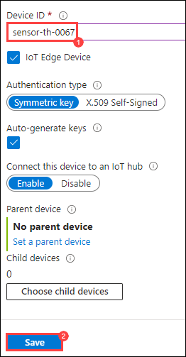

1. Navigate to **iot-az220-training-<inject key="DeploymentID" enableCopy="false"></inject>**, click on **Devices (1)** and select **sensor-th-0067 (2)**. 

      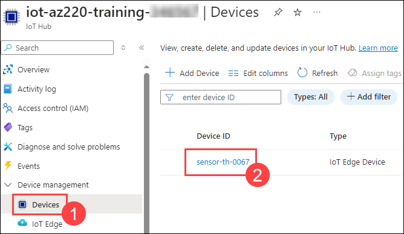

1. Copy the **Primary connection string** in a notepad for future use.

      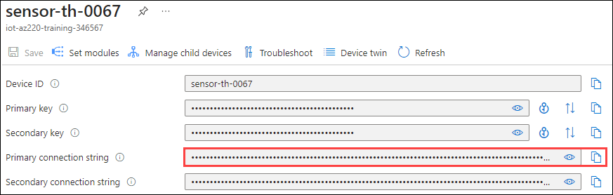
   
### Exercise 2: Create and configure an IoT Edge VM

#### Task 1: Create an IoT Edge Device Identity in IoT Hub using Azure CLI

1. On the Azure portal toolbar, to open the **Azure Cloud Shell**, click **Cloud Shell**.

   The Cloud Shell button is to the right of the search field and has an icon that appears to represent a command prompt.

   A Cloud Shell window will open near the bottom of the display screen.

      

1. Click on **Bash** when prompted.

      

1. Select the checkbox for **Mount Storage account (1)**, select the existing **subscription (2)** and click on **Apply (3)**.

      

1. Select **I want to create a storage account (1)** and click on **Next (2)**.

      

1. In the create a storage account page:

   - Subscription: **Select the default subscription (1)**
   - Resource Group: **Select the existing resource group (2)**
   - Region: Select **EAST US (3)**
   - Storage Account Name: **Provide the name as stoaz220<inject key="DeploymentID" enableCopy="false"></inject>** **(4)**
   - File Share: **Provide the name as fileshare220 (5)**

        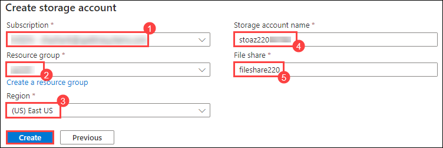

1. At the command prompt, use the following command to install Azure CLI extension for IoT

    ``` bash
    az extension add --name azure-iot
    ```
   
1. At the command prompt, verify that the Azure CLI extension for IoT is installed and up-to-date, enter the following command:

    ``` bash
    az extension update --name azure-iot
    ```

#### Task 2: Provision IoT Edge VM

1. In the **Custom deployment** page, under **Project details**, enter the following details:

   - Subscription: **Select the default subscription (1)**
   - Resource Group: **Select the existing resource group (2)**
   - Region: Select **EAST US (3)**
   - Virtual Machine Name: Provide the name as **vm-az220-training-edge0001-<inject key="DeploymentID" enableCopy="false"></inject>** **(4)**
   - Device Connection string: Paste the **connection string** you copied earlier in your notepad **(5)**
   - Virtual Machine Size: **Standard_DS1_v2 (6)**
   - Ubuntu OS Version: 18.04-LTS **(7)**
   - Admin Username: Provide the name as **demouser (8)**
   - Authentication Type: Select **Password (9)**
   - Admin Password Or Key: Provide the password as Password!223 **(10)**
   - Allow SSH: **True (11)**
   - Click on **Review + Create (12)**

     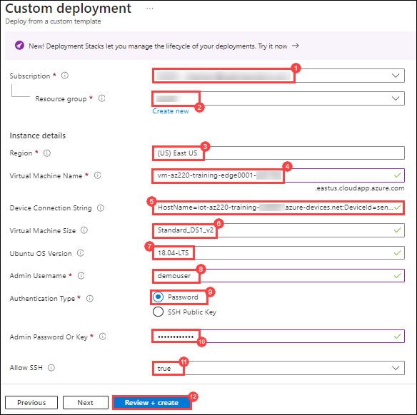

1. Once validation is passed, click on **Create**.

   > **Note**: Deployment can take as much as 5 minutes to complete.

1. Once the deployment has been completed, navigate to the **Outputs** pane, copy the values for **publicFQDN** and **publicSSH**.

   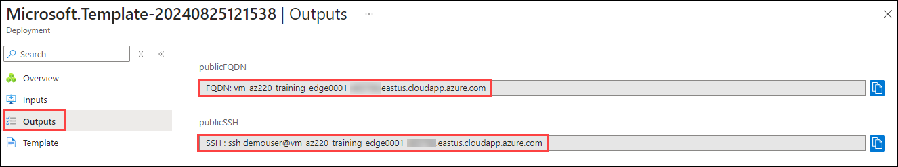

#### Task 3: Connect to the VM

1. If Cloud Shell is not still open, click **Cloud Shell**.

1. At the Cloud Shell command prompt, paste the **Public SSH** command that you noted earlier, and then press **Enter**.

1. When prompted with **Are you sure you want to continue connecting?**, type **yes** and then press **Enter**.

      This prompt is a security confirmation since the certificate used to secure the connection to the VM is self-signed. The answer         to this prompt will be remembered for subsequent connections, and is only prompted on the first connection.
   
1. When prompted to enter the password, enter **Password!223**.

   > **Note**: The password characters that you enter will not be displayed on screen.

      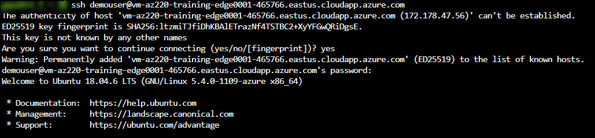
   
1. Once connected, the terminal command prompt will change to show the name of the Linux VM, similar to the following.

      

1. To ensure the IoT Edge daemon is running, enter the following command:

    ``` bash
    sudo iotedge system status
    ```
   A successful response will be similar to:
   
    ``` bash
    System services:
    aziot-edged             Running
    aziot-identityd         Running
    aziot-keyd              Running
    aziot-certd             Running
    aziot-tpmd              Ready

    Use 'iotedge system logs' to check for non-fatal errors.
    Use 'iotedge check' to diagnose connectivity and configuration issues.
    ```  

1. To verify the IoT Edge runtime has connected, run the following command:

    ``` bash
    sudo iotedge check
    ```
   This runs a number of checks and displays the results. For this lab, ignore the Configuration checks warnings/errors. The final         Connectivity checks should succeed and be similar to:

    ``` bash
    Connectivity checks
    -------------------
    √ container on the default network can connect to IoT Hub AMQP port - OK
    √ container on the default network can connect to IoT Hub HTTPS / WebSockets port - OK
    √ container on the default network can connect to IoT Hub MQTT port - OK
    √ container on the IoT Edge module network can connect to IoT Hub AMQP port - OK
    √ container on the IoT Edge module network can connect to IoT Hub HTTPS / WebSockets port - OK
    √ container on the IoT Edge module network can connect to IoT Hub MQTT port - OK
    ```

### Exercise 3: Add Edge Module to Edge Device

When a new module instance is created by the IoT Edge runtime, it gets a corresponding module identity. The module identity is stored in IoT Hub, and is used as the addressing and security scope for all local and cloud communications for that module instance. In implementation, modules images exist as container images in a repository, and module instances are containers on devices. The only supported container engine for IoT Edge devices in production is Moby.

In this exercise, you will add a Simulated Temperature Sensor as a custom IoT Edge module, and deploy it to run on the IoT Edge Device.

#### Task 1: Configure module for deployment

1. Search for **IoT Hub** and select it.

1. Open **iot-az220-training-<inject key="DeploymentID" enableCopy="false"></inject>**, click on **Iot Edge (1)** under **Device Management** tab in the left pane and select **sensor-th-0067 (2)**.

1. Scroll to the bottom of the **sensor-th-0067** blade.Scroll down to find the **Modules (1)** section and notice the list of the modules currently configured for the device.

      Currently, the IoT Edge device is configured with only the Edge Agent ($edgeAgent) and Edge Hub ($edgeHub) modules that are part 
      of the IoT Edge Runtime.

      At the top of the **sensor-th-0067** blade, click **Set Modules (2)**.

   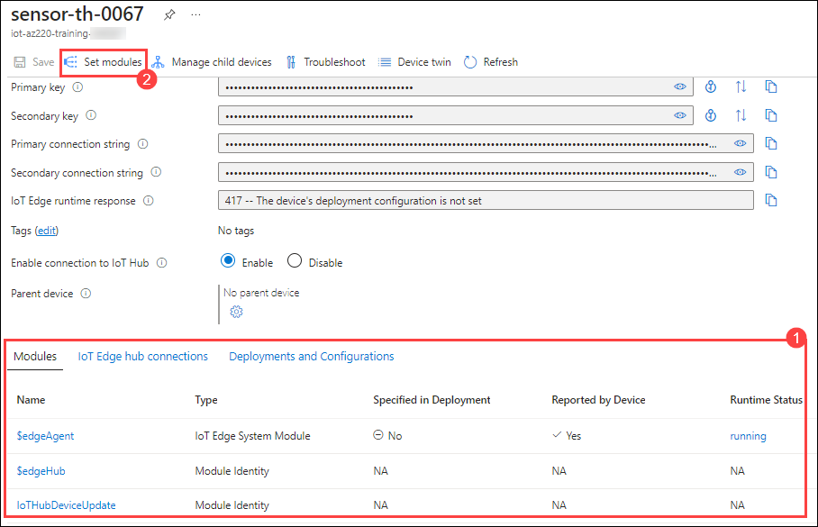

1. On the **Set modules on device: **sensor-th-0067** blade**, locate the **IoT Edge Modules** section. Click Add, and then select **IoT Edge Module**.

   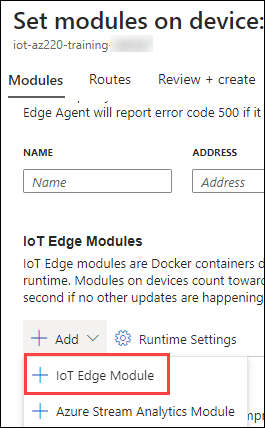

1. On the Add IoT Edge Module pane, under IOT Edge Module Name, enter **tempsensor (1)**. Under Image URI, enter **mcr.microsoft.com/azureiotedge-simulated-temperature-sensor:1.0. (2)**

      > **Note**: This image is a published image on Docker Hub that is provided by the Azure product group to support this testing scenario.

   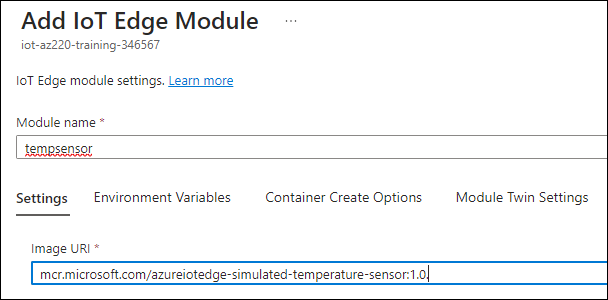

1. Click on Module Twin Settings (1), to specify the desired properties for the module twin, enter the following **JSON (2)** and click on **Add (3)**:

    ```json
    {
        "EnableProtobufSerializer": false,
        "EventGeneratingSettings": {
            "IntervalMilliSec": 500,
            "PercentageChange": 2,
            "SpikeFactor": 2,
            "StartValue": 20,
            "SpikeFrequency": 20
        }
    }
    ```

      > **Note**: This JSON configures the Edge Module by setting the desired properties of its module twin.

      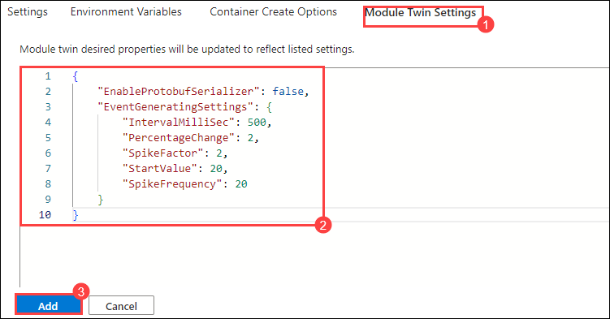

1. On the **Set modules on device: sensor-th-0067** blade, at the bottom of the blade, click **Next: Routes >**.

1. Provide the following details and click on **Review + create (3)**:

    * Name: **route (1)**
    * Value: **`FROM /messages/* INTO $upstream` (2)**

    This route will send all messages from all modules on the IoT Edge Device to IoT Hub

      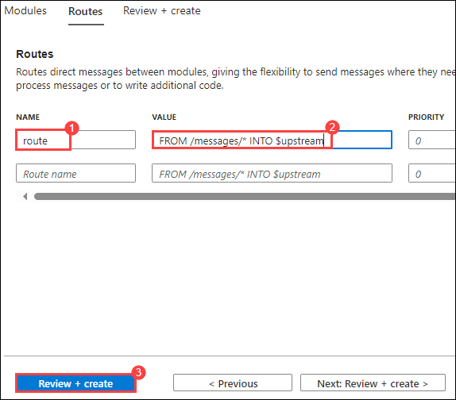

1. At the bottom of the blade, to finish setting the modules for the device, click **Create**.

1. On the **sensor-th-0067** blade, under **Modules**, notice that **tempsensor** is now listed.

    > **Note**: You may have to click **Refresh** to see the module listed for the first time.

    You may notice that the RUNTIME STATUS for **tempsensor** is not reported.

     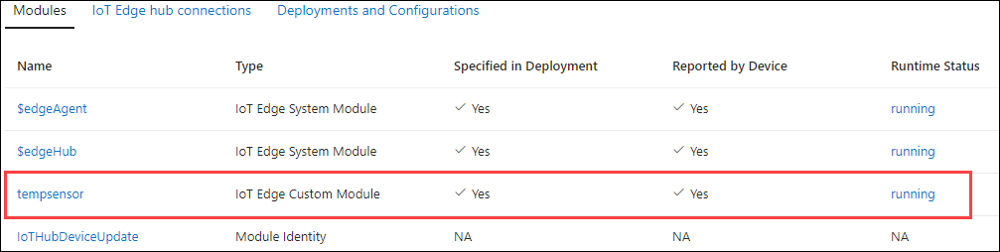

1. At the top of the blade, click **Refresh**.

1. Notice that the **RUNTIME STATUS** for the **tempsensor** module is now set to **running**.

    If the value is still not reported, or if an error is reported, wait a moment and then refresh the blade again.

#### Task 2: Confirm module deployment

1. Open a Cloud Shell session (if it is not still open).

    If you are no longer connected to the **vm-az220-training-edge0001-{your-id}** virtual machine, connect using SSH as your did 
    earlier in this lab. The SSH command should be available in Notepad.

1. At the Cloud Shell command prompt, to list the modules currently running on the IoT Edge Device, enter the following command:

    ```bash
    iotedge list
    ```

      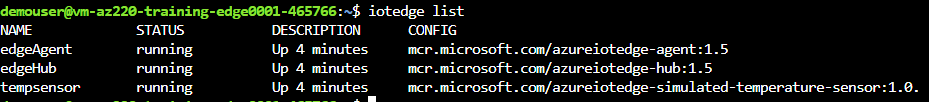
   
1. The output of the command look similar to the following.

    ```bash
    demouser@vm-az220-training-edge0001-{your-id}:~$ iotedge list
    NAME             STATUS           DESCRIPTION      CONFIG
    edgeHub          running          Up a minute      mcr.microsoft.com/azureiotedge-hub:1.1
    edgeAgent        running          Up 26 minutes    mcr.microsoft.com/azureiotedge-agent:1.1
    tempsensor       running          Up 34 seconds    mcr.microsoft.com/azureiotedge-simulated-temperature-sensor
    ```

    Notice that **tempsensor** is listed as one of the running modules.

1. To view the module logs, enter the following command:

    ```bash
    iotedge logs tempsensor
    ```

    The output of the command looks similar to the following:

    ```bash
    demouser@vm-az220-training-edge0001-{your-id}:~$ iotedge logs tempsensor
    11/14/2019 18:05:02 - Send Json Event : {"machine":{"temperature":41.199999999999925,"pressure":1.0182182583425192},"ambient":{"temperature":21.460937846433808,"humidity":25},"timeCreated":"2019-11-14T18:05:02.8765526Z"}
    11/14/2019 18:05:03 - Send Json Event : {"machine":{"temperature":41.599999999999923,"pressure":1.0185790159334602},"ambient":{"temperature":20.51992724976499,"humidity":26},"timeCreated":"2019-11-14T18:05:03.3789786Z"}
    11/14/2019 18:05:03 - Send Json Event : {"machine":{"temperature":41.999999999999922,"pressure":1.0189397735244012},"ambient":{"temperature":20.715225311096397,"humidity":26},"timeCreated":"2019-11-14T18:05:03.8811372Z"}
    ```

    The **iotedge logs** command can be used to view the module logs for any of the Edge modules.

      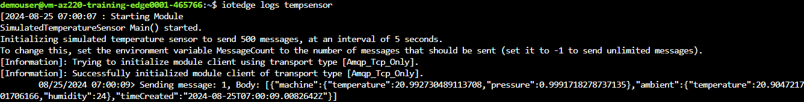
   
### Exercise 4: Deploy Azure Stream Analytics as IoT Edge Module

Now that the tempSensor module is deployed and running on the IoT Edge device, we can add a Stream Analytics module that can process messages on the IoT Edge device before sending them on to the IoT Hub.

#### Task 1: Create Azure Storage Account

1. Search for **storage account** and select it.

   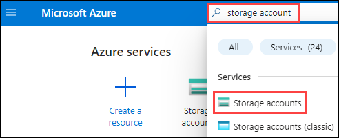

1. Click on **Create**.

   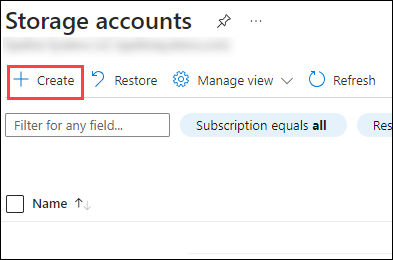

1. In the create a storage account page, provide the following:

   - Subscription: **Select the default subscription (1)**
   - Resource Group: **Select the existing resource group (2)**
   - Storage Account Name: Provide the name as **az220store<inject key="DeploymentID" enableCopy="false"></inject>** **(3)**
   - Region: Select **EAST US (4)**
   - Performance: **Standard (5)**
   - **Redundancy**: **Locally-redundant storage (LRS) (6)** 
   - Click on **Review + create (7)**

     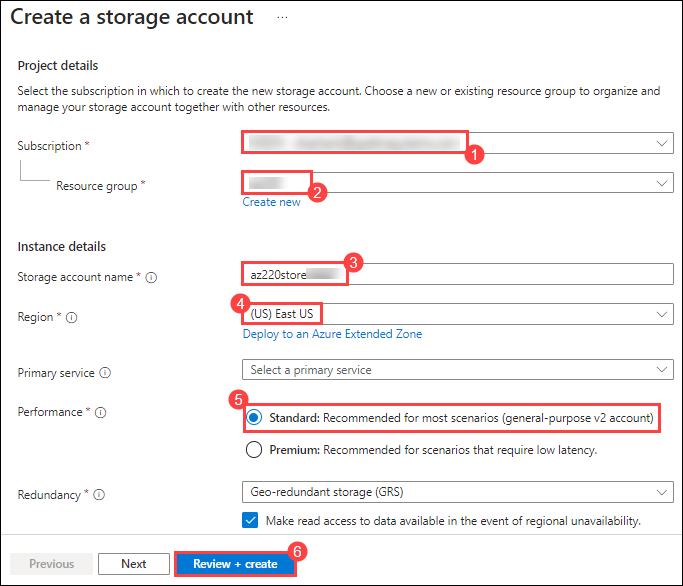

1. Click on **Create**.

#### Task 2: Create an Azure Stream Analytics job

1. Search for **Stream Analytics** and select **Stream Analytics jobs**.

   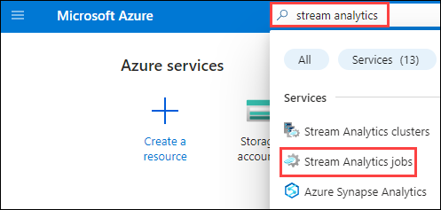

1. In the New Stream Analytics Job, provide the following under the **Basics** tab and click on **Next (6)**:

   - Subscription: **Select the default subscription (1)**
   - Resource Group: **Select the existing resource group (2)**
   - Name: **asa-az220-training-<inject key="DeploymentID" enableCopy="false"></inject>** **(3)**
   - Region: Select **EAST US (4)**
   - Hosting environment (This determines that the Stream Analytics job will deployed to an on-premises IoT Gateway Edge device.): **Edge (5)**
      
     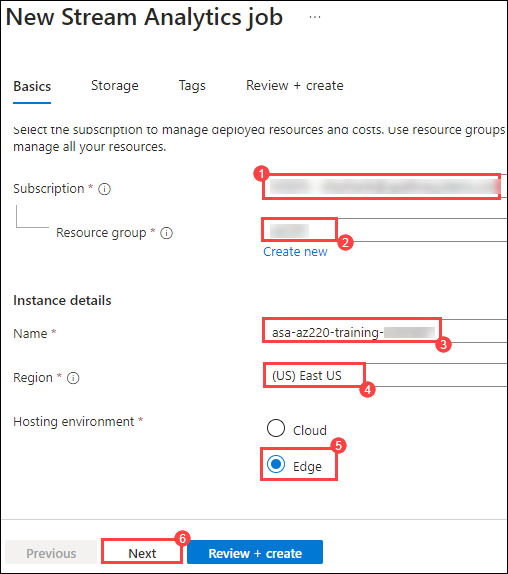

1. Under the storage tab, select **az220store<inject key="DeploymentID" enableCopy="false"></inject>** **(1)** and click on **Review + create (2)**

    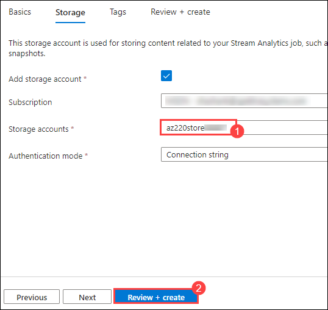
   
1. At the bottom of the blade, click **Create**.

    It can take a few moments to for this resource to be deployed.

#### Task 3: Configure Azure Stream Analytics Job

1. When you see the **Your deployment is complete** message, click **Go to resource**.

    You should now be on the Overview pane of your new Stream Analytics job.

1. On the left side navigation menu, under **Job topology**, click **Inputs (1)**. Under **+ Add Input (1)**, select **Edge Hub (2)**.

     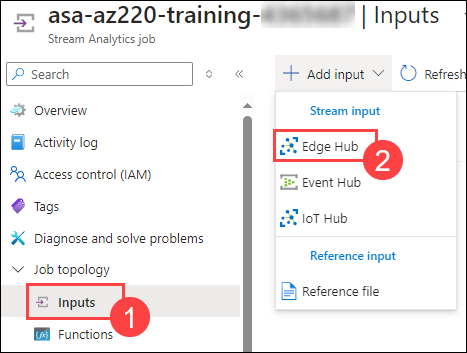

1. In the Edge Hub, provide the following and click on **Save (5)**:

   - Input alias: **temperature (1)**
   - Event serialization format dropdown: Ensure that **JSON** is selected **(2)**
   - Encoding dropdown: Ensure that **UTF-8** is selected **(3)** (UTF-8 is the only JSON encoding supported at the time of writing.)
   - Event compression type dropdown: Ensure that **None** is selected **(4)**

       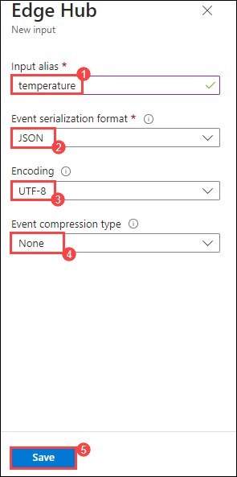
     
1. On the left side navigation menu, under **Job topology**, click **Outputs**. On the **Outputs** pane, click **+ Add**, and then click **Edge Hub**.

1. In the Edge Hub, provide the following and click on **Save (5)**:

   - Output alias: **alert (1)**
   - Event serialization format dropdown: Ensure that **JSON** is selected **(2)**
   - Format: Ensure that **Line separated** is selected **(3)**
   - Encoding: Ensure that **UTF-8** is selected (UTF-8 is the only JSON encoding supported at the time of writing.) **(4)**

      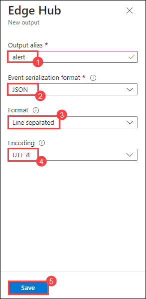
     
1. On the left side navigation menu, under **Job topology**, click **Query (1)**. In the **Query** pane, replace the Default query with the **following (2)**:

    ```sql
    SELECT
        'reset' AS command
    INTO
        alert
    FROM
        temperature TIMESTAMP BY timeCreated
    GROUP BY TumblingWindow(second,15)
    HAVING Avg(machine.temperature) > 25
    ```

   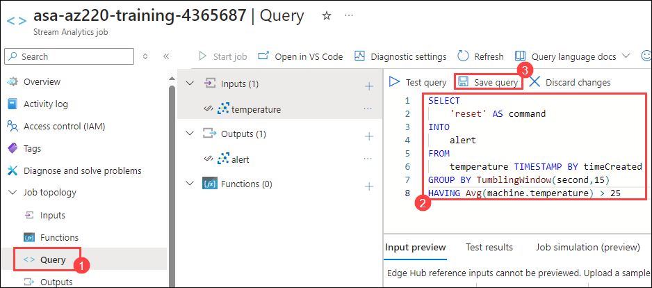

   Verify that your query is entered correctly, and then, at the top of the query editor, click **Save query (3)**.

   > **Note**: This query looks at the events coming into the **temperature** Input, and groups by a Tumbling Windows of 15 seconds, then it checks if the average temperature value within that grouping is greater than 25. If the average is greater than 25, then it sends an event with the **command** property set to the value of **reset** to the **alert** Output. For more information about the **TumblingWindow** functions, reference this link: [https://docs.microsoft.com/en-us/stream-analytics-query/tumbling-window-azure-stream-analytics](https://docs.microsoft.com/en-us/stream-analytics-query/tumbling-window-azure-stream-analytics)

#### Task 4: Deploy the Stream Analytics Job

1. Open **iot-az220-training-<inject key="DeploymentID" enableCopy="false"></inject>**, click on **Iot Edge (1)** under **Device Management** tab in the left pane and select **sensor-th-0067 (2)**.

1. On the **Set modules on device: **sensor-th-0067** blade**, locate the **IoT Edge Modules** section. Click Add, and then select **Azure Stream Analytics Module**.

      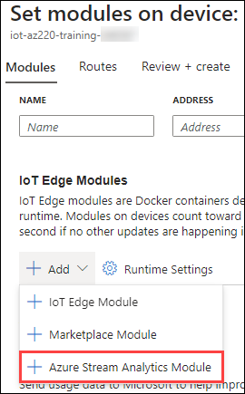

1. On the **Edge deployment** window, select the **subscription (1)**, select the **edge job(2)** we created earlier and click on **Save (3)**.

      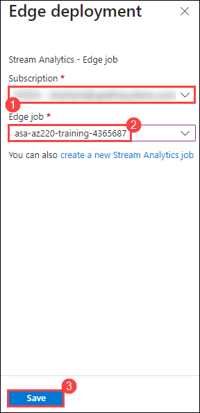

   > **Note**: The job may take upto 5-7 minutes to come up, please refresh the page for it to appear. The job may already be selected, yet the **Save** button is disabled - just open the **Edge job** dropdown again and select the **asa-az220-training-<inject key="DeploymentID" enableCopy="false"></inject>** job again. The **Save** button should then become enabled.

1. Once the Edge package has been successfully published, notice that the new ASA module is listed under the **IoT Edge Modules** section

1. Under **IoT Edge Modules**, click **asa-az220-training-<inject key="DeploymentID" enableCopy="false"></inject>**.

    This is the Steam Analytics module that was just added to your Edge device.

1. On the **Update IoT Edge Module** pane, notice that the **Image URI** points to a standard Azure Stream Analytics image.

    ```text
    mcr.microsoft.com/azure-stream-analytics/azureiotedge:1.0.14
    ```

    This is the same image used for every ASA job that gets deployed to an IoT Edge Device.

    > **Note**:  The version number at the end of the **Image URI** that is configured will reflect the current latest version when you created the Stream Analytics Module.

1. Leave all values as their defaults, and close the **IoT Edge Custom Modules** pane.

1. On the **Set modules on device: sensor-th-0067** pane, click **Next: Routes >**.

    Notice that the existing routing is displayed.

1. Replace the default route defined with the following three routes:

    * Route 1
        * NAME: `telemetryToCloud`
        * VALUE: `FROM /messages/modules/tempsensor/* INTO $upstream`
    * Route 2
        * NAME: `alertsToReset`
        * VALUE: `FROM /messages/modules/asa-az220-training-{your-id}/* INTO BrokeredEndpoint("/modules/tempsensor/inputs/control")`
    * Route 3
        * NAME: `telemetryToAsa`
        * VALUE: `FROM /messages/modules/tempsensor/* INTO BrokeredEndpoint("/modules/asa-az220-training-{your-id}/inputs/temperature")`

    The routes being defined are as follows:

    * The **telemetryToCloud** route sends the all messages from the **tempsensor** module output to Azure IoT Hub.
    * The **alertsToReset** route sends all alert messages from the Stream Analytics module output to the input of the **tempsensor** module.
    * The **telemetryToAsa** route sends all messages from the **tempsensor** module output to the Stream Analytics module input.

1. At the bottom of the **Set modules on device: sensor-th-0067** blade, click **Review + create**.

1. On the **Review + create** tab, notice that the **Deployment Manifest** JSON is now updated with the Stream Analytics module and the routing definition that was just configured.

1. Notice the JSON configuration for the **tempsensor** Simulated Temperature Sensor module:

    ```json
    "tempsensor": {
        "settings": {
            "image": "mcr.microsoft.com/azureiotedge-simulated-temperature-sensor",
            "createOptions": ""
        },
        "type": "docker",
        "version": "1.0",
        "status": "running",
        "restartPolicy": "always"
    },
    ```

1. Notice the JSON configuration for the routes that were previously configured, and how they are configured in the JSON Deployment definition:

    ```json
    "$edgeHub": {
        "properties.desired": {
            "routes": {
                "telemetryToCloud": "FROM /messages/modules/tempsensor/* INTO $upstream",
                "alertsToReset": "FROM /messages/modules/asa-az220-training-CP122619/* INTO BrokeredEndpoint(\\\"/modules/tempsensor/inputs/control\\\")",
                "telemetryToAsa": "FROM /messages/modules/tempsensor/* INTO BrokeredEndpoint(\\\"/modules/asa-az220-training-CP122619/inputs/temperature\\\")"
            },
            "schemaVersion": "1.0",
            "storeAndForwardConfiguration": {
                "timeToLiveSecs": 7200
            }
        }
    },
    ```

1. At the bottom of the blade, click **Create**.

#### Task 5: View Data

1. Go back to the **Cloud Shell** session where you're connected to the **IoT Edge Device** over **SSH**.

    If it is closed or timed out, reconnect. Run the **SSH** command and login as before.

1. At the command prompt, to view a list of the modules deployed to the device, enter the following command:

    ```bash
    iotedge list
    ```

    It can take a minute for the new Stream Analytics module to be deployed to the IoT Edge Device. Once it's there, you will see it in the list output by this command.

    ```bash
    demouser@vm-az220-training-edge0001-{your-id}:~$ iotedge list
    NAME               STATUS           DESCRIPTION      CONFIG
    asa-az220-training-CP1119  running          Up a minute      mcr.microsoft.com/azure-stream-analytics/azureiotedge:1.0.5
    edgeAgent          running          Up 6 hours       mcr.microsoft.com/azureiotedge-agent:1.0
    edgeHub            running          Up 4 hours       mcr.microsoft.com/azureiotedge-hub:1.0
    tempsensor         running          Up 4 hours       mcr.microsoft.com/azureiotedge-simulated-temperature-sensor
    ```

    > **Note**: If the Stream Analytics module does not show up in the list, wait a minute or two, then try again. It can take a minute for the module deployment to be updated on the IoT Edge Device.

1. At the command prompt, to watch the telemetry being sent from the Edge device by the **tempsensor** module, enter the following command:

    ```bash
    iotedge logs tempsensor
    ```

    > **Note**: If the simulated temperature sensor module stopped before the asa module was deployed, you can restart it by running the `iotedge restart tempsensor` command. Let it run for about 30 seconds and then recheck the logs.

1. Take a minute to observe the output.

    While watching the temperature telemetry being sent by **tempsensor**, notice that a **reset** command is sent by the Stream Analytics job when the **machine.temperature** reaches an average above **25**. This is the action configured in the Stream Analytics job query.

    Output of this event will look similar to the following:

    ```bash
    11/14/2019 22:26:44 - Send Json Event : {"machine":{"temperature":231.599999999999959,"pressure":1.0095600761599359},"ambient":{"temperature":21.430643635304012,"humidity":24},"timeCreated":"2019-11-14T22:26:44.7904425Z"}
    11/14/2019 22:26:45 - Send Json Event : {"machine":{"temperature":531.999999999999957,"pressure":1.0099208337508767},"ambient":{"temperature":20.569532965342297,"humidity":25},"timeCreated":"2019-11-14T22:26:45.2901801Z"}
    Received message
    Received message Body: [{"command":"reset"}]
    Received message MetaData: {"MessageId":null,"To":null,"ExpiryTimeUtc":"0001-01-01T00:00:00","CorrelationId":null,"SequenceNumber":0,"LockToken":"e0e778b5-60ff-4e5d-93a4-ba5295b995941","EnqueuedTimeUtc":"0001-01-01T00:00:00","DeliveryCount":0,"UserId":null,"MessageSchema":null,"CreationTimeUtc":"0001-01-01T00:00:00","ContentType":"application/json","InputName":"control","ConnectionDeviceId":"sensor-th-0067","ConnectionModuleId":"asa-az220-training-CP1119","ContentEncoding":"utf-8","Properties":{},"BodyStream":{"CanRead":true,"CanSeek":false,"CanWrite":false,"CanTimeout":false}}
    Resetting temperature sensor..
    11/14/2019 22:26:45 - Send Json Event : {"machine":{"temperature":320.4,"pressure":0.99945886361358849},"ambient":{"temperature":20.940019742324957,"humidity":26},"timeCreated":"2019-11-14T22:26:45.7931201Z"}
    ```
   
## Summary
In this lab, you have configured the Lab Prerequisites , created and configured an IoT Edge VM, added Edge Module to Edge Device and deployed Azure Stream Analytics as IoT Edge Module/

### You have successfully completed the lab
