# Automate IoT Device Management with Azure IoT Hub

IoT devices often use optimized operating systems or even run code directly on the silicon (without the need for an actual operating system). In order to update the software running on devices like these the most common method is to flash a new version of the entire software package, including the OS as well as the apps running on it (called firmware).

Because each device has a specific purpose, its firmware is also very specific and optimized for the purpose of the device as well as the constrained resources available.

The process for updating firmware can also be specific to the hardware and to the way the hardware manufacturer created the board. This means that a part of the firmware update process is not generic and you will need to work with your device manufacturer to get the details of the firmware update process (unless you are developing your own hardware which means you probably know what the firmware update process).

While firmware updates used to be applied manually on individual devices, this practice no longer makes sense considering the number of devices used in typical IoT solutions. Firmware updates are now more commonly done over-the-air (OTA) with deployments of new firmware managed remotely from the cloud.

There is a set of common denominators to all over-the-air firmware updates for IoT devices:

1. Firmware versions are uniquely identified
1. Firmware comes in a binary file format that the device will need to acquire from an online source
1. Firmware is locally stored is some form of physical storage (ROM memory, hard drive,...)
1. Device manufacturer provide a description of the required operations on the device to update the firmware.

Azure IoT Hub offers advanced support for implementing device management operations on single devices and on collections of devices. The [Automatic Device Management](https://docs.microsoft.com/azure/iot-hub/iot-hub-auto-device-config) feature enables you to simply configure a set of operations, trigger them, and then monitor their progress.

## Lab Scenario

The automated air processing system that you implemented in Contoso's cheese caves has helped the company to raise their already high quality bar. The company has more award-winning cheeses than ever before.

Your base solution consists of IoT devices that are integrated with sensors and a climate control system to provide real-time control of temperature and humidity within a multi-chamber cave system. You also developed a simple back-end app that demonstrated the ability to manage devices using both direct methods and device twin properties.

Contoso has extended the simple back-end app from your initial solution to include an online portal that operators can use to monitor and remotely manage the cave environment. With the new portal, operators can even customize the temperature and humidity within the cave based on the type of cheese or for a specific phase within the cheese aging process. Each chamber or zone within the cave can be controlled separately.

The IT department will be maintaining the back-end portal that they developed for the operators, but your manager has agreed to manage the device-side of the solution.

For you, this means two things:

1. The Operations team at Contoso is always looking for ways to make improvements. These improvements often lead to requests for new features in the device software.

1. The IoT devices that are deployed to cave locations need the latest security patches to ensure privacy and to prevent hackers from taking control of the system. In order to maintain system security, you need to keep the devices up to date by remotely updating their firmware.

You plan to implement features of IoT Hub that enable automatic device management and device management at scale.

The following resources will be created:

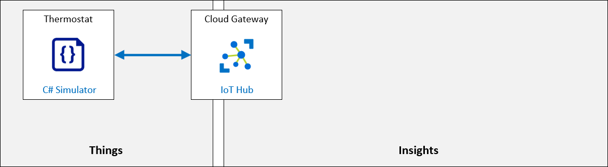

## Lab Objectives

In this lab, you will complete the following activities:

* Configure the lab prerequisites (the required Azure resources)
* Write code for a simulated device that will implement a firmware update
* Test the firmware update process on a single device using Azure IoT Hub automatic device management

### Task 1: Configure Lab Prerequisites

1. On the Azure portal, naviagate to Resource group and then select the resource group named **az220-rg**.

   

1. In the **az220-rg** page, select **iot-az220-training-<inject key="DeploymentID" enableCopy="false"></inject>**

   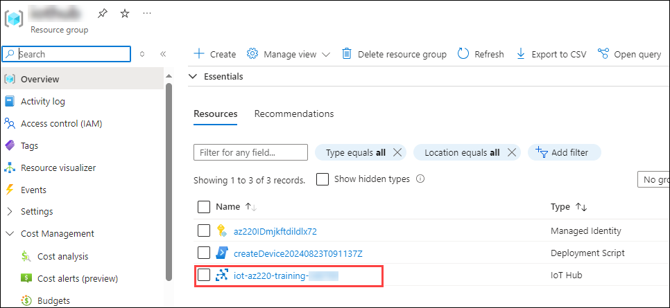

1. Click on **Devices (1)** under the Device management tab in the left pane and select **sensor-th-0155 (2)**.

   

1. Copy the **primary connection string** and paste it in a notepad.

   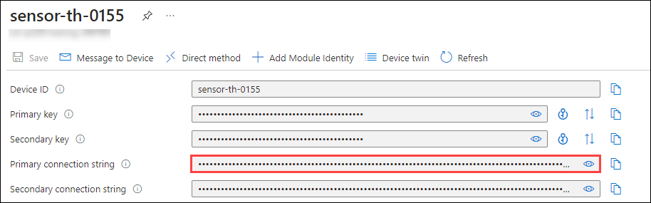

### Task 2: Examine code for a simulated device that implements firmware update

1. Open **Visual Studio Code** from the desktop.

   

1. Click on File (1) and select Open Folder (2).

1. Navigate to `C:\Users\GayatriMurali\MSLearnLabs-AZ-220-Microsoft-Azure-IoT-Developer\Allfiles\Labs\16-Automate IoT Device Management with Azure IoT Hub\Final` and select the **fwupdatedevice** folder.

1. Click on **Yes, i trust the authors** when prompted.

   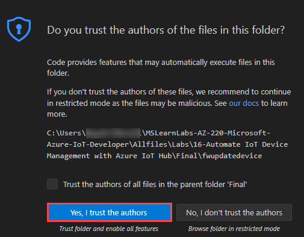

1. You should see the following files listed in the EXPLORER pane of Visual Studio Code:

   - FWUpdateDevice.csproj
   - Program.cs

1. In the EXPLORER pane, to open the project file, click **FWUpdateDevice.csproj**.

   Notice the referenced NuGet packages:

      Microsoft.Azure.Devices.Client - Device SDK for Azure IoT Hub
      Microsoft.Azure.Devices.Shared - Common code for Azure IoT Device and Service SDKs
      Newtonsoft.Json - Json.NET is a popular high-performance JSON framework for .NET

1. Navigate to **Program.cs** and at the top of the code file, locate the code comment line that begins with **The device connection string**.

    In this simple simulated device app, the device ID and the current firmware version will be tracked during the firmware update process.

      > **Note**: You will supply the device connection string value as a parameter when you enter the command to run the app later in this lab.

      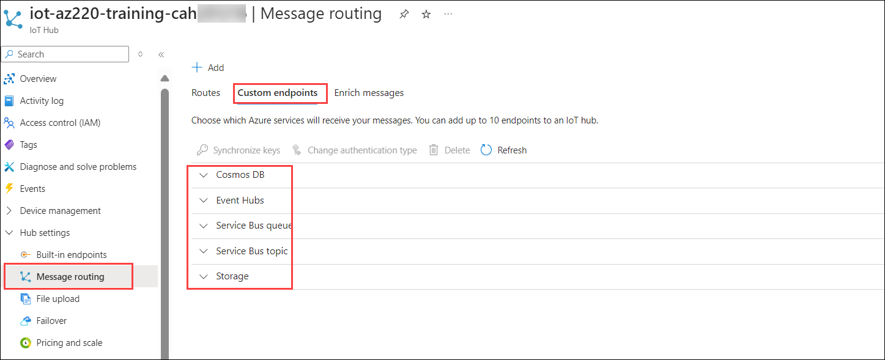

1. 


### Task 3: Test firmware update on a single device

1. In Vs code, click on **Terminal (1)** and click on **New Terminal (2)**. The folder location shown within the command prompt should show the FWUpdateDevice project folder.

   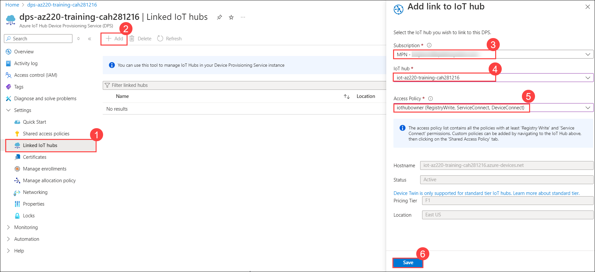

1. To run the FWUpdateDevice app, enter the following command:

    ``` bash
    dotnet run "<your device connection string>"
    ```

    > **IMPORTANT**: Remember to replace the placeholder value with your actual device connection string which you copied earlier in your notepad, and be sure to include "" around your connection string.
    >
    > For example: `dotnet run "HostName=iot-az220-training-{your-id}.azure-devices.net;DeviceId=sensor-th-0155;SharedAccessKey={}="`

    After about 5-10 seconds you should see the initial output displayed in the Terminal pane.

1. Review the contents of the Terminal pane.

    You should see the following output in the terminal:

    ``` bash
        sensor-th-0155: Device booted
        sensor-th-0155: Current firmware version: 1.0.0
    ```

    Once this information is displayed, the simulated device app enters a holding pattern, waiting for a device twin update that will trigger a firmware update.

      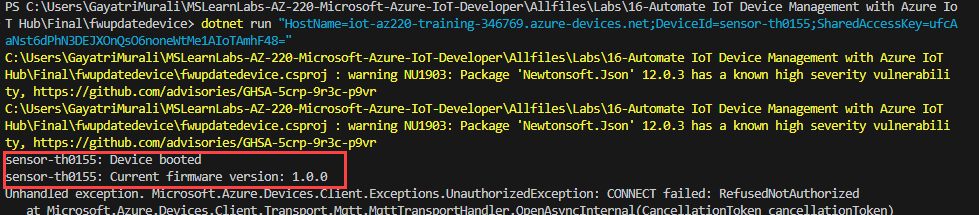

1. Navigate back to `portal.azure.com`.

1. Open **iot-az220-training-<inject key="DeploymentID" enableCopy="false"></inject>**, click on **Devices (1)** under the Device management tab in the left pane and select **sensor-th-0155 (2)**.

   

1. Click on **Device twin** and review the contents of the device twin file.

    Notice the values of the desired and reported properties, and the update times listed.

      

      

1. Navigate back to **iot-az220-training-<inject key="DeploymentID" enableCopy="false"></inject>** blade, click on **Configurations + Deployments (1)**, click on + Add and select **Device Twin Configuration (2)**.

   

1. In the **Name and Label** tab, provide the name as **firmwareupdate (1)** and click on **Next: Twins Settings > (2)**

   

1. Under the **Twin Setting**s tab, in the **Device Twin Property** field, enter **properties.desired.firmware (1)**. In the **Device Twin Property Content (2)** field, replace the existing contents with the following and click on **Next: Target Devices> (3)**:

    ``` json
    {
        "fwVersion":"1.0.1",
        "fwPackageURI":"https://MyPackage.uri",
        "fwPackageCheckValue":"1234"
    }
    ```
      > **Note**: You can right-click in the content field and select **Format Document** to format the JSON if needed.

      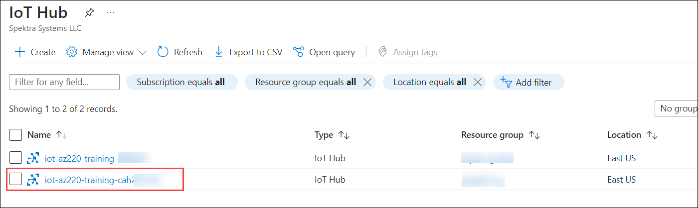

1. On the **Target Devices** tab, under **Priority**, in the **Priority (higher values ...)** field, enter **10 (1)**. Under **Target Condition**, in the **Target Condition (2)** field, enter the following query and click on **Next: Metrics> (3)** :

    ``` SQL
    deviceId='sensor-th-0155'
    ```

   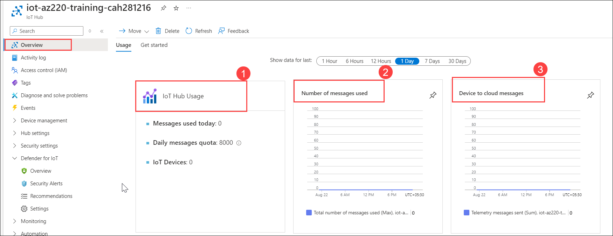

1. On the **Metrics** tab, under **METRIC NAME**, enter **fwupdated (1)**. 1. Under **METRIC CRITERIA (2)**, enter the following and click on **Next: Review + Create> (3)**:

    ``` SQL
    SELECT deviceId FROM devices
        WHERE properties.reported.firmware.currentFwVersion='1.0.1'
    ```

      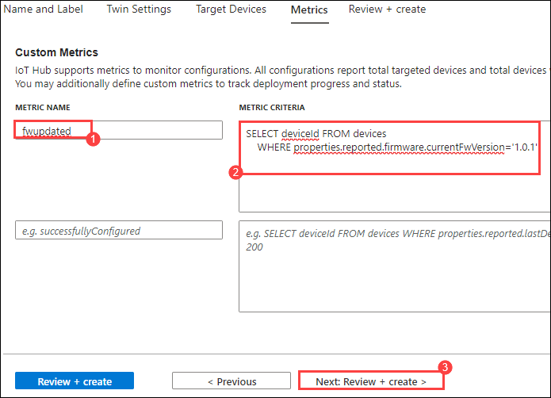

1. On the **Review + create** tab, click **Create** after the "Validation passed" pops up.

1. Navigate back to **iot-az220-training-<inject key="DeploymentID" enableCopy="false"></inject>** pane, under **Configuration Name**, verify that your new **firmwareupdate** configuration is listed.

1. Switch to the **Visual Studio Code** window, and review the contents of the Terminal pane. The Terminal pane should include new output generated by your app that lists the progress of the firmware update process that was triggered.

      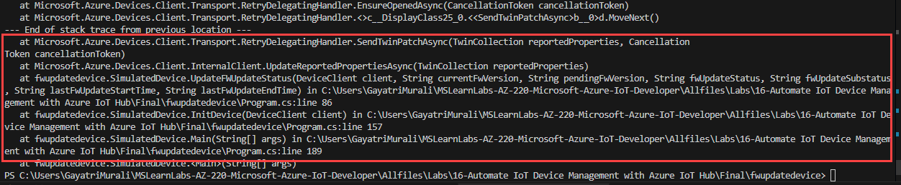

   
