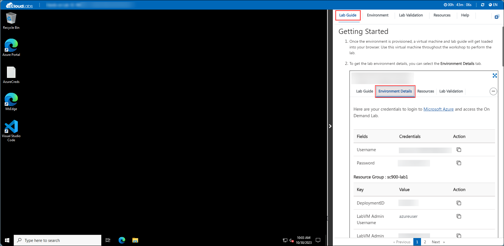
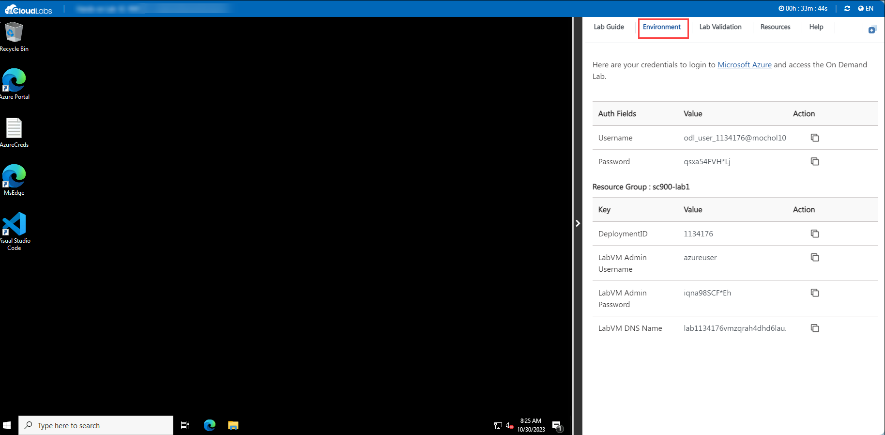
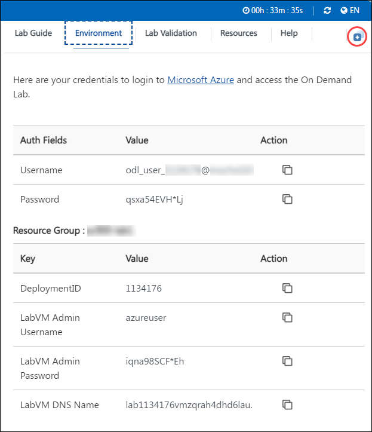

# Getting Started with Your AZ-220: Microsoft Azure IoT Developer Workshop
 
Welcome to your AZ-220: Microsoft Azure IoT Developer Workshop workshop! We've prepared a seamless environment for you to explore and learn about Azure services in IoT. Let's begin by making the most of this experience.

## Overview

This hands-on lab will guide you through setting up Azure IoT services by starting with the creation of an Azure IoT Hub. You'll learn to connect an IoT device to Azure, perform individual enrollment in the Device Provisioning Service (DPS), and set up device message routing. The lab also covers integrating IoT Hub with Event Grid, exploring time-stamped data using Azure Data Explorer, and introduces Azure IoT Edge, where you'll set up an IoT Edge Gateway, develop, deploy, and debug a custom module using VS Code. Finally, you'll learn how to remotely monitor and control devices, and automate IoT device management with Azure IoT Hub.

## Accessing Your Lab Environment
 
Once you're ready to dive in, your virtual machine and lab guide will be right at your fingertips within your web browser.
 
   

### Virtual Machine & Lab Guide
 
Your virtual machine is your workhorse throughout the workshop. The lab guide is your roadmap to success.
 
## Exploring Your Lab credentials and Other Values
 
For a comprehensive overview of your environment, including user credentials and other essential details required for the lab, please refer to the **Environment Details** tab.
 
   
 
## Utilizing the Split Window Feature
 
For convenience, you can open the lab guide in a separate window by selecting the **Split Window** button from the top right corner.
 
   
 
## Managing Your Virtual Machine
 
Feel free to start, stop, or restart your virtual machine as needed from the **Resources** tab. Your experience is in your hands!
 
   
 
## **Lab Duration Extension**

1. To extend the duration of the lab, kindly click the **Hourglass** icon in the top right corner of the lab environment. 

    

    >**Note:** You will get the **Hourglass** icon when 10- 12 minutes are remaining in the lab duration.

2. Click **OK** to extend your lab duration.
 
     

3. If you have not extended the duration prior to when the lab is about to end, a pop-up will appear, giving you the option to extend. Click **OK** to proceed.

   >**Note:** This extension can be applied once by the user. If you need additional time, please feel free to reach out to the [Spektra Support Team](labs-support@spektrasystems.com).

## Let's Get Started with Azure Portal
 
1. On your virtual machine, click on the Azure Portal icon as shown below:
 
      .png)
 
2. You'll see the **Sign into Microsoft Azure** tab. Here, enter your credentials:
 
   - **Email/Username:** <inject key="AzureAdUserEmail"></inject>
 
      
 
3. Next, provide your password:
 
   - **Password:** <inject key="AzureAdUserPassword"></inject>
 
     
 
4. If prompted to stay signed in, you can click "No."
 
5. If a **Welcome to Microsoft Azure** pop-up window appears, simply click "Maybe Later" to skip the tour.
 
6. Click "Next" from the bottom right corner to embark on your Lab journey!
 
      .png)
 
Now you're all set to explore the powerful world of technology. Feel free to reach out if you have any questions along the way. Enjoy your workshop!
